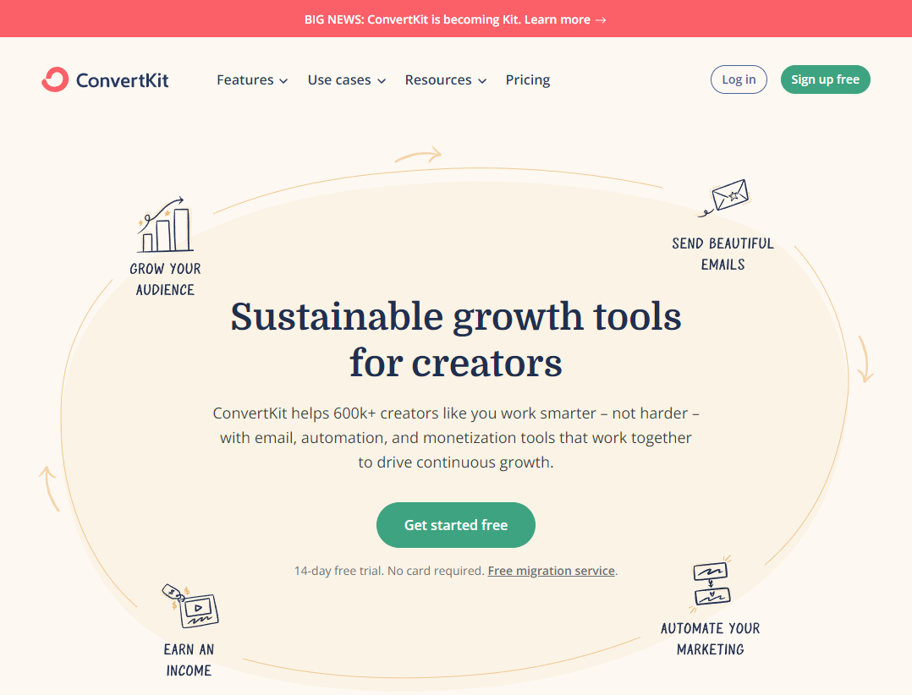
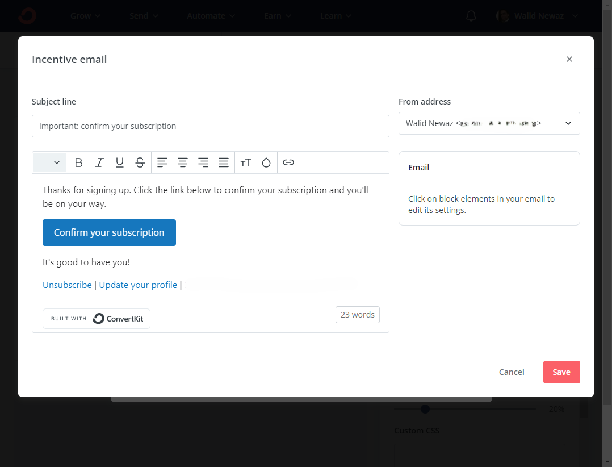
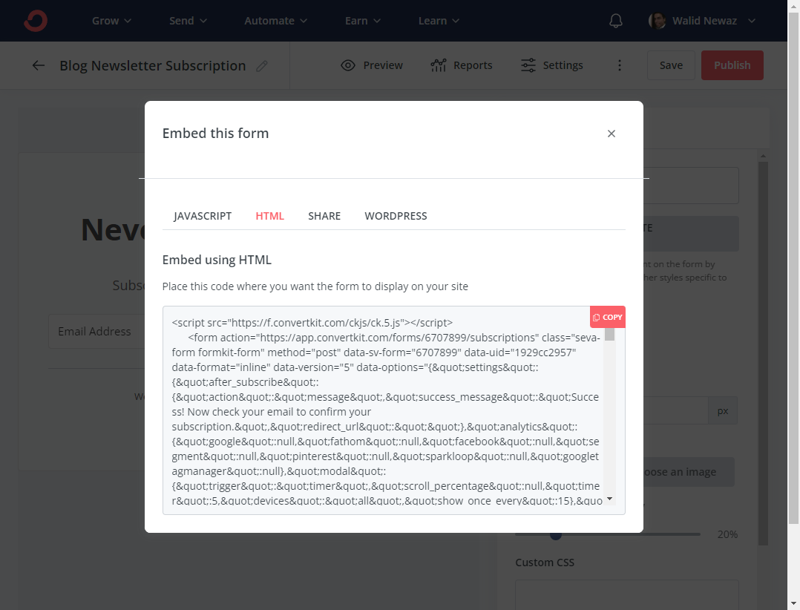
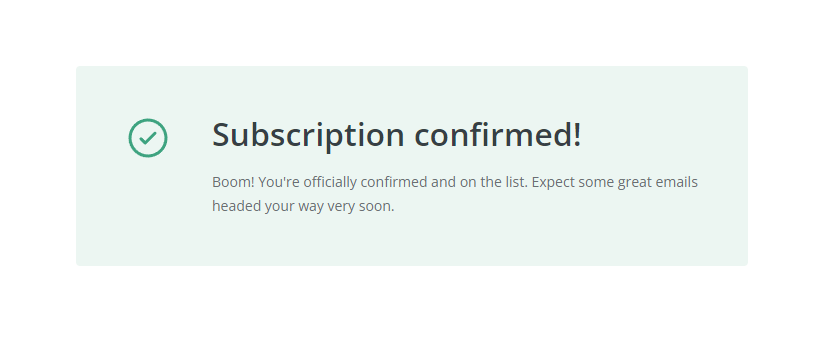
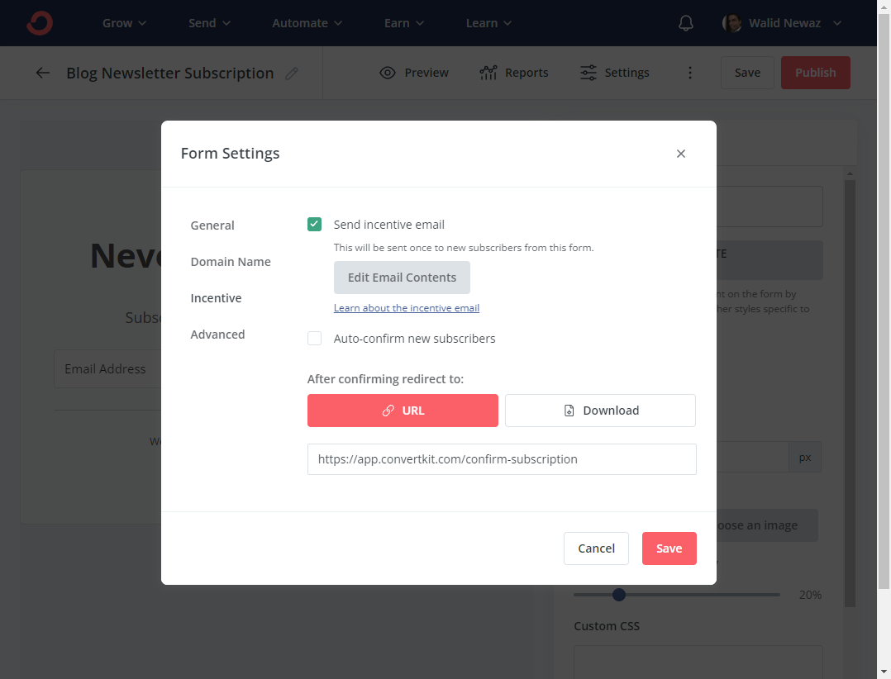
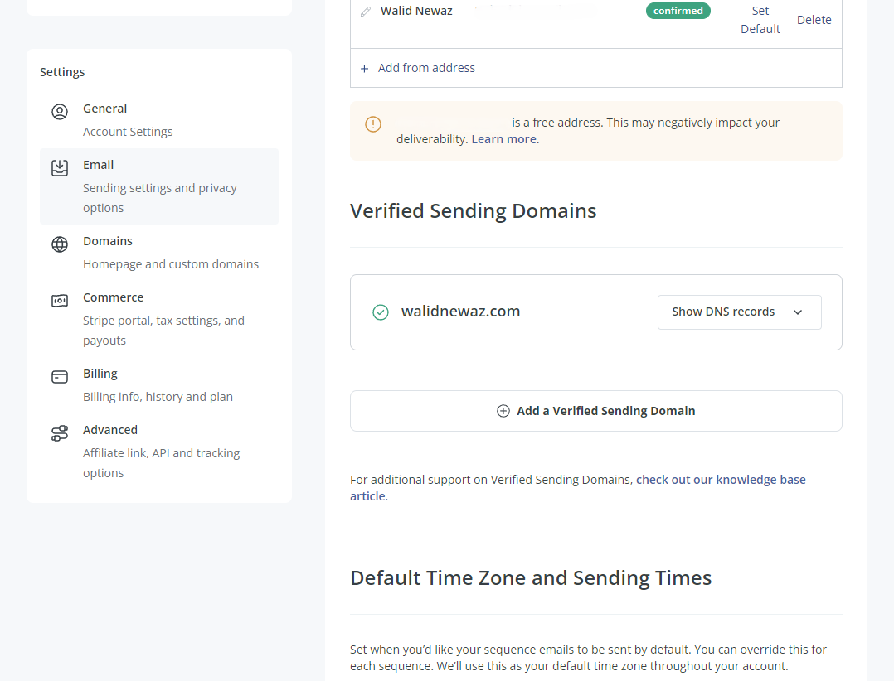
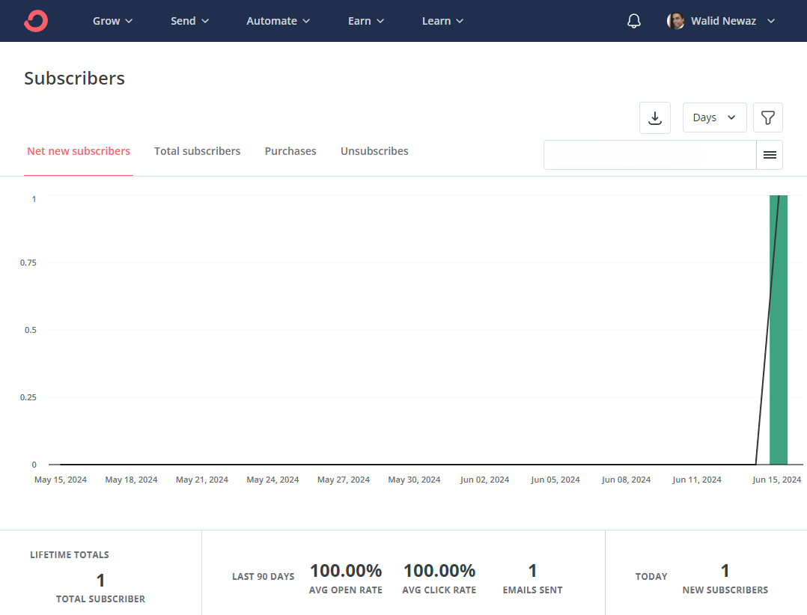

# Adding a Newsletter to My Blog Running on Top of Gatsby

## Various Options Out There

There are plenty of options available when it comes to email marketing service platforms. Most of them are feature-rich, and several allow you to start for free with various limitations.

As a newcomer to newsletters and email marketing, it was important to me that the platform I chose for my personal blog’s newsletters be easy to use, easy to customize, easy to integrate, and, most importantly, free to use up to a significant number of subscribers.

There are many robust email marketing services like Mailchimp, Constant Contact, ActiveCampaign, and AWeber, to name a few. However, after reviewing the free options available and considering my primary requirement for simplicity, I decided to pick ConvertKit.



The rest of this post explains the process of integrating ConvertKit into my blog site built with GatsbyJS. However, the process outlined here should principally apply to all front-end frameworks and any email marketing platform.

## Adding a ConvertKit Newsletter Form

ConvertKit allows creators to easily add newsletter forms to their sites, manage subscriptions, publish newsletters, and much more. I chose ConvertKit because of their free option and the simplicity of their UI. The following steps break down the process.

### Sign Up for a ConvertKit Account

1. Sign up for a free ConvertKit account.
2. Confirm your registration by verifying your email address.

### Create a Newsletter Registration Form

1. Log into the ConvertKit dashboard.
2. On the main menu, click "Grow" then "Landing Pages and Forms."
3. Click "Create a Form."
4. Select "Inline."
5. Select a template. I picked "Mills."
6. Enter a form name at the top left (e.g., Blog Newsletter Subscription).
7. You can edit the look and feel of the form to match the theme of your website using the various options listed under "General styles."
8. Once you are satisfied, click the "Save" button.
9. Click "Settings."
10. Click "Incentive."
11. Click "Edit Email Content" to update the default text of the email sent to the user when they subscribe.



### Create the Newsletter React Component

1. When you are ready to use the form, click the "Publish" button.
2. Select the HTML option.
3. Copy the code and convert it into a React component.
4. Go to your IDE and create a Newsletter React component.
5. Paste the HTML code copied earlier within a fragment.



The following component is the one I created to enclose the HTML body of the newsletter subscription form:

```javascript {numberLines}
import * as React from 'react';
import styled from 'styled-components';

import './newsletter.css';

const StyledForm = styled.form`
  background-color: rgb(249, 250, 251);
  border-radius: 4px;
  margin: 1.15rem;
  width: 100%;

  @media (max-width: 768px) {
    margin: 2.25rem;
  }
`;

const NewsLetterForm: React.FC = () => (
  <StyledForm
    action='https://app.convertkit.com/forms/67xxxxxx/subscriptions'
    className='seva-form formkit-form'
    method='post'
    data-sv-form='67xxxxxx'
    data-uid='1929xxxxxx'
    data-format='inline'
    data-version='5'
    data-options='{"settings":{"after_subscribe":{"action":"message","success_message":"Success! Now check your email to confirm your subscription.","redirect_url":""},"analytics":{"google":null,"fathom":null,"facebook":null,"segment":null,"pinterest":null,"sparkloop":null,"googletagmanager":null},"modal":{"trigger":"timer","scroll_percentage":null,"timer":5,"devices":"all","show_once_every":15},"powered_by":{"show":true,"url":"https://convertkit.com/features/forms?utm_campaign=poweredby&amp;utm_content=form&amp;utm_medium=referral&amp;utm_source=dynamic"},"recaptcha":{"enabled":true},"return_visitor":{"action":"hide","custom_content":""},"slide_in":{"display_in":"bottom_right","trigger":"timer","scroll_percentage":null,"timer":5,"devices":"all","show_once_every":15},"sticky_bar":{"display_in":"top","trigger":"timer","scroll_percentage":null,"timer":5,"devices":"all","show_once_every":15}},"version":"5"}'
    min-width='400 500 600 700 800'
  >
    <div className='formkit-background' style={{ opacity: '0.2' }}></div>
    <div data-style='minimal'>
      <div
        className='formkit-header'
        data-element='header'
        style={{
          color: 'rgb(77, 77, 77)',
          fontSize: '27px',
          fontWeight: '700',
        }}
      >
        <h2>Never Miss an Update.</h2>
      </div>
      <div
        className='formkit-subheader'
        data-element='subheader'
        style={{
          color: 'rgb(104, 104, 104)',
          fontSize: '18px',
        }}
      >
        <p>Subscribe to get the latest content by email.</p>
      </div>
      <ul
        className='formkit-alert formkit-alert-error'
        data-element='errors'
        data-group='alert'
      ></ul>
      <div
        data-element='fields'
        data-stacked='false'
        className='seva-fields formkit-fields'
      >
        <div className='formkit-field'>
          <input
            className='formkit-input'
            name='email_address'
            aria-label='Email Address'
            placeholder='Email Address'
            required
            type='email'
            style={{
              color: 'rgb(0, 0, 0)',
              borderColor: 'rgb(227, 227, 227)',
              borderRadius: '4px',
              fontWeight: '400',
            }}
          />
        </div>
        <button
          data-element='submit'
          className='formkit-submit formkit-submit'
          style={{
            color: 'rgb(255, 255, 255)',
            backgroundColor: 'rgb(0, 100, 0)',
            borderRadius: '4px',
            fontWeight: '700',
          }}
        >
          <div className='formkit-spinner'>
            <div></div>
            <div></div>
            <div></div>
          </div>
          <span className=''>Subscribe</span>
        </button>
      </div>
      <div
        className='formkit-guarantee'
        data-element='guarantee'
        style={{
          color: 'rgb(77, 77, 77)',
          fontSize: '13px',
          fontWeight: '400',
        }}
      >
        We won't send you spam. Unsubscribe at any time.
      </div>
      <div className='formkit-powered-by-convertkit-container'>
        <a
          href='https://convertkit.com/features/forms?utm_campaign=poweredby&amp;utm_content=form&amp;utm_medium=referral&amp;utm_source=dynamic'
          data-element='powered-by'
          className='formkit-powered-by-convertkit'
          data-variant='dark'
          target='_blank'
          rel='nofollow'
        >
          Built with ConvertKit
        </a>
      </div>
    </div>
  </StyledForm>
);

/**
 * Newsletter signup section on the homepage.
 * @returns
 */
const Newsletter: React.FC = () => {
  return (
    <section className='homepage-newsletter col flex justify-center'>
      <NewsLetterForm />
    </section>
  );
};

export default Newsletter;
```

I extracted the CSS that was within `<style>` tags in the original code snippet into the file `./newsletter.css`. I placed the included `<script>` tag within my site's common header component, since the newsletter component would be visible on all pages of the site. Lastly, I added the `Newsletter` component within my site's footer.

### Create ConfirmSubscription React Component

1. Once the user confirms their subscription by clicking the "Confirm your subscription" button in the email they receive, they are sent to the default ConvertKit confirmation link.
2. To change that, create a page that will take the user to your site for the confirmation message.
3. Create a ConfirmSubscription React component that is visually similar to the default ConvertKit confirmation link.

Here is source of the `Confirmation` component:

```javascript {numberLines}
import * as React from 'react';

const Confirmation: React.FC = () => (
  <div className='container flex flex-col gap-6 items-center py-16'>
    <div className='flex flex-row bg-green-50 gap-10 items-start justify-center max-w-2xl rounded p-12 mb-4'>
      <div className='flex'>
        <svg
          className='fill-current inline-block overflow-visible w-6 h-6 text-green-500 w-12 h-12'
          name='check-circle'
          viewBox='0 0 24 24'
          xmlns='http://www.w3.org/2000/svg'
          width='24'
          height='24'
          fill='currentColor'
          style={{
            fontSize: 'inherit',
          }}
        >
          <path d='M16.016 10.133a.75.75 0 1 0-1.06-1.06l-4.359 4.358-1.623-1.622a.75.75 0 0 0-1.06 1.06l2.167 2.167a.75.75 0 0 0 1.168-.135l2.384-2.384 2.383-2.384z'></path>
          <path
            fill-rule='evenodd'
            d='M12 2.25c-5.385 0-9.75 4.365-9.75 9.75s4.365 9.75 9.75 9.75 9.75-4.365 9.75-9.75S17.385 2.25 12 2.25zM3.75 12a8.25 8.25 0 1 1 16.5 0 8.25 8.25 0 0 1-16.5 0z'
            clip-rule='evenodd'
          ></path>
        </svg>
      </div>
      <div className='flex flex-col gap-4'>
        <div
          className='text-gray-800 leading-10 font-semibold'
          style={{
            fontSize: '2rem',
          }}
        >
          Subscription confirmed!
        </div>
        <div className='text-gray-700 text-sm leading-6'>
          Boom! You're officially confirmed and on the list. Expect some great
          emails headed your way very soon.
        </div>
      </div>
    </div>
  </div>
);

export default Confirmation;
```



### Create the confirmation page

1. Add the ConfirmSubscription component to a confirmation page on your site, with a path such as /confirm-subscription.
2. Go to the ConvertKit dashboard, and click on the "Grow" menu option.
3. Click "Landing Pages & Forms."
4. Select your newsletter form.
5. Click "Settings."
6. Click "Incentive."
7. Under the section "After confirming redirect to:", enter the URL of your site’s confirmation page.
8. Click "Save."



### Improve Chances of Deliverability

1. Verify your domain by updating your email settings. Follow the instructions in the ConvertKit help section.
2. Add the necessary DNS record to your nameserver according to your host.
3. Set the default timezone and sending times.
4. Add your mailing address.
5. Click "Save changes."



## Conclusion

Now users should be able to subscribe to the newsletters from your site. Subscribers will be listed under the "Grow" menu option of the ConvertKit dashboard.



For additional instructions on how to manage subscribers and send emails to your website’s subscribers, please refer to the many instructional videos on the ConvertKit site and the knowledge base under the "Learn" section.

Happy coding...
