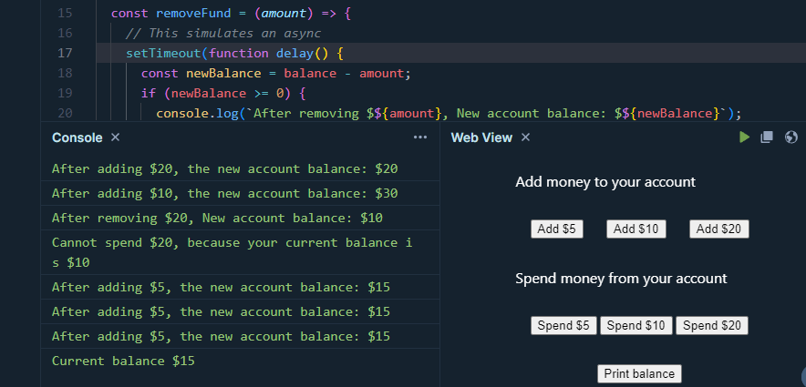
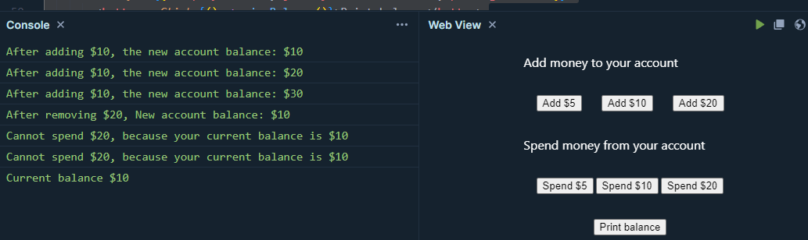

# React Hooks: A Deep Dive into useState, useEffect, and Custom Hooks

React Hooks revolutionized the way we write React components by allowing us to use state and other React features without writing a class. Introduced in React 16.8, hooks like `useState` and `useEffect` have become essential tools for every React developer. In this post, we'll explore these hooks in detail, along with creating our own custom hooks to maximize reusability and maintainability in our applications.

## Handling State and Side Effects Before Hooks

Before hooks were introduced, React relied heavily on class components for managing state and side effects. Understanding how this worked can give us a better appreciation for the simplicity and flexibility that hooks provide.

### State Management in Class Components

In class components, state is managed using the `state` property and the `setState` method. Here's an example:

```jsx {numberLines}
import React, { Component } from 'react';

class Counter extends Component {
  constructor(props) {
    super(props);
    this.state = { count: 0 };
  }

  increment = () => {
    this.setState((prevState) => ({ count: prevState.count + 1 }));
  };

  render() {
    return (
      <div>
        <p>Count: {this.state.count}</p>
        <button onClick={this.increment}>Increment</button>
      </div>
    );
  }
}

export default Counter;
```

In this example, the `Counter` component initializes state in the constructor and uses `this.setState` to update the state. Each state change triggers a re-render of the component.

### Side Effects in Class Components

Side effects in class components are handled using lifecycle methods such as `componentDidMount`, `componentDidUpdate`, and `componentWillUnmount`. Here’s an example of how you might set up a timer in a class component:

```jsx {numberLines}
import React, { Component } from 'react';

class Timer extends Component {
  constructor(props) {
    super(props);
    // Initialize the state with count set to 0
    this.state = { count: 0 };
  }

  componentDidMount() {
    // Set up a timer that increments the count state every second
    this.timer = setInterval(() => {
      this.setState((prevState) => ({ count: prevState.count + 1 }));
    }, 1000);
  }

  componentDidUpdate(prevProps, prevState) {
    // Check if the count has changed and log the new count
    if (this.state.count !== prevState.count) {
      console.log('Count changed:', this.state.count);
    }
  }

  componentWillUnmount() {
    // Clear the timer when the component unmounts to prevent memory leaks
    clearInterval(this.timer);
  }

  render() {
    return (
      <div>
        <p>Count: {this.state.count}</p>
      </div>
    );
  }
}

export default Timer;
```

Here, `componentDidMount` sets up the timer when the component mounts, `componentDidUpdate` logs the count when it changes, and `componentWillUnmount` cleans up the timer when the component unmounts.

#### Explanation of Inefficiencies

1. Unnecessary Updates: The `componentDidUpdate` method checks if `this.state.count` has changed to log the new count. However, this method runs on every update, which can be inefficient if there are other state or prop changes that don't affect count.
2. Component-Based Timer Logic: Using `setInterval` in `componentDidMount` and clearing it in `componentWillUnmount` can be less intuitive and more error-prone, especially as the component grows in complexity. It's generally better to handle side effects like this in a more declarative manner using hooks (in functional components).

### State and Side Effects in Functional Components

Before hooks, functional components were stateless and couldn’t handle side effects directly. They were simple functions that took props and returned JSX. Any state management or side effects had to be handled in parent class components.

```jsx {numberLines}
const Greeting = (props) => {
  return <h1>Hello, {props.name}!</h1>;
};

export default Greeting;
```

## Understanding useState

The `useState` hook is the most fundamental hook in React, enabling us to add state to functional components. It returns an array with two elements: the current state value and a function to update that state.

### Basic Usage

Here's a simple example of how `useState` works:

```jsx {numberLines}
import React, { useState } from 'react';

const Counter = () => {
  // Declare a state variable 'count' and a function 'setCount' to update it
  // Initialize 'count' to 0 using the useState hook
  const [count, setCount] = useState(0);

  // Define a function 'increment' that increments the 'count' state by 1
  const increment = () => setCount(count + 1);

  // Return the JSX to render
  return (
    <div>
      {/* Display the current value of 'count' */}
      <p>Count: {count}</p>
      {/* Render a button that calls 'increment' function when clicked */}
      <button onClick={increment}>Increment</button>
    </div>
  );
};

export default Counter;
```

In this example, `useState(0)` initializes the state variable `count` to `0`. The `setCount` function updates the state, and the component re-renders with the new count value when the button is clicked.

### Using useState with Objects

State can also be an object, which is useful for managing more complex state:

```jsx {numberLines}
import React, { useState } from 'react';

// Define a functional component named UserProfile
const UserProfile = () => {
  // Declare a state variable 'user' and a function 'setUser' to update it
  // Initialize 'user' with an object containing 'name' and 'age' properties
  const [user, setUser] = useState({ name: '', age: 0 });

  // Define a function 'updateName' that updates the 'name' property of 'user'
  const updateName = (name) => setUser({ ...user, name });

  // Define a function 'updateAge' that updates the 'age' property of 'user'
  const updateAge = (age) => setUser({ ...user, age });

  // Return the JSX to render
  return (
    <div>
      {/* Input field for user's name */}
      <input
        type="text"
        value={user.name}
        onChange={(e) => updateName(e.target.value)}
        placeholder="Name"
      />

      {/* Input field for user's age */}
      <input
        type="number"
        value={user.age}
        onChange={(e) => updateAge(parseInt(e.target.value, 10))}
        placeholder="Age"
      />

      {/* Display the user's name and age */}
      <p>
        Name: {user.name}, Age: {user.age}
      </p>
    </div>
  );
};

// Export the UserProfile component as the default export
export default UserProfile;
```

Here, `useState` initializes `user` as an object with `name` and `age` properties. The `updateName` and `updateAge` functions update the respective properties while preserving the other properties using the spread operator.

## Exploring useEffect

The `useEffect` hook allows us to perform side effects in function components. It can be used for tasks like fetching data, directly manipulating the DOM, and setting up subscriptions.

### Basic Usage

Here's an example of `useEffect`:

```jsx {numberLines}
import React, { useState, useEffect } from 'react';

const Timer = () => {
  // Declare a state variable 'count' and a function 'setCount' to update it
  // Initialize 'count' to 0
  const [count, setCount] = useState(0);

  // useEffect hook to handle side effects
  useEffect(() => {
    // Set up an interval that updates 'count' every second (1000 milliseconds)
    const timer = setInterval(() => {
      // Update the 'count' state using the previous state value
      setCount((prevCount) => prevCount + 1);
    }, 1000);

    // Return a cleanup function to clear the interval when the component unmounts
    return () => clearInterval(timer);
  }, []); // The empty dependency array ensures this effect runs only once after the initial render

  // Return the JSX to render
  return <div>Count: {count}</div>;
};

export default Timer;
```

In this example, `useEffect` sets up a timer that increments the `count` state every second. The function passed to `useEffect` runs after the component renders. The cleanup function returned by `useEffect` clears the timer when the component unmounts.

### Dependencies in useEffect

The second argument to `useEffect` is a dependency array. This array tells React when to re-run the effect:

```jsx {numberLines}
useEffect(() => {
  console.log('Count changed:', count);
}, [count]);
```

Here, the effect runs only when `count` changes. If the dependency array is empty (`[]`), the effect runs only once after the initial render.

## Creating Custom Hooks

Custom hooks let us encapsulate logic that we want to reuse across multiple components. A custom hook is simply a JavaScript function whose name starts with `use` and that can call other hooks.

### Example: useLocalStorage

Let's create a custom hook called `useLocalStorage` to manage state that syncs with `localStorage`:

```jsx {numberLines}
import { useState, useEffect } from 'react';

const useLocalStorage = (key, initialValue) => {
  // State value stored in localStorage
  const [value, setValue] = useState(() => {
    // Retrieve stored value from localStorage based on key
    const storedValue = localStorage.getItem(key);
    // Parse JSON stored value or use initialValue if no stored value
    return storedValue ? JSON.parse(storedValue) : initialValue;
  });

  // useEffect hook to update localStorage whenever value or key changes
  useEffect(() => {
    // Stringify value and store it in localStorage under specified key
    localStorage.setItem(key, JSON.stringify(value));
    // useEffect dependencies include key and value to trigger update
  }, [key, value]);

  // Return value state and setValue function to update it
  return [value, setValue];
};

export default useLocalStorage;
```

### Using useLocalStorage

Here's how you can use the `useLocalStorage` hook:

```jsx {numberLines}
import React from 'react';
import useLocalStorage from './useLocalStorage';

const Settings = () => {
  const [username, setUsername] = useLocalStorage('username', '');

  return (
    <div>
      <input
        type="text"
        value={username}
        onChange={(e) => setUsername(e.target.value)}
        placeholder="Username"
      />
      <p>Stored Username: {username}</p>
    </div>
  );
};

export default Settings;
```

This example demonstrates a form where the username input is synced with `localStorage`. The `useLocalStorage` hook manages the state and handles the side effect of updating `localStorage`.

## Optimizing React Hooks

Optimizing hooks involves several strategies to ensure that your components run efficiently and avoid unnecessary re-renders.

### Memoization

Use `useMemo` to memoize expensive calculations and `useCallback` to memoize functions, preventing unnecessary re-creations on every render.

```jsx {numberLines}
import React, { useState, useMemo, useCallback } from 'react';

function ExpensiveComponent({ data }) {
  const [count, setCount] = useState(0);

  const expensiveCalculation = useMemo(() => {
    return data.reduce((acc, value) => acc + value, 0);
  }, [data]);

  const handleClick = useCallback(() => {
    setCount(count + 1);
  }, [count]);

  return (
    <div>
      <p>Sum: {expensiveCalculation}</p>
      <button onClick={handleClick}>Increment</button>
    </div>
  );
}
```

### Dependency Arrays

Always specify dependency arrays in `useEffect`, `useCallback`, and `useMemo` to control when your side effects or memoizations should be re-executed. Omitting dependencies can lead to performance issues or incorrect behavior.

```jsx {numberLines}
useEffect(() => {
  // Your effect logic
}, [dependency1, dependency2]);
```

## Gotchas with Hooks

### Infinite Loops

Be cautious with dependency arrays in `useEffect` to avoid infinite loops. Ensure that you correctly manage dependencies and avoid unnecessary updates.

```jsx {numberLines}
useEffect(() => {
  const interval = setInterval(() => {
    setSeconds(s => s + 1);
  }, 1000);
  
  return () => clearInterval(interval);
}, []); // Empty array to run only once
```

Here inside the `useEffect` callback function, an interval is set up using `setInterval` to update the state variable seconds every 1000 milliseconds (1 second). However, the component enters an infinite loop where the `useEffect` runs once, sets up the interval that updates `seconds` every second, but the `seconds` state actually never changes because the interval callback always references the initial state (`0`). This causes the effect to continuously execute the `setSeconds` function, creating an infinite loop of state updates.

### Stale Closures

When using state within a function inside `useEffect` or event handlers, be aware of stale closures, which can lead to unexpected behavior. Let's consider a game of earning and spending money:

```jsx {numberLines}
import React, { useState } from 'react';

export function App(props) {
  const [balance, setBalance] = useState(0);

  const addFund = (amount) => {
    // This simulates an async
    setTimeout(function delay() {
      const newBalance = balance + amount;
      console.log(`After adding $${amount}, the new account balance: $${newBalance}`);
      setBalance(newBalance);
    }, 1000);
  };

  const removeFund = (amount) => {
    // This simulates an async
    setTimeout(function delay() {
      const newBalance = balance - amount;
      if (newBalance >= 0) {
        console.log(`After removing $${amount}, New account balance: $${newBalance}`);
        setBalance(newBalance);
      } else {
        console.log(`Cannot spend $${amount}, because your current balance is $${balance}`);
      }
    }, 1000);
  };

  const viewBalance = () => console.log(`Current balance $${balance}`);

  return (
    <div>
      <p style={{ color: 'white' }}>Add money to your account</p>
      <div style={{ display: 'flex', justifyContent: 'space-between', padding: '1rem', width: '15rem' }}>
        <button onClick={() => addFund(5)}>Add $5</button>
        <button onClick={() => addFund(10)}>Add $10</button>
        <button onClick={() => addFund(20)}>Add $20</button>
      </div>
      <p style={{ color: 'white' }}>Spend money from your account</p>
      <div style={{ display: 'flex', justifyContent: 'space-between', padding: '1rem', width: '15rem' }}>
        <button onClick={() => removeFund(5)}>Spend $5</button>
        <button onClick={() => removeFund(10)}>Spend $10</button>
        <button onClick={() => removeFund(20)}>Spend $20</button>
      </div>
      <div style={{ display: 'flex', justifyContent: 'center', padding: '1rem' }}>
        <button onClick={() => viewBalance()}>Print balance</button>
      </div>
    </div>
  );
}
```

Clicking `Add` or `Spend` adds or removes funds from your account after a 1 second delay. Everything works as expected, until you try to add or spend money rapidly. The value of `balance` does not update as expected.



This is because, on each click `setTimeout(delay, 1000)` schedules the execution of `delay()` after `1` second. `delay()` captures the variable `balance` as being the value when it was scheduled. Since `setBalance()` are executed asynchronously, the value of `balance` is bound within the closure of when it was scheduled, not when it is executed.

To fix the problem, let's use a functional way `setBalance(balance => balance + amount)` to update count state:

```jsx {numberLines}
import React, { useState } from 'react';

export function App(props) {
  const [balance, setBalance] = useState(0);

  const addFund = (amount) => {
    // This simulates an async
    setTimeout(function delay() {
      setBalance(balance => {
        const newBalance = balance + amount;
        console.log(`After adding $${amount}, the new account balance: $${newBalance}`);
        return newBalance;
      });
    }, 1000);
  };

  const removeFund = (amount) => {
    // This simulates an async
    setTimeout(function delay() {
      setBalance(balance => {
        const newBalance = balance - amount;
        if (newBalance >= 0) {
          console.log(`After removing $${amount}, New account balance: $${newBalance}`);
          return newBalance;
        } else {
          console.log(`Cannot spend $${amount}, because your current balance is $${balance}`);
          return balance;
        }
      });
    }, 1000);
  };

  const viewBalance = () => console.log(`Current balance $${balance}`);

  return (
    <div>
      <p style={{ color: 'white' }}>Add money to your account</p>
      <div style={{ display: 'flex', justifyContent: 'space-between', padding: '1rem', width: '15rem' }}>
        <button onClick={() => addFund(5)}>Add $5</button>
        <button onClick={() => addFund(10)}>Add $10</button>
        <button onClick={() => addFund(20)}>Add $20</button>
      </div>
      <p style={{ color: 'white' }}>Spend money from your account</p>
      <div style={{ display: 'flex', justifyContent: 'space-between', padding: '1rem', width: '15rem' }}>
        <button onClick={() => removeFund(5)}>Spend $5</button>
        <button onClick={() => removeFund(10)}>Spend $10</button>
        <button onClick={() => removeFund(20)}>Spend $20</button>
      </div>
      <div style={{ display: 'flex', justifyContent: 'center', padding: '1rem' }}>
        <button onClick={() => viewBalance()}>Print balance</button>
      </div>
    </div>
  );
}
```

This time adding and removing funds properly when performed in rapid successions.



When a callback that returns the new state based on the previous one is supplied to the state update function, React makes sure that the latest state value is supplied as an argument to that callback:

```javascript
setCount(alwaysActualStateValue => newStateValue);
```

### Performance Issues

Improper use of hooks can lead to performance issues. Always be mindful of how often effects are triggered and optimize accordingly using memoization and proper dependency management.

## Conclusion

React hooks like `useState` and `useEffect` have transformed how we write functional components by making state management and side effects more intuitive and less verbose. Custom hooks further enhance code reuse and maintainability by encapsulating common logic. As you continue your journey with React, mastering these hooks will significantly boost your productivity and the quality of your applications.

For further reading and more advanced use cases, check out the [official React documentation on hooks](https://reactjs.org/docs/hooks-intro.html) and explore other hooks such as `useContext`, `useReducer`, and `useMemo`.

Happy coding!
