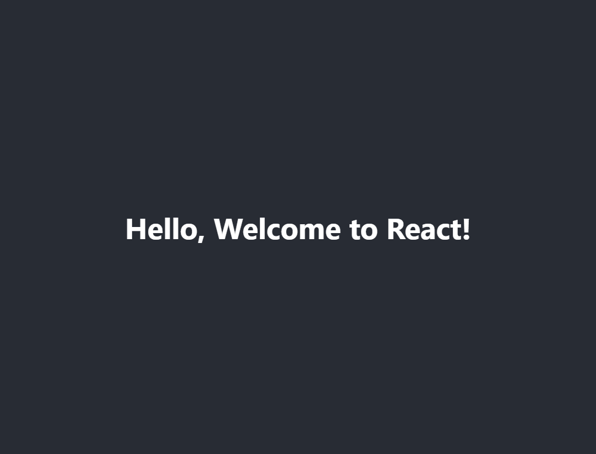
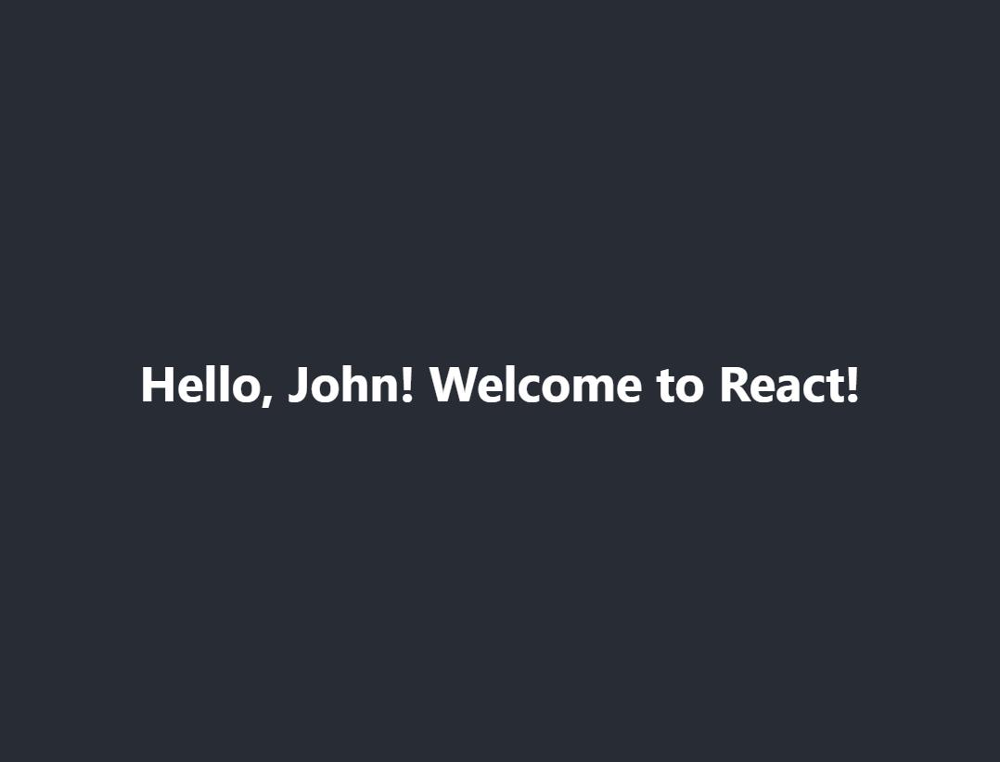
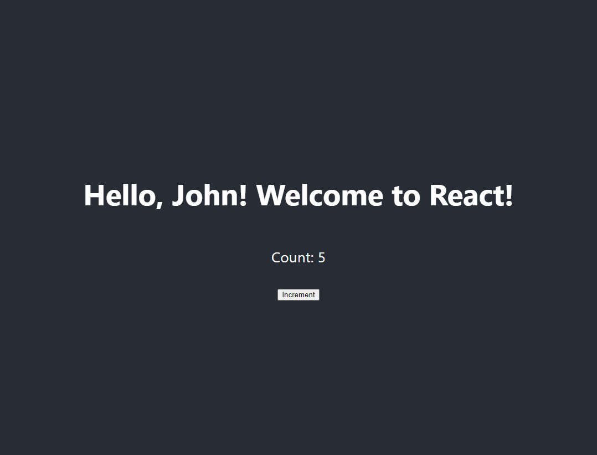

# Introduction to React: Building your first React component

React, is a powerful JavaScript library for building user interfaces. It is renowned for its efficiency and flexibility. One of the foundational concepts of React is components, which are reusable pieces of code that represent a part of the UI. In this article, we'll walk you through building your first React component, step-by-step.

## What is a React Component?

A React component is a small, reusable piece of code that returns a React element to be rendered to the page. Components can be thought of as custom, self-contained HTML elements that can accept inputs (props) and manage their own state.

Components come in two types:

1. **Functional Components**: These are simple functions that accept props and return React elements.
2. **Class Components**: These are ES6 classes that extend `React.Component` and have more capabilities like managing state and lifecycle methods.

## Setting Up Your React Environment

Before creating your first component, ensure you have a React environment set up. If you haven't already, you can set up a new React project using Create React App.

1. **Install Node.js and npm**: React and Create React App require Node.js and npm. You can download and install them from [nodejs.org](https://nodejs.org/).

2. **Create a New React App**

```shell {numberLines}
npx create-react-app my-first-react-app
cd my-first-react-app
npm start
```

This command sets up a new React project and starts the development server. Your default browser should open at `http://localhost:3000`, displaying a welcome message.

## Creating Your First React Component

Let's create a simple React component that displays a greeting message.

### Step 1: Functional Component

First, we'll create a functional component. Open the `src` directory and create a new file named `Greeting.js`.

```javascript {numberLines}
// src/Greeting.js
import React from 'react';

function Greeting() {
  return <h1>Hello, Welcome to React!</h1>;
}

export default Greeting;
```

In this file, we've defined a functional component named `Greeting` that returns a simple greeting message.

### Step 2: Using the Component

Next, let's use this `Greeting` component in our main `App` component. Open `src/App.js` and modify it as follows:

```javascript {numberLines}
// src/App.js
import React from 'react';
import './App.css';
import Greeting from './Greeting';

function App() {
  return (
    <div className="App">
      <header className="App-header">
        <Greeting />
      </header>
    </div>
  );
}

export default App;
```

In this code, we've imported the `Greeting` component and used it within the `App` component's JSX. When you save the file, the browser should automatically refresh, displaying the greeting message.



## Adding Props to the Component

Props are inputs to a React component. They allow you to pass data from a parent component to a child component. Let's modify our `Greeting` component to accept a `name` prop and display a personalized greeting.

### Step 1: Update the Component

Update the `Greeting` component to accept and use props:

```javascript {numberLines}
// src/Greeting.js
import React from 'react';

function Greeting(props) {
  return <h1>Hello, {props.name}! Welcome to React!</h1>;
}

export default Greeting;
```

### Step 2: Pass Props

Now, pass a `name` prop to the `Greeting` component in `App.js`:

```javascript {numberLines}
// src/App.js
import React from 'react';
import './App.css';
import Greeting from './Greeting';

function App() {
  return (
    <div className="App">
      <header className="App-header">
        <Greeting name="John" />
      </header>
    </div>
  );
}

export default App;
```

With these changes, the greeting message should now include the name "John".



## Class Components and State

Let's create a class component and use state to manage the data. We'll create a `Counter` component that increments a count when a button is clicked.

### Step 1: Create the Class Component

Create a new file named `Counter.js` in the `src` directory:

```javascript {numberLines}
// src/Counter.js
import React, { Component } from 'react';

class Counter extends Component {
  constructor(props) {
    super(props);
    this.state = { count: 0 };
  }

  increment = () => {
    this.setState({ count: this.state.count + 1 });
  };

  render() {
    return (
      <div>
        <p>Count: {this.state.count}</p>
        <button onClick={this.increment}>Increment</button>
      </div>
    );
  }
}

export default Counter;
```

In this code, we've defined a `Counter` class component with a state property `count` and a method `increment` to update the count.

### Step 2: Use the Class Component

Import and use the `Counter` component in `App.js`:

```javascript {numberLines}
// src/App.js
import React from 'react';
import './App.css';
import Greeting from './Greeting';
import Counter from './Counter';

function App() {
  return (
    <div className="App">
      <header className="App-header">
        <Greeting name="John" />
        <Counter />
      </header>
    </div>
  );
}

export default App;
```

When you save the file and view the application, you should see the counter and the button. Clicking the button will increment the count.



## Conclusion

In this article, we covered the basics of building your first React component. We started with a simple functional component, added props for customization, and then created a class component with state management. Understanding these fundamental concepts is crucial as they form the foundation for building more complex and dynamic user interfaces with React.

## Additional Resources

To further explore React and enhance your skills, consider checking out these resources:

- [Official React Documentation](https://reactjs.org/docs/getting-started.html): The official React documentation is a comprehensive resource for learning React.
- [React Components](https://reactjs.org/docs/components-and-props.html): Learn more about React components and props.
- [State and Lifecycle](https://reactjs.org/docs/state-and-lifecycle.html): Understand state management and lifecycle methods in React.
- [React Hooks](https://reactjs.org/docs/hooks-intro.html): Learn about using hooks to manage state and side effects in functional components.

By experimenting with different components and exploring these resources, you'll gain a deeper understanding of React and become proficient in building dynamic, responsive UIs. Happy coding!
