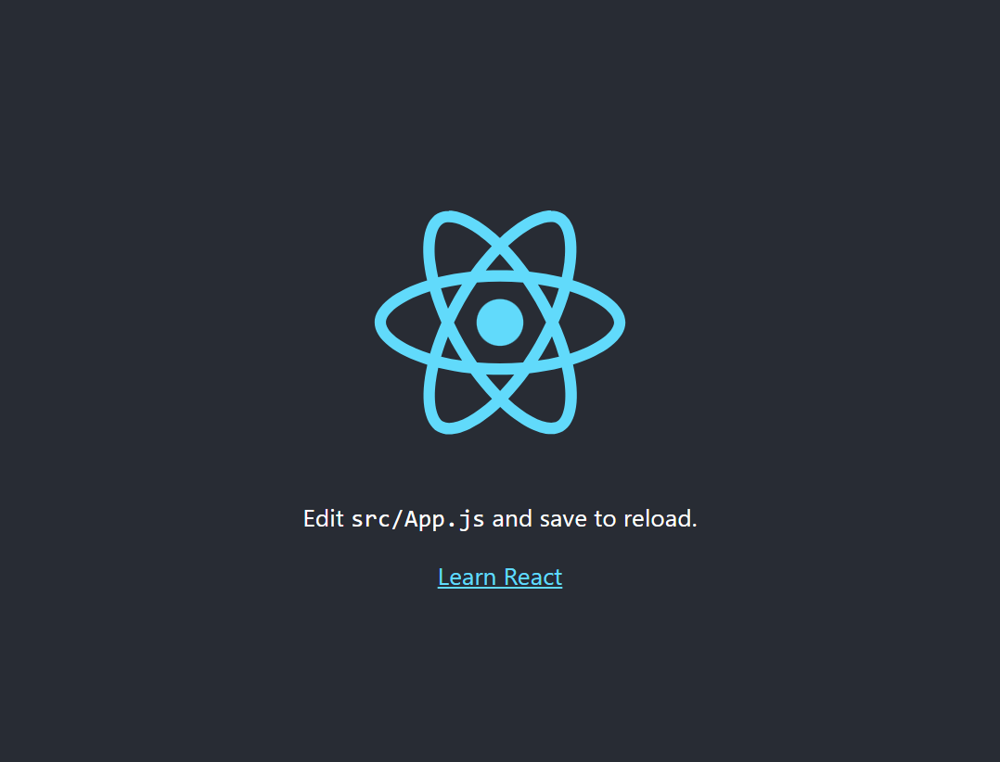
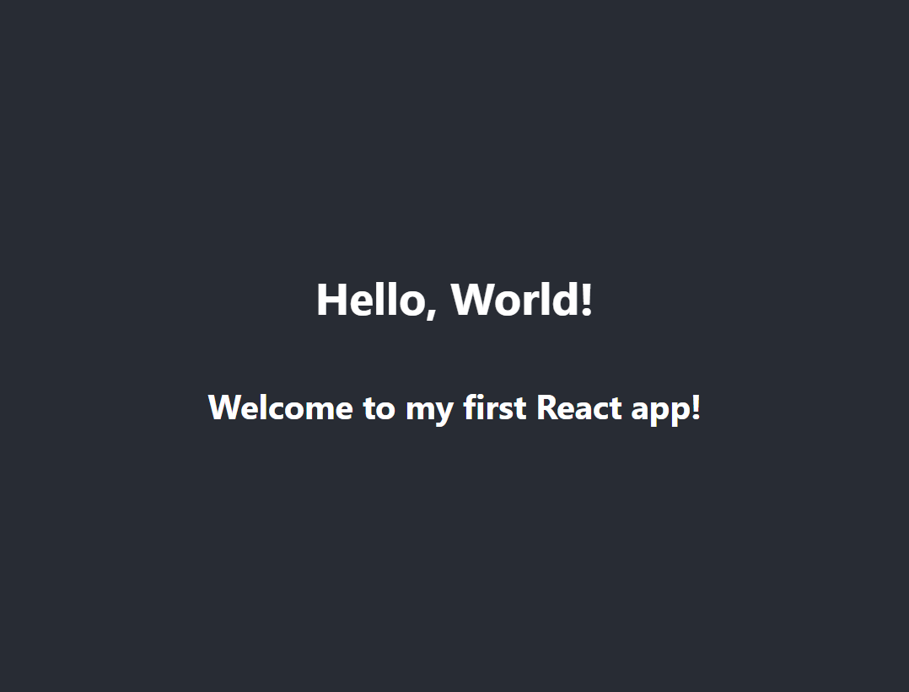

# Introduction to React: Setting Up Your First React Project

Creating a new React project can seem challenging, especially if you're new to the framework. However, with the help of `Create React App`, the process is streamlined and straightforward. In this article, we'll guide you through setting up your first React project, understanding the basic folder structure, and creating a simple React component.

## Prerequisites

Before we begin, make sure you have the following installed on your machine:

- **Node.js**: Ensure you have Node.js installed. You can download it from the [official website](https://nodejs.org/).
- **npm** or **Yarn**: Both npm (bundled with Node.js) and Yarn are package managers. You can choose either for managing your dependencies.

## Step 1: Installing Create React App

Create React App is an officially supported way to create single-page React applications. It offers a modern build setup with no configuration. To install Create React App, open your terminal and run:

```bash
npx create-react-app my-first-react-app
```

This command will create a new directory called `my-first-react-app` with all the necessary files and dependencies installed.

## Step 2: Running Your React Application

Navigate into your new project directory and start the development server:

```bash
cd my-first-react-app
npm start
```

This will start the development server, and you should see something like this:

```bash
Compiled successfully!

You can now view my-first-react-app in the browser.

  Local:            http://localhost:3000
  On Your Network:  http://192.168.1.10:3000
```

Open your browser and go to `http://localhost:3000`. You should see the default Create React App welcome screen.



## Step 3: Understanding the Folder Structure

Let's take a look at the basic folder structure generated by Create React App:

```bash
my-first-react-app
├── README.md
├── node_modules
├── package.json
├── public
│   ├── favicon.ico
│   ├── index.html
|   ├── logo192.png
|   ├── logo512.png
│   ├── manifest.json
│   └── robots.txt
└── src
    ├── App.css
    ├── App.js
    ├── App.test.js
    ├── index.css
    ├── index.js
    ├── logo.svg
    ├── reportWebVitals.js
    └── setupTests.js
```

### Key Files and Folders

- **`public` folder**: Contains static files like `index.html`, which is the main HTML file for your React app.
- **`src` folder**: Contains the source code for your React application.
  - **`index.js`**: The entry point of the application. This is where the React app is attached to the DOM.
  - **`App.js`**: The main App component. This is where you'll start building your React components.
  - **`App.css`**: The CSS file for styling your App component.

## Step 4: Creating Your First React Component

React components are the building blocks of any React application. Let's create a simple component to display "Hello, World!".

### Open `App.js` and replace its content with the following code

```javascript
import React from 'react';
import './App.css';

function App() {
  return (
    <div className="App">
      <header className="App-header">
        <h1>Hello, World!</h1>
      </header>
    </div>
  );
}

export default App;
```

### Open `App.css` and add some basic styling

```css
.App {
  text-align: center;
}

.App-header {
  background-color: #282c34;
  min-height: 100vh;
  display: flex;
  flex-direction: column;
  align-items: center;
  justify-content: center;
  font-size: calc(10px + 2vmin);
  color: white;
}
```

Save your changes and go back to your browser. You should see a styled "Hello, World!" message.


## Step 5: Adding More Components

Let's add another component to understand how components work together in React. Create a new file in the `src` folder named `Greeting.js` and add the following code:

```javascript
import React from 'react';

function Greeting(props) {
  return (
    <div>
      <h2>{props.message}</h2>
    </div>
  );
}

export default Greeting;
```

In this example, the `Greeting` component accepts a `message` prop and displays it inside an `h2` tag.

Now, modify the `App.js` file to use the `Greeting` component:

```javascript
import React from 'react';
import './App.css';
import Greeting from './Greeting';

function App() {
  return (
    <div className="App">
      <header className="App-header">
        <h1>Hello, World!</h1>
        <Greeting message="Welcome to my first React app!" />
      </header>
    </div>
  );
}

export default App;
```

Save the changes and check your browser. You should now see both the "Hello, World!" message and the "Welcome to my first React app!" message.



## Additional Resources

To further personalize and enhance your React knowledge, check out the following resources:

- [Official React Documentation](https://reactjs.org/docs/getting-started.html): The official documentation is a comprehensive resource for learning React.
- [Create React App Documentation](https://create-react-app.dev/docs/getting-started/): Detailed documentation on Create React App.
- [React Tutorial: An Introduction to React](https://reactjs.org/tutorial/tutorial.html): A hands-on tutorial to help you learn the basics of React.
- [MDN Web Docs: React](https://developer.mozilla.org/en-US/docs/Web/JavaScript/Frameworks/React): A well-rounded overview of React on MDN Web Docs.
- [React by Example](https://reactbyexample.github.io/): Practical examples and tutorials for learning React.

## Conclusion

Setting up your first React project with Create React App is a breeze, thanks to its streamlined setup process. Understanding the folder structure and learning how to create and use components are essential steps in your React journey. With this foundation, you're well on your way to building dynamic and interactive web applications using React. Happy coding!
