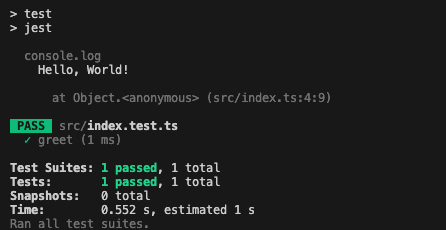

# Setting Up Your TypeScript Environment: Tools and Best Practices

Setting up a TypeScript environment involves choosing the right tools and following best practices to ensure a smooth development experience. This guide will walk you through the essential tools and best practices for setting up and maintaining a TypeScript project.

## Essential Tools for TypeScript Development

### TypeScript Compiler (tsc)

The TypeScript compiler, `tsc`, is the core tool for compiling TypeScript code to JavaScript. You can install it via npm:

```bash
npm install -g typescript
```

Use `tsc --init` to create a `tsconfig.json` file, which allows you to configure the compiler options.

### Code Editor

- **Visual Studio Code**: VS Code is a popular choice for TypeScript development, offering excellent TypeScript support out of the box, including IntelliSense and debugging capabilities.
- **WebStorm**: Another powerful IDE with great TypeScript support.

### Linters and Formatters

- **ESLint**: Use ESLint to ensure your code follows consistent style and quality standards. Install ESLint and the TypeScript plugin:

```bash
npm install eslint @typescript-eslint/parser @typescript-eslint/eslint-plugin --save-dev
```

- **Prettier**: Prettier is a code formatter that helps maintain consistent code style. You can integrate it with ESLint for seamless code formatting. Prettier can be installed using several package managers, including `npm` and `yarn`.

```bash
npm install --save-dev --save-exact prettier
```

Additional instructions about Prettier installing can be found <a href="https://prettier.io/docs/en/install" target="_blank">here</a>.

### Build Tools

- **Webpack**: Webpack is a powerful module bundler that can be configured to handle TypeScript files. Use the `ts-loader` to integrate TypeScript with Webpack.
- **Babel**: Babel can be used alongside TypeScript to transpile modern JavaScript features. Use the `@babel/preset-typescript` preset to enable TypeScript support.

### Testing Frameworks


- **Jest**: Jest is a popular testing framework that works well with TypeScript. Install the necessary packages:

```bash
npm install jest ts-jest @types/jest --save-dev
```

- **Cypress**: For end-to-end testing, Cypress offers excellent TypeScript support. Install the TypeScript definitions for Cypress:

```bash
npm install @types/cypress --save-dev
```

## Starter Code Example

Let's create a simple TypeScript project to demonstrate how to set up your environment and compile TypeScript code.

### Write TypeScript Code

Create a new TypeScript file, `src/index.ts`:

```javascript {numberLines}
export function greet(name: string): string {
  return `Hello, ${name}!`;
}

console.log(greet("World"));
```

### Update `tsconfig.json`

Set the destination directory to `dist`.

```json {numberLines 3}
{
  "compilerOptions": {
    "outDir": "./dist"
  }
}
```

### Compile TypeScript Code

Compile your TypeScript code to JavaScript:

```bash
npx tsc
```

This will generate a `dist` folder (or `outDir` specified in `tsconfig.json`) with the compiled JavaScript files.

### Run Compiled Code

Execute the compiled JavaScript file using Node.js:

```bash
node dist/index.js
```

## Testing the code

### Setup Jest

Run the following in your terminal:

```bash {outputLines: 1}
npx ts-jest config:init
```

This will create a basic Jest configuration file (`jest.config.js`) which will inform Jest about how to handle `.ts` files correctly.

You can also use `jest --init` command, to have more options related to Jest. However, anser `no` to the Jest question about whether or not to enable TypeScript. Instead, add the line: `preset: "ts-jest"` to the `jest.config.ts` file afterwards.

### Add a test

In your `./src` directory create the file `index.test.ts` and add the following source:

```javascript {numberLines}
import { greet } from "./index";

test("greet", () => {
  expect(greet("World")).toBe("Hello, World!");
});
```

### Update `package.json`

Update `package.json` to add a test script:

```json {numberLines}
{
  "scripts": {
    "test": "jest"
  }
}
```

### Run  test

Execute the test by running the following command in your terminal:

```bash
npm test
```

You should see something like the following as an output:



## Best Practices for TypeScript Projects

### Use Strict Mode

- Enable strict mode in your `tsconfig.json` to enforce strict type checking and catch potential errors early:

```json {numberLines 3}
{
  "compilerOptions": {
    "strict": true
  }
}
```

### Organize Your Code

Follow a consistent project structure to organize your code. Separate your code into modules and use meaningful file and folder names.

### Type Definitions

Use TypeScript's type definition files (`.d.ts`) to define types for external libraries and modules that do not have built-in type definitions.

### Avoid Any

Minimize the use of the `any` type to maintain type safety. Use more specific types whenever possible.

### Leverage Modern JavaScript Features

Take advantage of modern JavaScript features such as async/await, destructuring, and template literals to write clean and concise code.

### Consistent Code Style

Use tools like ESLint and Prettier to enforce consistent code style and formatting across your project.

## Conclusion

Setting up a TypeScript environment with the right tools and following best practices can significantly improve your development workflow. By leveraging TypeScript's powerful features and maintaining a well-organized codebase, you can build robust and scalable applications with ease.
