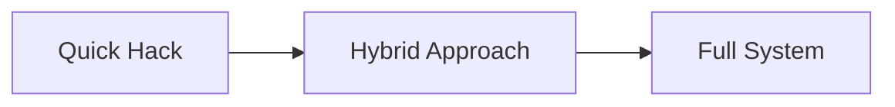

# Chapter 1: Introduction — Why Feedback Matters

Before we dive into prototypes and code, let’s set the stage.
Every blog, technical article, or app feature benefits from feedback loops. Without them, you’re publishing in a vacuum—you don’t know whether your content helped, confused, or even frustrated your readers.

In this chapter we will:

* Explore **why feedback matters** for blogs and apps.
* Compare **quick hacks** vs. **full feedback systems**.
* Identify **types of feedback** and when to use them.
* Prepare your mindset for the *prototype → product* journey.

## 1.1 Why Feedback Matters

Feedback is the bridge between **what you think you delivered** and **what your audience actually received**.

Benefits:

* **Improves content quality**: Spot unclear sections or common questions.
* **Engages readers**: Creates a two-way conversation.
* **Guides growth**: Shows which posts or features resonate most.
* **Builds trust**: Readers see that you value their opinions.

Without feedback, it’s guesswork. With feedback, you’re iterating on real signals.

## 1.2 Quick Hacks vs. Full Systems

When adding feedback, developers often face a spectrum:

**Quick Hack:**

* A single “Was this helpful?” button.
* Uses Airtable, Google Forms, or a similar no-code tool.
* Fast to launch, zero backend code.

**Hybrid Approach:**

* Combines quick votes with a discussion system (Giscus/Disqus).
* More engagement, still relatively low setup.

**Full System:**

* Custom API, database, analytics, moderation tools.
* Takes time to build, but scalable and integrated with your stack.

This series will guide you through this evolution step by step.

## 1.3 Types of Feedback

1. **Binary votes** — “Helpful/Not Helpful,” “Yes/No.”
   * Low friction, good for quick validation.
2. **Ratings** — Star ratings or 1–5 scales.
   * More granularity, but higher friction.
3. **Open comments** — Full discussions, like Giscus or Disqus.
   * Rich insights, but harder to moderate.
4. **Analytics** — Behind-the-scenes feedback via dashboards, clicks, dwell time.
   * Indirect, but scales automatically.

We’ll explore all of these in the series.

## 1.4 Learn → Build → Grow Mindset

Each chapter will follow this rhythm:

* **Learn**: Understand the concept.
* **Build**: Prototype with no-code or minimal code.
* **Grow**: Expand into scalable, production-ready features.

By the end, you’ll not only have **working prototypes** but also the knowledge to build a **custom full-stack feedback system**.

## 1.5 Case Study Example

Imagine you publish a tutorial on your blog. Readers see it, but you don’t know if it helped. You add:

* A quick Airtable “Was this helpful?” button → now you get votes.
* A Giscus thread → now you get detailed comments.
* Later, a custom backend → now you can track trends, send notifications, and even run sentiment analysis on comments.

This layered approach mirrors real-world product evolution: start small, grow with needs.

## 1.6 Summary

In this chapter, we:

* Learned **why feedback is crucial** for blogs and apps.
* Compared **quick hacks** with **full-stack systems**.
* Reviewed **types of feedback** you’ll encounter.
* Set the **Learn → Build → Grow** structure for the series.

## 1.7 Exercise

Audit your own blog or app:

* List **3 areas** where feedback would be valuable.
* Identify what type of feedback fits each (vote, rating, comment, analytics).
* Decide whether you’d start with a quick hack or plan for a full system.

## 1.7 Next Step

In the next chapter, we’ll get hands-on with **Airtable prototyping**:

* Create a simple “Was this helpful?” button.
* Store results in Airtable.
* Embed the feedback form directly into your blog.