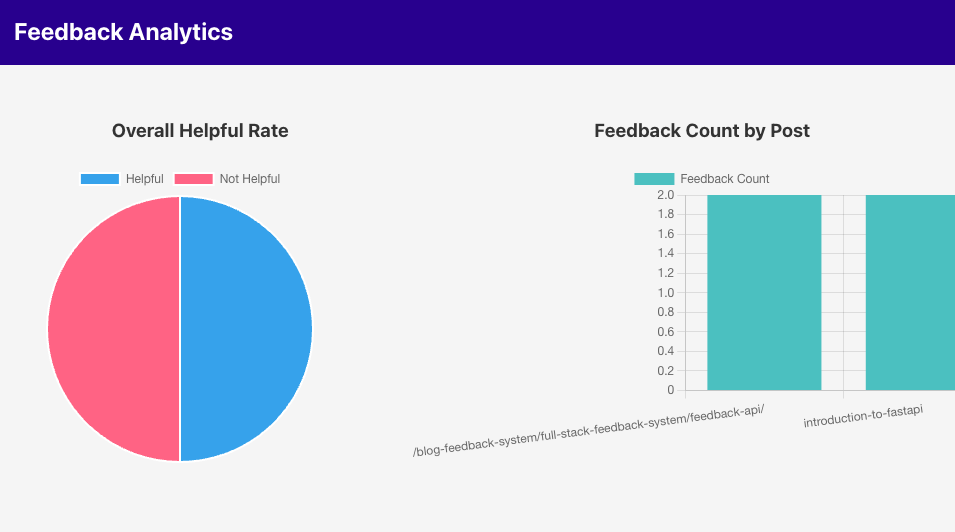

# Chapter 6: Scaling the Feedback System — Analytics

Collecting feedback is only the first step. To make it actionable, you need **analytics**:

* How many readers voted “helpful” vs. “not helpful”?
* Which posts get the most engagement?
* How are comments trending over time?

In this chapter, we’ll:

* Learn the importance of analytics in feedback systems.
* Build analytics endpoints in **FastAPI** and **NestJS**.
* Grow with a simple **React dashboard** using Chart.js.

## 6.1 Why Analytics?

Analytics transforms raw feedback into **insights**:

* **Quantitative**: % of readers who found content useful.
* **Comparative**: Which posts perform better?
* **Temporal**: Are votes/comments increasing or declining over time?

Without analytics, feedback stays as isolated records. With analytics, you get **signals you can act on** (improving posts, planning new topics, identifying pain points).

## 6.2 Analytics API Endpoints

### FastAPI — Aggregated Stats

```python
"""
@file: app/analytics.py
@showLineNumbers
@copy
"""
from fastapi import APIRouter, Depends
from sqlalchemy.orm import Session
from sqlalchemy import func
from app.main import get_db
from app.models import Feedback

router = APIRouter()

@router.get("/analytics/summary")
def analytics_summary(db: Session = Depends(get_db)):
    total = db.query(func.count(Feedback.id)).scalar()
    helpful = db.query(func.count(Feedback.id)).filter(Feedback.helpful == True).scalar()
    not_helpful = db.query(func.count(Feedback.id)).filter(Feedback.helpful == False).scalar()
    return {
        "total": total,
        "helpful": helpful,
        "not_helpful": not_helpful,
        "helpful_rate": (helpful / total * 100) if total else 0
    }

@router.get("/analytics/by_post")
def analytics_by_post(db: Session = Depends(get_db)):
    results = (
        db.query(Feedback.post_slug, func.count(Feedback.id).label("count"))
        .group_by(Feedback.post_slug)
        .all()
    )
    return [{"post_slug": slug, "count": count} for slug, count in results]
```

Register in `app/main.py`:

```python
from app import analytics
# ...
app.include_router(analytics.router)
```

### NestJS — Aggregated Stats

```ts
/**
 * @file: src/feedback/feedback.analytics.controller.ts
 * @showLineNumbers
 */
import { Controller, Get } from '@nestjs/common';
import { InjectRepository } from '@nestjs/typeorm';
import { Repository } from 'typeorm';
import { Feedback } from './feedback.entity';

@Controller('analytics')
export class FeedbackAnalyticsController {
  constructor(
    @InjectRepository(Feedback)
    private repo: Repository<Feedback>,
  ) {}

  @Get('summary')
  async getSummary() {
    const total = await this.repo.count();
    const helpful = await this.repo.count({ where: { helpful: true } });
    const notHelpful = await this.repo.count({ where: { helpful: false } });
    return {
      total,
      helpful,
      notHelpful,
      helpfulRate: total ? (helpful / total) * 100 : 0,
    };
  }

  @Get('by_post')
  async getByPost() {
    const rows = await this.repo
      .createQueryBuilder('f')
      .select('f.postSlug', 'postSlug')
      .addSelect('COUNT(f.id)', 'count')
      .groupBy('f.postSlug')
      .getRawMany();
    return rows;
  }
}
```

Register in `FeedbackModule`:

```ts
import { FeedbackAnalyticsController } from './feedback.analytics.controller';

@Module({
  controllers: [FeedbackController, FeedbackAnalyticsController],
  // ...
})
export class FeedbackModule {}
```

## 6.3 React Analytics Dashboard

We’ll consume the `/analytics` API endpoints and display charts.

We are going to setup a new analytics dashboard application. We're going to setup a new React application using <a href="https://vite.dev/" target="_blank">Vite</a>. Follow the instuctions on the site to create a React + TypeScript application with the name `feedback-ui`.

Once the application is created, add the following component:

```tsx
/**
 * @file: src/components/AnalyticsDashboard.tsx
 * @showLineNumbers
 */
import React, { useEffect, useState } from 'react';
import { Bar, Pie } from 'react-chartjs-2';
import {
  Chart as ChartJS,
  Title,
  Tooltip,
  Legend,
  ArcElement,
  BarElement,
  CategoryScale,
  LinearScale,
} from 'chart.js';

ChartJS.register(Title, Tooltip, Legend, ArcElement, BarElement, CategoryScale, LinearScale);

export const AnalyticsDashboard: React.FC<{ apiUrl: string }> = ({ apiUrl }) => {
  const [summary, setSummary] = useState<any>(null);
  const [byPost, setByPost] = useState<any[]>([]);

  useEffect(() => {
    fetch(`${apiUrl}/analytics/summary`).then(res => res.json()).then(setSummary);
    fetch(`${apiUrl}/analytics/by_post`).then(res => res.json()).then(setByPost);
  }, [apiUrl]);

  if (!summary) return <p>Loading analytics...</p>;

  return (
    <div>
      <h2>Feedback Analytics</h2>

      <h3>Overall Helpful Rate</h3>
      <Pie
        data={{
          labels: ['Helpful', 'Not Helpful'],
          datasets: [
            {
              data: [summary.helpful, summary.not_helpful],
              backgroundColor: ['#36A2EB', '#FF6384'],
            },
          ],
        }}
      />

      <h3>Feedback Count by Post</h3>
      <Bar
        data={{
          labels: byPost.map(r => r.post_slug || r.postSlug),
          datasets: [
            {
              label: 'Feedback Count',
              data: byPost.map(r => r.count),
              backgroundColor: '#4BC0C0',
            },
          ],
        }}
      />
    </div>
  );
};
```

This component loads data from `/analytics/summary`, and `/analytics/by_post` routes, and saves them in the `summary` and `byPost` states respectively. The values within the states are then displayed as a pie chart and a bar chart.

To use the analytics dashboard component, go to you `App.tsx` module, and update the application component with the following:

```tsx
/** Components */
import { AnalyticsDashboard } from './components/AnalyticsDashboard';

// ...

function App() {
  return <AnalyticsDashboard apiUrl="http://127.0.0.1:8000" />
}
```

This will render the data pulled in from the backend API.

The following is a demonstration of the analytics dashboard. **Note:** additional styles have been added to the components to make it more useful.



## 6.4 Case Study Example

Imagine you’ve published **10 blog posts**:

* Analytics shows **80% helpful rate** on Python tutorials.
* Analytics shows **40% helpful rate** on an older article.

Now you know where to focus edits, SEO improvements, or additional clarifications.

## 6.5 Summary

In this chapter, you:

* Added **analytics endpoints** in both FastAPI and NestJS.
* Built a **React dashboard** using `Chart.js`.
* Learned how analytics can turn raw feedback into **actionable insights**.

## 6.6 Exercise

1. Extend your backend API with `/analytics/summary` and `/analytics/by_post`.
2. Build the **AnalyticsDashboard** component in `Gatsby`.
3. Submit test feedback and confirm charts update correctly.
4. (Optional) Deploy the dashboard as a protected admin route.

## 6.7 Next Step

In the next chapter, we’ll add **notifications** and prepare for **sentiment analysis**:

* Push alerts to Slack or email when new feedback arrives.
* (Later) run ML on comments to auto-tag them (positive/negative/neutral).
