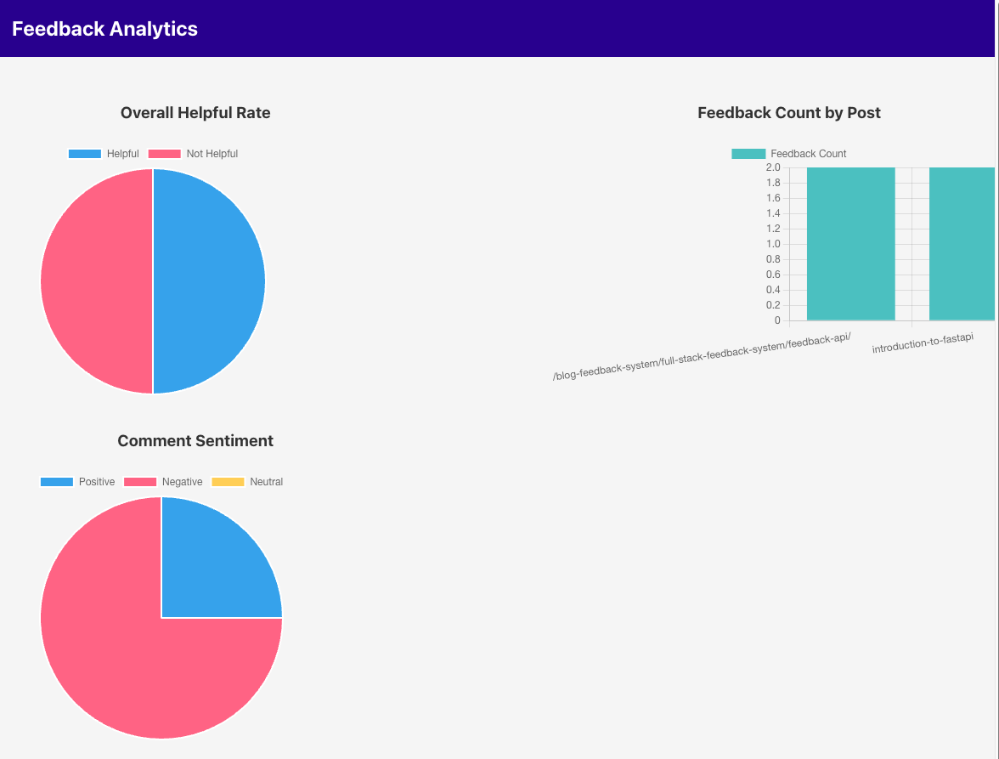

# Chapter 7: Scaling the Feedback System — Sentiment Analysis

So far, you’ve built:

* **Feedback collection** (Airtable, Giscus/Disqus, your own API).
* **Analytics dashboards** (summary stats, charts).

But raw comments can still be overwhelming. Instead of manually reading hundreds of comments, we can use **sentiment analysis** to classify them automatically as:

* Positive (“This tutorial was great!”)
* Negative (“I got stuck and couldn’t follow this.”)
* Neutral (“I tried this on FastAPI version 0.95.”)

In this chapter, we’ll:

* Learn about sentiment analysis basics.
* Build sentiment endpoints in **FastAPI** and **NestJS**.
* Grow with a **dashboard view** that displays aggregated sentiment.

## 7.1 Sentiment Analysis in Practice

**Why it matters:**

* Quickly detect problematic posts (lots of negative feedback).
* Identify high-impact content (lots of positive feedback).
* Prioritize improvements without manual triage.

**Approaches:**

1. **Rule-based** (lexicons like VADER in Python).
2. **ML models** (pre-trained Hugging Face pipelines).
3. **Custom fine-tuned models** (advanced, out of scope here).

## 7.2 FastAPI Sentiment API

We’ll use **Hugging Face transformers** for a modern, out-of-the-box solution.

### 7.2.1 Install Dependencies

We are using a combination of `PyTorch` with the `Hugging Face Transformers` library. PyTorch is a deep-learning library, similar to `TensorFLow`, and `Flax`.

```bash
pip install transformers torch
```

### 7.2.2 Sentiment Service

```python
# filename: app/sentiment.py
from fastapi import APIRouter, Depends
from sqlalchemy.orm import Session
from transformers import pipeline
from app.main import get_db
from app.models import Feedback

router = APIRouter()
sentiment_model = pipeline("sentiment-analysis")

@router.get("/analytics/sentiment")
def sentiment_summary(db: Session = Depends(get_db)):
    comments = db.query(Feedback.comment).filter(Feedback.comment.isnot(None)).all()
    results = {"positive": 0, "negative": 0, "neutral": 0}

    for (comment,) in comments:
        if not comment.strip():
            continue
        pred = sentiment_model(comment[:512])[0]  # truncate to 512 chars
        label = pred["label"].lower()
        if "pos" in label:
            results["positive"] += 1
        elif "neg" in label:
            results["negative"] += 1
        else:
            results["neutral"] += 1
    return results
```

The code above uses a `sentiment-analysis` task pipeline, using the default model and tokenizer. We are not applying any additional customizations on this pipeline, such as finetuning. We discuss the usage of various HuggingFace Transformer models, their customization, deep-learning frameworks (`PyTorch`, `TensorFlow`, etc.), and tools such as `LangChain` in a separate tutorial series pertaining to developing AI applications.

For now the defaults will suffice.

Register in `app/main.py`:

```python
from app import sentiment
app.include_router(sentiment.router)
```

## 7.3 NestJS Sentiment API

For Node.js we’ll use **Hugging Face Inference API** (instead of running big models locally).

### 7.3.1 Install Axios

```bash
npm install axios
```

### 7.3.2 Sentiment Service (Hugging Face API)

```ts
// filename: src/feedback/feedback.sentiment.service.ts
import { Injectable } from '@nestjs/common';
import axios from 'axios';
import { InjectRepository } from '@nestjs/typeorm';
import { Repository } from 'typeorm';
import { Feedback } from './feedback.entity';

@Injectable()
export class FeedbackSentimentService {
  constructor(
    @InjectRepository(Feedback) private repo: Repository<Feedback>,
  ) {}

  async analyze() {
    const comments = await this.repo
      .createQueryBuilder('f')
      .select('f.comment')
      .where('f.comment IS NOT NULL')
      .getRawMany();

    const results = { positive: 0, negative: 0, neutral: 0 };

    for (const row of comments) {
      if (!row.f_comment?.trim()) continue;
      const res = await axios.post(
        'https://api-inference.huggingface.co/models/distilbert-base-uncased-finetuned-sst-2-english',
        row.f_comment,
        { headers: { Authorization: `Bearer ${process.env.HF_API_KEY}` } },
      );
      const label = res.data[0].label.toLowerCase();
      if (label.includes('pos')) results.positive++;
      else if (label.includes('neg')) results.negative++;
      else results.neutral++;
    }

    return results;
  }
}
```

### 7.3.3 Sentiment Controller

```ts
// filename: src/feedback/feedback.sentiment.controller.ts
import { Controller, Get } from '@nestjs/common';
import { FeedbackSentimentService } from './feedback.sentiment.service';

@Controller('analytics')
export class FeedbackSentimentController {
  constructor(private readonly service: FeedbackSentimentService) {}

  @Get('sentiment')
  analyze() {
    return this.service.analyze();
  }
}
```

## 7.4 Sentiment Dashboard

We’ll extend our React dashboard (from Chapter 6) to visualize sentiment.

```tsx
// filename: src/components/SentimentChart.tsx
import React, { useEffect, useState } from 'react';
import { Pie } from 'react-chartjs-2';

export const SentimentChart: React.FC<{ apiUrl: string }> = ({ apiUrl }) => {
  const [data, setData] = useState<any>(null);

  useEffect(() => {
    fetch(`${apiUrl}/analytics/sentiment`).then(res => res.json()).then(setData);
  }, [apiUrl]);

  if (!data) return <p>Loading sentiment...</p>;

  return (
    <div>
      <h3>Comment Sentiment</h3>
      <Pie
        data={{
          labels: ['Positive', 'Negative', 'Neutral'],
          datasets: [
            {
              data: [data.positive, data.negative, data.neutral],
              backgroundColor: ['#36A2EB', '#FF6384', '#FFCE56'],
            },
          ],
        }}
      />
    </div>
  );
};
```

Usage in `AnalyticsDashboad`:

```tsx
<SentimentChart apiUrl={apiUrl} />
```

The following is a demonstration of the updated analytics dashboard.



## 7.5 Use Case Example

* A blog post on **“Python Metaclasses”** gets 30 comments.
* Sentiment analysis shows **20 negative comments** (“hard to follow,” “too advanced”).
* You now know this post needs rewriting or splitting into beginner + advanced versions.

## 7.6 Summary

In this chapter, you:

* Learned why sentiment analysis matters for feedback.
* Built sentiment endpoints in **FastAPI** and **NestJS**.
* Extended the React dashboard with a **sentiment chart**.

Now you’re not just collecting feedback — you’re extracting *meaning* from it.

## 7.7 Exercise

1. Add a `/analytics/sentiment` endpoint in your backend.
2. Integrate the **SentimentChart** into your dashboard.
3. Submit a few test comments:
   * “This was fantastic!” → should be Positive.
   * “I couldn’t understand anything.” → should be Negative.
   * “Installed FastAPI 0.97 today.” → likely Neutral.
4. Confirm the chart updates correctly.

## 7.8 Next Step

In the final chapter, we’ll **reflect on the journey**:

* From prototype → hybrid → full-stack → analytics + ML.
* Lessons learned about tradeoffs.
* How feedback systems tie back to the idea of **“writing as learning.”**
