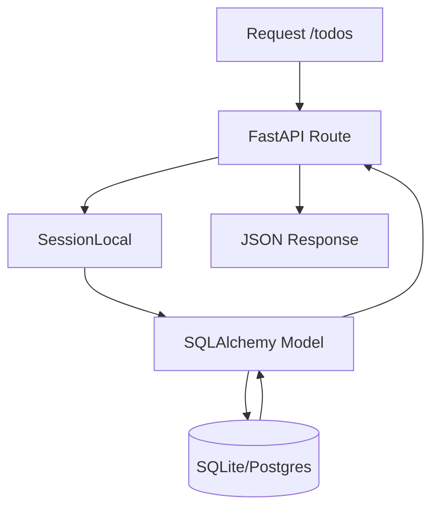

# Chapter 11: Working With Relational Databases

In this chapter, you will learn:

* How to use **SQLAlchemy** with FastAPI for relational data.
* How to manage schema changes with **Alembic** (FastAPI) and **migrations**.
* How to implement **CRUD operations** that persist to a database.
* How to write **tests** for database-backed APIs.

By the end, our running projects will have:

* **FastAPI Todo API** → switched from in-memory to **SQLite with SQLAlchemy**.
* **Django Blog App** → persisting posts in DB (already implemented in Ch.9), expanded with queries.

## 11.1 FastAPI With SQLAlchemy

Let's replace our in-memmory database for our todo app, with an actual SQLite database. For that we're going to use SQLAlchemy.

### 11.1.1 Install Dependencies

```bash
poetry add sqlalchemy aiosqlite alembic
```

### 11.1.2 Configure Database Connection

```python
# @file app/core/db.py
# @showLineNumbers

from sqlalchemy import create_engine
from sqlalchemy.orm import sessionmaker, declarative_base

SQLALCHEMY_DATABASE_URL = "sqlite:///./db.sqlite3"

engine = create_engine(
    SQLALCHEMY_DATABASE_URL, connect_args={"check_same_thread": False}
)
SessionLocal = sessionmaker(autocommit=False, autoflush=False, bind=engine)

Base = declarative_base()
```

The engine is SQLAlchemy’s interface to the database. `create_engine()` is used to connect to the SQLite database `db.sqlite3` located at the project root. The database will be created the first time it is accessed.

FastAPI uses asynchronous code and dependency injection, so multiple threads may touch the DB. However, SQLite limits access to the database to a single thread that created the connection. Therefore we set `"check_same_thread": False` as the connection arguments, so FastAPI can safely use SQLite. For PostgreSQL/MySQL, this would not be needed.

`SessionLocal` is a factory, not an actual session. A `Session` handles database conversations (unit of work). We will see later how it is used when FastAPI handles a request.

Finally, `declarative_base()` creates a base class used to define SQLAlchemy ORM models. We'll examine an ORM model next.

### 11.1.3 Define the App Models

Let's add a SQL model to our app for the todos. This model sould have all the fields found in `TodoItemEntity`. Every model must inherit from `Base`.

```python
# @file app/todos/models.py
# @showLineNumbers

from sqlalchemy import Column, Integer, String, Boolean
from app.core.db import Base

class TodoBaseModel(Base):
    __tablename__ = "todos"

    id = Column(Integer, primary_key=True, index=True)
    title = Column(String, index=True)
    completed = Column(Boolean, default=False)
```

The model is represented by the table `todos`. The `id` field is being declared as the primary key for the table. `title` is declared as a string, and `completed` as a boolean.


### 11.1.4 Replace In-memory DB

Let's replace the in-memory database with the SQLite database.

```python
# @file app/core/db.py
# @showLineNumbers
from sqlalchemy import create_engine
from sqlalchemy.orm import sessionmaker, declarative_base, Session

SQLALCHEMY_DATABASE_URL = "sqlite:///./db.sqlite3"

engine = create_engine(
    SQLALCHEMY_DATABASE_URL, connect_args={"check_same_thread": False}
)
SessionLocal = sessionmaker(autocommit=False, autoflush=False, bind=engine)

Base = declarative_base()

# Create tables
Base.metadata.create_all(bind=engine)

def get_db():
    """Dependency to provide DB session."""
    db = SessionLocal()
    try:
        yield db
    finally:
        db.close()
```

### 11.1.5 Update Repository CRUD Operations

Let's update the `TodoRepository` so that it can query the SQL database for data, instead of the mock in-memory database.

```python
# @file app/todos/repository.py
# @showLineNumbers

from typing import Protocol, Iterable
from sqlalchemy.orm import Session

from app.todos.models import TodoBaseModel


class TodoRepository(TodoRepositoryProtocol):
    def __init__(self, db: Session):
        self.db = db

    def list_todos(self):
        """Return all todos."""
        return self.db.query(TodoBaseModel).all()

    def create_todo(self, title: str, completed: bool) -> TodoBaseModel :
        """Adds a new TodoItem to the database."""
        new_todo = TodoBaseModel (title=title, completed=completed)
        self.db.add(new_todo)
        self.db.commit()
        self.db.refresh(new_todo)
        return new_todo

    def get_todo(self, id: int):
        """Retrieve a Todo item by ID."""
        found_todo = self.db.get(TodoBaseModel, id)
        return found_todo

    def update_todo(self, id: int, title: str, completed: bool) -> TodoBaseModel :
        """Update a Todo item by ID."""
        found_todo = self.get_todo(id)
        found_todo.title = title
        found_todo.completed = completed
        self.db.add(found_todo)
        self.db.commit()
        self.db.refresh(found_todo)
        return found_todo

    def delete_todo(self, id: int) -> TodoBaseModel :
        """Deletes an item by ID."""
        found_todo = self.get_todo(id)
        self.db.delete(found_todo)
        self.db.commit()
        self.db.refresh(found_todo)
        return found_todo
```

The repository methods demonstrate four common `SQLAlchemy` Queries (ORM Style).
#### 1. Select all:
```python
found_todos = self.db.query(TodoBaseModel).all()
```
#### 2. Get by primary key:
```python
found_todo = self.db.get(TodoBaseModel, id)
```
#### 3. Insert:
```python
new_todo = TodoBaseModel (title=title, completed=completed)
self.db.add(new_todo)
self.db.commit()
self.db.refresh(new_todo)
```
#### 4. Update
```python
found_todo = self.db.get(TodoBaseModel, id)
found_todo.title = title
self.db.add(found_todo)
self.db.commit()
```
#### 5. Delete
```python
found_todo = self.get_todo(id)
self.db.delete(found_todo)
self.db.commit()
```

## 11.2 Alembic for DB Migration

We'll use Alembic for database migrations. This includes database setup and any schema changes.

### 11.2.1 Alembic Setup

Let's initialize Alembic for our project by running the following:

```bash
poetry run alembic init alembic
```

### 11.2.2 Update Migration Setup

Now that `Alembic` has been setup, you will find the following directory setup along with the rest of our source:

```bash
fastapi-todo/
├── alembic.ini
├── alembic/
|   ├── env.py  
|   ├── README  
|   ├── script.py.mako  
│   └── versions/
|        └── ... # This is where the migration script live
```

We need to update the configration files that is generated to ensure that `Alembic` uses our database and models correctly.

```ini
# @file alembic.ini

# Update DB URL
sqlalchemy.url = sqlite:///./db.sqlite3
```

Now let's ensure that our app models are imported and used correctly by `Alembic`.

```python
# @file alembic/env.py
# @showLineNumbers
# @highlight 5,20,21,53-68
from logging.config import fileConfig

from sqlalchemy import engine_from_config
from sqlalchemy import pool
from app.core.db import engine, Base

from alembic import context

# this is the Alembic Config object, which provides
# access to the values within the .ini file in use.
config = context.config

# Interpret the config file for Python logging.
# This line sets up loggers basically.
if config.config_file_name is not None:
    fileConfig(config.config_file_name)

# add your model's MetaData object here
# for 'autogenerate' support
from app.todos import models
target_metadata = Base.metadata

# other values from the config, defined by the needs of env.py,
# can be acquired:
# my_important_option = config.get_main_option("my_important_option")
# ... etc.


def run_migrations_offline() -> None:
    """Run migrations in 'offline' mode.

    This configures the context with just a URL
    and not an Engine, though an Engine is acceptable
    here as well.  By skipping the Engine creation
    we don't even need a DBAPI to be available.

    Calls to context.execute() here emit the given string to the
    script output.

    """
    url = config.get_main_option("sqlalchemy.url")
    context.configure(
        url=url,
        target_metadata=target_metadata,
        literal_binds=True,
        dialect_opts={"paramstyle": "named"},
    )

    with context.begin_transaction():
        context.run_migrations()


def run_migrations_online() -> None:
    """Run migrations in 'online' mode.

    In this scenario we need to create an Engine
    and associate a connection with the context.

    """
    connectable = engine

    with connectable.connect() as connection:
        context.configure(
            connection=connection, target_metadata=target_metadata
        )

        with context.begin_transaction():
            context.run_migrations()


if context.is_offline_mode():
    run_migrations_offline()
else:
    run_migrations_online()

```

### 11.2.3 Run Migration

Let's generate our first migration script, and run it with the `upgrade head` command.

```bash
poetry run alembic revision --autogenerate -m "init"
poetry run alembic upgrade head
```

All subsequent migrations are run like a git commit. `upgrade head` is used to apply the changes into the database.

```bash
poetry run alembic revision -m "Add a column"
poetry run alembic upgrade head
```

This should create the databse with the new `todos` table.

## 11.3 Testing Database Operations

We are going to use a mock database for our tests. The mock DB is going to be file based.

### 11.3.1 Test Utils

Let's create some utility functions to setup the mock database, and the test client that uses it. This is done so that the same client can be used across all test suites:

```python
# @file tests/test_utils.py
# @showLineNumbers
from sqlalchemy import create_engine
from sqlalchemy.orm import sessionmaker
from fastapi.testclient import TestClient

from app.core.db import Base, get_db
from app.main import app

TEST_DB_URL = "sqlite:///./test.db"

engine = create_engine(
    TEST_DB_URL,
    connect_args={"check_same_thread": False},
)

TestingSessionLocal = sessionmaker(
    autocommit=False, autoflush=False, bind=engine
)

def override_get_db():
    db = TestingSessionLocal()
    try:
        yield db
    finally:
        db.close()

def create_test_app():
    """Factory to return a fresh TestClient with DB overrides."""
    Base.metadata.drop_all(bind=engine)
    Base.metadata.create_all(bind=engine)

    # This swaps the get_db to the override
    app.dependency_overrides[get_db] = override_get_db
    return TestClient(app)
```

### 11.3.2 Test Fixtures

We can now declare the test client and to create test fixtures which are injected into our tests by `pytest`.

```python
# @file tests/conftest.py
# @showLineNumbers
import pytest
from tests.test_utils import create_test_app

@pytest.fixture(scope="session")
def client():
    client = create_test_app()
    return client

```

### 11.3.3 Using Test Fixtures

Now the new client with the test database can be used for all tests as follows:

```python
# @file tests/conftest.py
# @showLineNumbers
# @highlight 3, 5
import pytest

from ..conftest import client, auth_token

def test_create_todo(client, auth_token) -> None:
    """Test the addition of a todo item."""
    headers = {"Authorization": f"Bearer {auth_token}"}
    response = client.post(
      "/api/todos",
      json={"title": "Learn FastAPI"}, headers=headers
    )
    assert response.status_code == 200
    data = response.json()
    assert data["title"] == "Learn FastAPI"
    assert data["completed"] is False
```

## 11.4 SQLAlchemy & FastAPI Flow



## 11.5 Chapter Assignment

1. Create a `SQLAlchemy` model for the `users` app.
2. Update the `UserRepository` to use the new model.
3. Seed the `users` table with data from the existing mock DB.
4. Test login.

## 11.6 Further Reading

* [SQLAlchemy ORM](https://docs.sqlalchemy.org/en/20/orm/)
* [Alembic Migrations](https://alembic.sqlalchemy.org/)
* [Django Aggregation](https://docs.djangoproject.com/en/stable/topics/db/aggregation/)
* [FastAPI with SQL Databases](https://fastapi.tiangolo.com/tutorial/sql-databases/)
