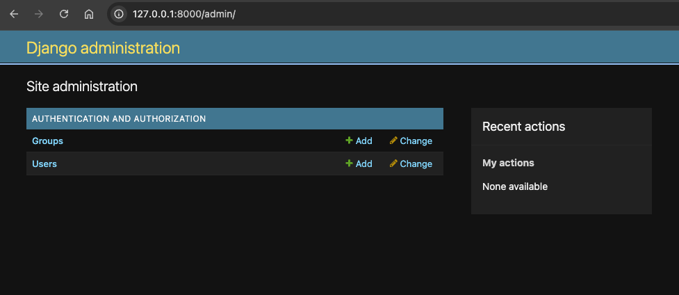
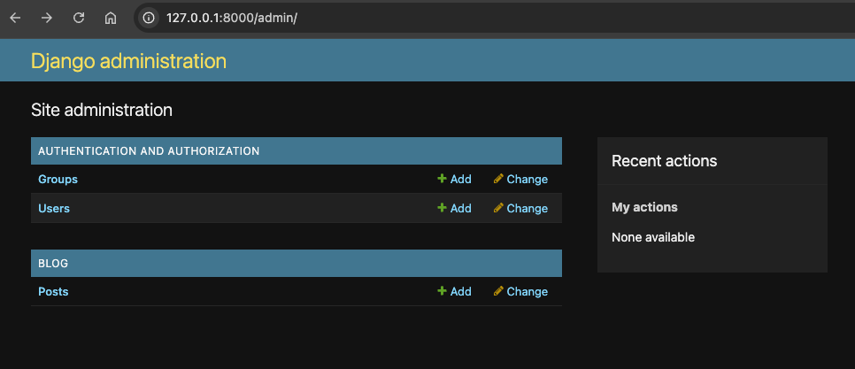
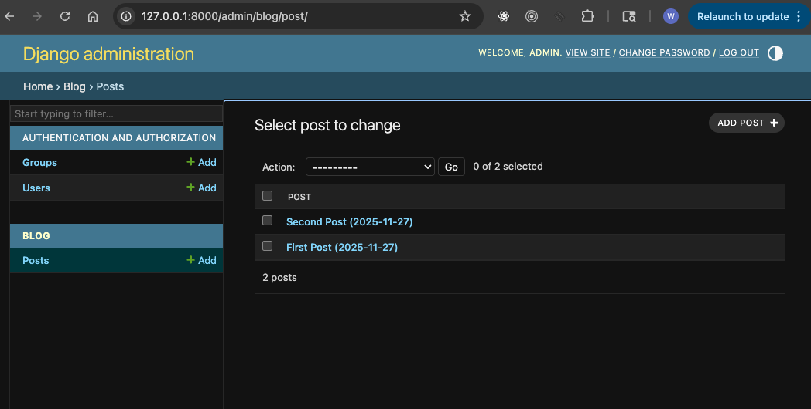
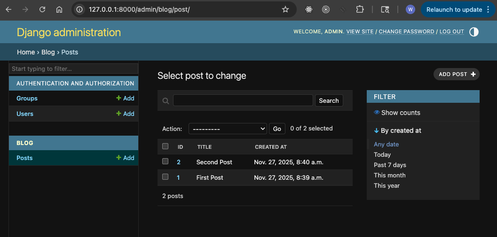
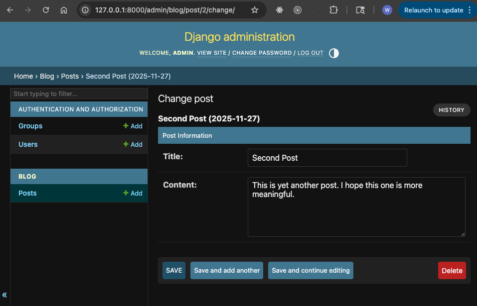
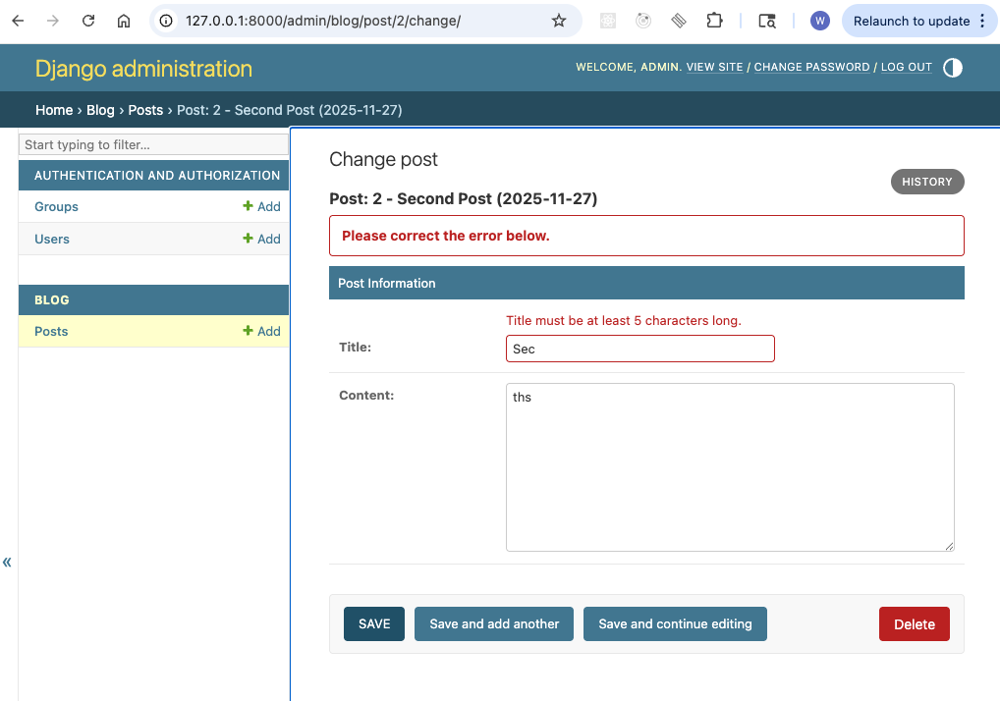
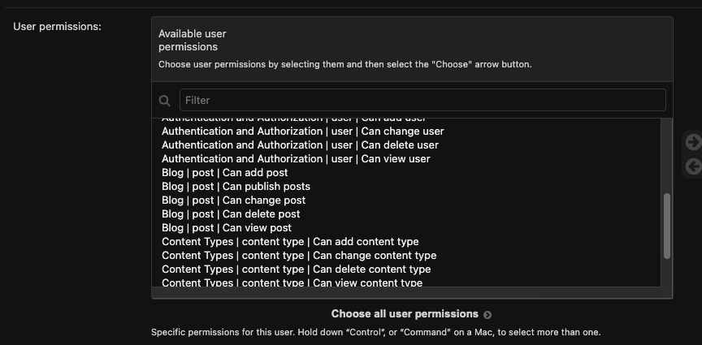

# Chapter 10: Django Admin — Leveraging Django’s Built-In Management Interface

In this chapter, you will learn:

- What the Django Admin is
- How to enable access to the Django Admin
- Registering models with the admin
- Customizing the Admin Views
- Permissions and Access Control

## 10.1 What is the Django Admin

Django Admin is one of Django’s most powerful built-in features. It provides a fully functional, configurable, database-driven web interface for managing your application’s data. With almost no setup, you can inspect, create, edit, delete, search, sort, and filter model instances — all with robust authentication and permissions already integrated.

While Django Admin is not meant to be your public-facing UI, it plays a crucial role in internal dashboards, editorial workflows, customer-support tools, and development-time debugging. In this chapter, you’ll learn how to register models with the admin site, customize admin pages, add search and list filters, connect Django Admin to forms, and enforce permissions. You’ll also explore best practices for using Django Admin in real production systems, where misconfiguration can affect both security and performance.

## 10.2 Enabling and Accessing Django Admin

Django Admin works out of the box, assuming you have the following:

* `django.contrib.admin` in `INSTALLED_APPS`
* Authentication and session middleware enabled
* URL patterns mapped to the admin site

Your project already includes these settings. The final step is ensuring your `urls.py` exposes the admin:

```python
# @file src/blogsite/urls.py
# @showLineNumbers
# @highlight 5
from django.contrib import admin
from django.urls import path, include

urlpatterns = [
    path("admin/", admin.site.urls),  # admin dashboard
    path("", include("apps.blog.urls")),
]
```

Next, enter the following command and follow the prompts to create a superuser:

```bash
poetry run python manage.py createsuperuser
```

Then run the development server:

```bash
poetry run python manage.py runserver
```

Navigate to: `http://localhost:8000/admin/`

Log in using your superuser credentials. You’ll see a pre-built interface for managing authentication data, permissions, and content types.



## 10.3 Registering Models with the Admin Site

By default, Django Admin only shows models you explicitly register.

### 10.3.1 Blog Post Model

Let's register the blog post model that we'd created in the previous chapter.

```python
# @file src/apps/blog/models.py
# @showLineNumbers

from django.db import models

class Post(models.Model):
    """Database model for blog posts."""

    title = models.CharField(max_length=100)
    content = models.TextField()
    created_at = models.DateTimeField(auto_now_add=True)

    def __str__(self) -> str:
        """Return a human-readable representation."""
        return f"{self.title} ({self.created_at:%Y-%m-%d})"
```

To display this in the admin, register it:

```python
# @file src/apps/blog/admin.py
# @showLineNumbers
# @highlight 2, 4

from django.contrib import admin
from .models import Post

admin.site.register(Post)
```

Refresh the admin UI — “Posts” will appear in the Site adminstration page.



This allows you to inspect, and modify the data tied to this model.

## 10.4 Customizing Admin Views

The default view of the model uses the `__str__()` method to display a row of data on a table as shown below:



This is not terribly useful, since each record is represented by a single line of text.

However, the basic model registration is only the beginning. Django allows deep customization. We are going to customize this view, so that we see more fields of the model as columns on the table.

### 10.4.1 Adding List Display Options

Let's customize the model registration for `Post`, by extending the `ModelAdmin` object. The `ModelAdmin` class is the representation of your model in the admin interface.

The `ModelAdmin` is very flexible. It has several options for dealing with customizing the interface. Below we are using only a handful of these options:

```python
# @file src/apps/blog/admin.py
# @showLineNumbers

@admin.register(Post)
class PostAdmin(admin.ModelAdmin):
    list_display = ("id", "title", "created_at")
    search_fields = ("title",)
    list_filter = ("created_at",)
```

- `list_display`: used to control which fields are displayed on the change list page of the admin.
- `search_fields`: used to enable search box on the admin change list.
- `list_filter`: used to activate filters in the right sidebar of the change list page.

After reloading, you should see the following:



This adds:

* A better column layout
* A search bar
* Sidebar filters

### 10.4.2 Organizing Form Layout (Fieldsets)

Set `fielsets` to control the layout of admin "add" and "chnage" pages.

`fieldset` is a list of 2-touples, in the format (name, field_options), 

```python
# @file src/apps/blog/admin.py
# @showLineNumbers

fieldsets = (
    ("Post Information", {
        "fields": ("title", "content")
    }),
)
```



## 10.5 Using Custom Forms in Admin

Django Admin can use Django forms for consistent validation.

```python
# @file src/apps/blog/forms.py
# @showLineNumbers

from django import forms
from .models import Post

class PostAdminForm(forms.ModelForm):
    class Meta:
        model = Post
        fields = ["title", "content"]

    def clean_title(self):
        title = self.cleaned_data["title"]
        if len(title) < 5:
            raise forms.ValidationError("Title must be at least 5 characters long.")
        return title
```

Attach the form to your admin:

```python
# @file src/apps/blog/admin.py
# @showLineNumbers

from .forms import PostAdminForm

class PostAdmin(admin.ModelAdmin):
    form = PostAdminForm
```

You can test the form validation by entering an invalid `title`, and save it:



## 10.6 Permissions and Access Control

Django Admin uses Django's built-in permissions system.

Each model automatically gets:

* `add_post`
* `change_post`
* `delete_post`
* `view_post`

You can add custom permissions:

```python
# @file src/apps/blog/models.py
# @showLineNumbers

class Post(models.Model):
    ...
    class Meta:
        permissions = [
            ("can_publish", "Can publish posts"),
        ]
```

The new custom permissions added to a model need to be migrated to the database. Therefore you'd need to run the following in the terminal:

```bash
poetry run python manage.py makemigrations blog
poetry run python manage.py migrate
```

Then assign these to users or groups via the admin interface. This new permission would be available under user permissions:



## 10.7 How Django Admin Works Internally

The admin uses introspection and metadata from your models to build:

* Forms
* Tables
* Filters
* Search queries
* Relationships

This makes the admin extremely powerful for internal data management, but also means:

**Never expose Django Admin to untrusted users.**

Always:

* Restrict access
* Use strong passwords
* Enable HTTPS in production

## 10.8 Chapter Assignment

**Build an Editorial Dashboard**

1. Create a model `Author` with fields: `name`, `bio`, `twitter_handle`.
2. Create a model `Article` with fields: `title`, `body`, `author`, `status`.
3. Register both models in the admin.
4. Customize:
   * `list_display`
   * `search_fields`
   * `list_filter`
   * `readonly_fields`
5. Add a custom permission: `can_publish`.

Bonus:

* Add a custom admin action `mark_as_published`.

## 10.9 Chapter Summary

In this chapter we examined the basics of Django Admin. However there are many more additional features of Django admin including but not limited to security.

In this section we have reviewed some of the most important aspects of the Django framework. However Django is a fairly large Python framework, and should be studied comprehensively if you would like to write production grade applications using Django using more robust databases such as PostgreSQL, or MySQL; caching using Redis; Auth using OAuth 2, etc.

In the next section we will delve deeper into databases and data modeling in Python.


## 10.10 Further Reading

* Django Admin Docs: [https://docs.djangoproject.com/en/stable/ref/contrib/admin/](https://docs.djangoproject.com/en/stable/ref/contrib/admin/)
* Django Permissions: [https://docs.djangoproject.com/en/stable/topics/auth/default/#permissions-and-authorization](https://docs.djangoproject.com/en/stable/topics/auth/default/#permissions-and-authorization)

