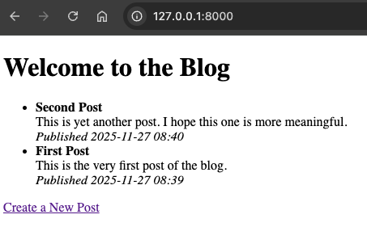

# Chapter 9: Django ORM and Advanced Queries

In this chapter, you will learn:

* How Django’s **ORM (Object-Relational Mapper)** works.
* How to define **models** for your Blog app.
* How to use **migrations** to keep the database schema in sync.
* How to run **basic and advanced queries** with the ORM.
* How to write **tests** for models and queries.

By the end, the Blog app will persist posts in a database instead of using an in-memory Python list.

## 9.1 Django's ORM

We're going to Django’s **Object-Relational Mapper (ORM)** to interact with a database. Django comes with a sqlite database by default when a project is initiated. But how does Django's ORM work?

Django’s **Object-Relational Mapper (ORM)** provides a high-level, Pythonic interface for interacting with relational databases without writing raw SQL. Instead of manually crafting queries, you work with **model classes** and **QuerySets**, allowing Django to translate your Python method calls into efficient SQL statements behind the scenes. The ORM handles common operations like creating, updating, deleting, and filtering records using simple and expressive syntax—for example, `Post.objects.filter(author=user)` becomes a `SELECT` query under the hood. It also manages relationships through `ForeignKey`, `OneToOneField`, and `ManyToManyField`, automatically generating joins and maintaining referential integrity.

By abstracting away vendor-specific SQL differences and providing a consistent API across databases, Django’s ORM speeds up development, enforces best practices, and keeps your data-access logic clean and maintainable while still offering escape hatches when raw SQL is needed.

## 9.2 Django Models

**Django models** are the core of Django’s data layer, representing the structure and behavior of the information your application manages. A model is a Python class that subclasses `django.db.models.Model`, with each attribute mapping to a database column and each instance representing a single row in the corresponding table.

Django models don’t just define fields—they encapsulate business rules, relationships, default values, validation, and custom query logic through the powerful ORM. With models, you interact with the database using clean and expressive Python code instead of writing raw SQL, enabling features like migrations, relationships (ForeignKey, ManyToMany), and robust query abstractions.

Together, models provide a structured, maintainable, and database-agnostic foundation for your application’s data handling, making them one of the most essential components of the Django framework.

### 9.2.1 Define the Blog Model

Let's define a Blog model that we're going to use to interact with the database.

```python
# @file src/apps/blog/models.py
# @showLineNumbers
from django.db import models

class Post(models.Model):
    """Database model for blog posts."""

    title = models.CharField(max_length=100)
    content = models.TextField()
    created_at = models.DateTimeField(auto_now_add=True)

    def __str__(self) -> str:
        """Return a human-readable representation."""
        return f"{self.title} ({self.created_at:%Y-%m-%d})"
```

* `CharField` → short strings (with max length).
* `TextField` → long text (blog content).
* `DateTimeField(auto_now_add=True)` → automatically stores creation timestamp.
* `__str__` makes objects readable in Django Admin.

## 9.3 Django Migrations

**Django migrations** are the mechanism Django uses to track and apply changes to your database schema over time. Whenever you modify your models—whether by adding a field, changing a data type, renaming a model, or introducing a new relationship—Django can automatically detect these changes and generate a migration file that describes how to transform the database structure to match your updated models. These migration files are version-controlled Python scripts that represent incremental steps in your application’s evolution, allowing Django to understand exactly what needs to be created, modified, or removed when setting up or updating your database. Because migrations are generated from your models rather than handwritten SQL, they help maintain consistency between your Python code and your underlying relational database, regardless of whether you're using SQLite, PostgreSQL, MySQL, or another backend.

Even in a brand-new Django app, **migrations are essential** because they establish the initial database schema that corresponds to your models and Django’s built-in authentication and session framework. Out of the box, Django ships with several installed apps—such as `auth`, `contenttypes`, `sessions`, and `admin`—each of which requires its own set of database tables. Running `makemigrations` (for your project’s own apps) and `migrate` (to apply all pending migrations) creates these tables and ensures the database is ready to store users, permissions, session data, and other core functionality your application relies on. Even before you write your first model, migrations provide the structural foundation that Django needs to function correctly, and they establish a version-controlled, systematic process for managing future schema changes as you build out the rest of your application.

When you launch Django app using the command we have been using in the last few chapters:

```bash
poetry run python manage.py runserver
```

you should see something similar on the terminal:

```bash
# @highlight 6,7
Watching for file changes with StatReloader
Performing system checks...

System check identified no issues (0 silenced).

You have 18 unapplied migration(s). Your project may not work properly until you apply the migrations for app(s): admin, auth, contenttypes, sessions.
Run 'python manage.py migrate' to apply them.
November ***
Django version 5.2.8, using settings 'blogsite.settings'
Starting development server at http://127.0.0.1:8000/
Quit the server with CONTROL-C.
```

### 9.3.1 Create Migration Script

After defining the Blog Model, we need to generate and apply schema changes:

```bash
poetry run python manage.py makemigrations blog
```

This shows the following on the terminal:

```bash
# @highlight 2
Migrations for 'blog':
  src/apps/blog/migrations/0001_initial.py
    + Create model Post
```

This created a brand new migration script, `0001_initial.py` in the `migrations` directory.

> Note: Migration files live in an app’s `migrations/` directory and are executed in order, allowing Django to build, modify, or roll back your schema in a predictable, controlled way.

### 9.3.2 Generating a Migration Script

Let's open the newly generated migration script:

```python
# @file src/apps/blog/migrations/0001_initial.py
# @showLineNumbers

# Generated by Django 5.2.8 on ***

from django.db import migrations, models


class Migration(migrations.Migration):

    initial = True

    dependencies = []

    operations = [
        migrations.CreateModel(
            name="Post",
            fields=[
                (
                    "id",
                    models.BigAutoField(
                        auto_created=True,
                        primary_key=True,
                        serialize=False,
                        verbose_name="ID",
                    ),
                ),
                ("title", models.CharField(max_length=100)),
                ("content", models.TextField()),
                ("created_at", models.DateTimeField(auto_now_add=True)),
            ],
        ),
    ]
```

Structurally, a migration file contains a `Migration` class with two key parts: **dependencies** and **operations**. The `dependencies` list tells Django which migration must run before this one—this ensures changes happen in the proper sequence.

The `operations` list contains one or more high-level instructions, such as `CreateModel`, `AddField`, `AlterField`, `RemoveField`, or `RunPython`. Each operation is written in a database-agnostic format so Django can convert it into the appropriate SQL for your database backend.

When you run `python manage.py migrate`, Django reads these migration files, determines which ones have not yet been applied (tracked in the `django_migrations` table), translates the operations into SQL, executes them, and marks them as complete. This system provides a reliable, reversible, and version-controlled mechanism for evolving your database schema alongside your codebase.

### 9.3.3 Running the Migration Script

Let us now run the generated migration script:

```bash
poetry run python manage.py migrate
```

This shows the following on the terminal:

```bash
# @highlight 21
Operations to perform:
  Apply all migrations: admin, auth, blog, contenttypes, sessions
Running migrations:
  Applying contenttypes.0001_initial... OK
  Applying auth.0001_initial... OK
  Applying admin.0001_initial... OK
  Applying admin.0002_logentry_remove_auto_add... OK
  Applying admin.0003_logentry_add_action_flag_choices... OK
  Applying contenttypes.0002_remove_content_type_name... OK
  Applying auth.0002_alter_permission_name_max_length... OK
  Applying auth.0003_alter_user_email_max_length... OK
  Applying auth.0004_alter_user_username_opts... OK
  Applying auth.0005_alter_user_last_login_null... OK
  Applying auth.0006_require_contenttypes_0002... OK
  Applying auth.0007_alter_validators_add_error_messages... OK
  Applying auth.0008_alter_user_username_max_length... OK
  Applying auth.0009_alter_user_last_name_max_length... OK
  Applying auth.0010_alter_group_name_max_length... OK
  Applying auth.0011_update_proxy_permissions... OK
  Applying auth.0012_alter_user_first_name_max_length... OK
  Applying blog.0001_initial... OK
  Applying sessions.0001_initial... OK
```

## 9.4 Using the Model

### 9.4.1 Update the View

Let's update the views so that we may now use the ORM instead of the in-memory list to store posts.

```python
# @file src/apps/blog/views.py
# @showLineNumbers
# @highlight 3, 8, 17

from django.shortcuts import render, redirect
from .forms import PostForm
from .models import Post


def home(request):
    """Render homepage with all blog posts from DB."""
    posts = Post.objects.all().order_by("-created_at") # Get all posts ordered by newest
    return render(request, "blog/home.html", {"posts": posts})


def create_post(request):
    """Handle GET (show form) and POST (save form to DB)."""
    if request.method == "POST":
        form = PostForm(request.POST)
        if form.is_valid():
            Post.objects.create(**form.cleaned_data)
            return redirect("home")
    else:
        form = PostForm()
    return render(request, "blog/create_post.html", {"form": form})
```

### 9.4.2 Update Templates

Update `home.html` so posts render properly:

```html
<!--
@file src/apps/blog/templates/blog/home.html
@highlight 11-15
-->
<!DOCTYPE html>
<html lang="en">
<head>
    <meta charset="UTF-8">
    <title>Django Blog</title>
</head>
<body>
    <h1>Welcome to the Blog</h1>
    <ul>
        
            <li>
                <strong>{{ post.title }}</strong><br>
                {{ post.content }}<br>
                <em>Published {{ post.created_at|date:"Y-m-d H:i" }}</em>
            </li>
        
            <li>No posts yet!</li>
        
    </ul>
    <a href="">Create a New Post</a>
</body>
</html>
```

Adding some posts should now display the content on the homepage in the new format:



If you shutdown the server and restart it, you should see the posts saved into the database earlier.

## 9.5 Testing Models and Queries

We can test the `Post` model in isolation. The following tests cover creating `Post` objects, and running some queries against the model.

```python
# @file tests/apps/blog/test_models.py
# @showLineNumbers
import pytest
from django.urls import reverse
from apps.blog.models import Post


@pytest.mark.django_db
def test_post_creation_and_query():
    post = Post.objects.create(title="Test Post", content="Hello ORM")
    assert Post.objects.count() == 1
    assert "Test Post" in str(post)

    posts = Post.objects.filter(title__icontains="test")
    assert posts.exists()
    assert posts.first().content == "Hello ORM"


@pytest.mark.django_db
def test_home_view_displays_posts(client):
    Post.objects.create(title="Visible Post", content="This should appear")
    response = client.get(reverse("home"))
    assert response.status_code == 200
    body = response.content.decode()
    assert "Visible Post" in body
```

## 9.6 Chapter Summary

In this chapter we briefly touched some of the concepts behind Django's ORM that is used to interact with a database. We implemented a `Post` model and replaced the previous in-memory list to save blog posts. This makes the blog posts persist after a shutdown.

In the next chapter we will focus on **Django Admin**, which is essential for a professional Python Web Development curriculum.

## 9.7 Further Reading

* [Django Models](https://docs.djangoproject.com/en/stable/topics/db/models/)
* [Django QuerySet API](https://docs.djangoproject.com/en/stable/ref/models/querysets/)
* [Migrations](https://docs.djangoproject.com/en/stable/topics/migrations/)
