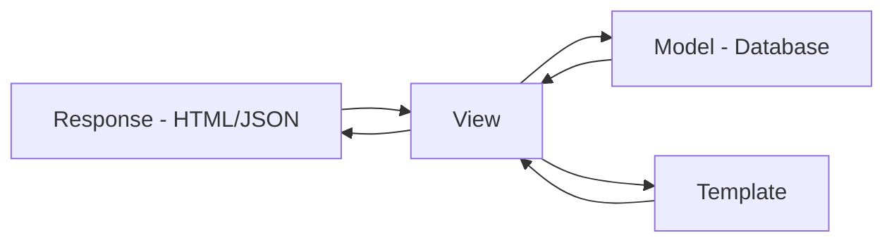

# Chapter 7: Introduction to Django

Django is a **batteries-included web framework** designed for building full-stack applications quickly. While FastAPI shines for APIs and async workloads, Django is ideal for **applications with server-rendered HTML, authentication, admin dashboards, and a well-structured ORM**.

In this chapter, you will learn:

* What Django is and how it follows the **MVT (Model-View-Template)** pattern.
* How to set up a Django project with **Poetry**.
* The Django project/app structure.
* How to create your first app and render a simple page.
* How to run tests in Django with **Pytest-Django**.

## 7.1 Django Project

A **Django project** is the overall web application: it defines global configuration, settings, URL routing, middleware, and deployment behavior. Every Django project contains a central configuration package—usually named after the project itself—that stores `settings.py`, `urls.py`, `wsgi.py`, and ASGI configuration. This “project layer” is responsible for orchestrating the entire application. It doesn’t contain business logic or domain-specific code; instead, it organizes the pieces that make up your site. Think of the Django project as the container that wires everything together.

### 7.1.1 Install Django with Poetry

```bash
poetry new blogsite --src
cd blogsite
poetry add django
```

We're using `Poetry` to add a new project called `blogsite`. We also install the `django`, `pytest` and `pytest-django` modules as dependencies. After this step, we are now ready to bootstrap our first Django project.

### 7.1.2 Start a Django Project with django-admin

We use the `django-admin` tool to start a project. Here is the command format:

```bash
django-admin startproject <project-name> <target-dir>
```

This creates the following directory structure:

```bash
<target>/
  ├── manage.py
  └── <project_name>/
        ├── settings.py
        ├── urls.py
        └── ...
```

### 7.1.3 Organize source

We're going to use the `src/` as the `<target>`. This is similar to the project structure of the FastAPI applications we'd worked on in the previous section. In order to do this, first we need to start the Django project within a temporary directory:

```bash
mkdir temp_project
poetry run django-admin startproject blogsite temp_project
```

This creates the following directory structure in the project root, next to the `src/` directory:

```bash
temp_project/
  ├── manage.py
  └── blogsite/
        ├── settings.py
        ├── urls.py
        └── ...
```

Let's move the content of the `temp_project` directory to `src/`. So we run the following command:

```bash
rm -rf src/*  # Make sure the target dir is empty
mv temp_project/blogsite src
```

Finally, let's move the `manage.py` to project root:

```bash
mv temp_project/manage.py manage.py
```

The update the `manage.py` is needed:

```python
# @file manage.py
from pathlib import Path

# Add this BEFORE calling execute_from_command_line()
BASE_DIR = Path(__file__).resolve().parent
sys.path.append(str(BASE_DIR / "src"))

os.environ.setdefault('DJANGO_SETTINGS_MODULE', 'blogsite.settings')
```

Delete the temp folder:

```bash
rm -rf temp_project
```

This creates the final project structure:

```bash
blogsite/
├── src/
│   └── blogsite/
│       ├── __init__.py
│       ├── settings.py   # configuration (DB, installed apps, middleware)
│       ├── urls.py       # URL routing entrypoint
│       ├── wsgi.py       # An entry-point for ASGI-compatible web servers
│       └── asgi.py       # An entry-point for WSGI-compatible web servers
├── tests/
├── README.md
├── manage.py      # CLI for Django commands
└── pyproject.toml
```

### 7.1.4 Run the development server

```bash
poetry run python manage.py runserver
```

You’ll see the following output on the command line:

```bash
Watching for file changes with StatReloader
Performing system checks...

System check identified no issues (0 silenced).

You have 18 unapplied migration(s). Your project may not work properly until you apply the migrations for app(s): admin, auth, contenttypes, sessions.
Run 'python manage.py migrate' to apply them.
November ***
Django version 5.2.8, using settings 'blogsite.settings'
Starting development server at http://127.0.0.1:8000/
Quit the server with CONTROL-C.

WARNING: This is a development server. Do not use it in a production setting. Use a production WSGI or ASGI server instead.
For more information on production servers see: https://docs.djangoproject.com/en/5.2/howto/deployment/
```

Visit `http://127.0.0.1:8000/` → you’ll see Django’s default welcome page.

## 7.2 Django Apps

A **Django app**, is a self-contained module that implements a specific feature or domain of your site. Each app typically provides its own *models*, *views*, *templates*, *admin configuration*, and *URLs*. For example, a _blog_, a _comments system_, a _payments module_, or a _user profile area_ would each be packaged as separate Django apps. A single Django project can include many apps, and each app can be reused across multiple projects.

Apps are registered using `INSTALLED_APPS` in `settings.py`, which tells Django to load their **models**, **migrations**, and **configuration**. In practice, Django apps help you keep your project modular and scalable: each app owns one piece of functionality, and the Django project coordinates them into a cohesive whole.

### 7.2.1 Creating a Blog App

In order to create an app within the Django project, we use the `manage.py` CLI utility. Here is the command format:

```bash
python manage.py startapp <app-name> <target-dir>
```

Just like earlier, we'd like to place the app source inside the `src/` directory. Let's create a `blog` app within the `blogsite` project. To create your app, make sure you’re in the same directory as `manage.py` and type this command:

```bash
mkdir -p src/apps
mkdir -p src/apps/blog
poetry run python manage.py startapp blog src/apps/blog
```

New structure:

```bash
blogsite/
├── src/
|   ├── blogsite/  
│   └── apps/
|        └── blog/
│             ├── migrations/
│             ├── admin.py
│             ├── apps.py
│             ├── models.py
│             ├── tests.py
│             └── views.py
```

Enable it in `settings.py`:

```python
# @file src/blogsite/settings.py
INSTALLED_APPS = [
    "django.contrib.admin",
    "django.contrib.auth",
    "django.contrib.contenttypes",
    "django.contrib.sessions",
    "django.contrib.messages",
    "django.contrib.staticfiles",
    "apps.blog",  # <-- added
]
```

### 7.2.2 Adding a View

A **Django view** is the function or class responsible for handling an incoming HTTP request and returning an HTTP response. It acts as the core of your application’s request–response cycle: the view receives data from the URL router, performs any necessary business logic (such as querying the database, validating input, or calling services), and then returns a response—often HTML, JSON, or a redirect. Views are intentionally decoupled from templates and models, which keeps the application modular: the view decides **what** data to send, templates decide **how** to present it, and models decide **how** data is stored.

Create a simple view:

```python
# @file src/apps/blog/views.py
# @showLineNumbers
from django.http import HttpResponse

def home(request):
    """Basic home view for the blog app."""
    return HttpResponse("Hello, Django Blog!")
```

### 7.2.3 Mapping view with URL

A **Django URL** is a mapping between a specific URL pattern and the view that should handle requests to that pattern. Django’s URL routing system looks at the incoming request path, matches it against the patterns defined in your `urls.py` modules, and then dispatches the request to the corresponding view function or class. This separation of routing from business logic keeps the application organized: URLs define **how users reach a resource**, while views define **what happens once they do**.

Create app-level URLs:

```python
# @file src/apps/blog/urls.py
# @showLineNumbers
from django.urls import path
from . import views

urlpatterns = [
    path("", views.home, name="home"),
]
```

### 7.2.3 Launch the app

We need to make some additional changes so that the app is properly registered with the Django project. Update the app name for blog to match the directory structure:

```python
# @file src/blogsite/urls.py
# @showLineNumbers
# @highlight 5
from django.apps import AppConfig

class BlogConfig(AppConfig):
    default_auto_field = "django.db.models.BigAutoField"
    name = "apps.blog"
```

Add an `__init__.py` file to `apps` directory. And finally wire it into the project URLs:

```python
# @file src/blogsite/urls.py
# @showLineNumbers
# @highlight 6
from django.contrib import admin
from django.urls import path, include

urlpatterns = [
    path("admin/", admin.site.urls),
    path("", include("blog.urls")),  # <-- root goes to blog app
]
```

Run the following in the terminal:

```bash
poetry run python manage.py runserver
```

Now visit `http://127.0.0.1:8000/` → you’ll see `"Hello, Django Blog!"`.

## 7.3 Testing with Pytest-Django

Just like the previous chapters, we're going to use `pytest` to test our application. 

### 7.3.1 Install dependencies

```bash
poetry add --group dev pytest pytest-django
```

### 7.3.2 Config pyproject.toml

```toml
[tool.pytest.ini_options]
DJANGO_SETTINGS_MODULE = "blogsite.settings"
pythonpath = ["src"]
```

This makes pytest behave like `manage.py` by making `src/` importable.

### 7.3.3 Simple test

Write a simple test:

```python
# @file tests/apps/blog/test_views.py
# @showLineNumbers
import pytest
from django.test import Client

@pytest.mark.django_db
def test_home_view():
    client = Client()
    response = client.get("/")
    assert response.status_code == 200
    assert "Hello, Django Blog!" in response.content.decode()
```

Run tests:

```bash
poetry install    # Run once to apply the updates to pyproject.toml
poetry run pytest
```

You should see something similar to this on the console:

```bash
================================= test session starts ==================================
platform darwin -- Python 3.10.17, pytest-9.0.1, pluggy-1.6.0
django: version: 5.2.8, settings: blogsite.settings (from ini)
rootdir: .../chapter_7/blogsite
configfile: pyproject.toml
plugins: django-4.11.1
collected 1 item                                                                       

tests/apps/blog/test_views.py .                                                  [100%]

================================== 1 passed in 0.09s ===================================
```

## 7.4 Understanding the MVT Pattern

Unlike FastAPI’s explicit routing + views, Django uses **MVT**:

* **Model** → Defines the database schema.
* **View** → Python function/class that handles requests.
* **Template** → HTML that is rendered and returned.



## 7.5 Chapter Summary

In this chapter we showed you how to setup a Django project, and create an app within the project. We added a custom view, and tied it to an app URL. We also discussed the essence of the MVT pattern.

In the next chapter, we’ll add actual HTML templates and form handling to the Blog app.

## 7.6 Further Reading

* [Django Official Docs](https://docs.djangoproject.com/en/stable/)
* [Pytest-Django Plugin](https://pytest-django.readthedocs.io/)
* [Django Project Structure Explained](https://docs.djangoproject.com/en/stable/intro/tutorial01/)