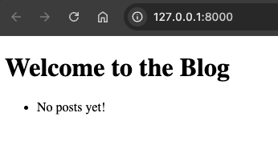
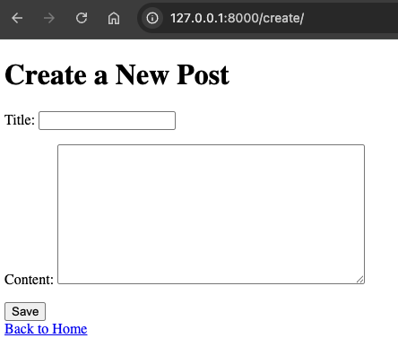
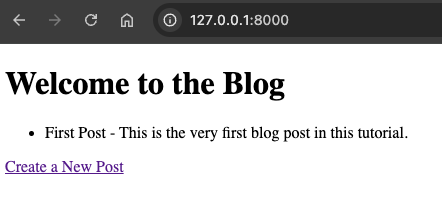
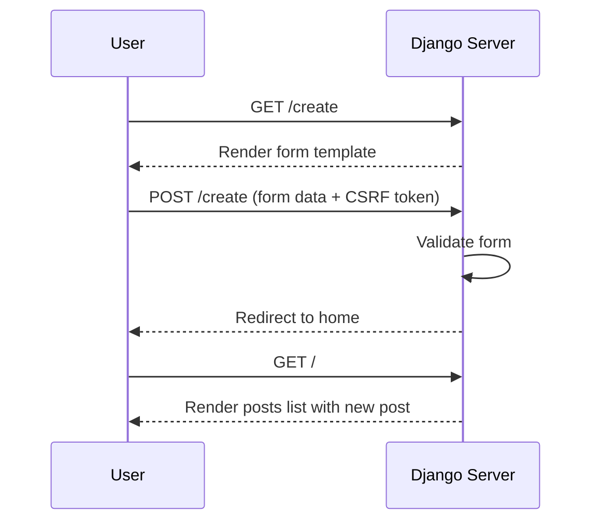

# Chapter 8: Templates, Forms, and Validation

In this chapter, you will learn:

* How Django handles **HTML templates** with its template engine.
* How to render dynamic data into templates.
* How to build and process **forms** in Django.
* How Django enforces **CSRF protection**.
* How to add **validation** for user input.

By the end, our Blog app will let users **create posts** through a form and **see them rendered** on a page.

## 8.1 Templates

**Django templates** form the presentation layer of a Django application, responsible for transforming data from views into HTML that is delivered to the browser. Templates use the Django Template Language (DTL), a simple yet powerful syntax that supports variable interpolation, control structures (like loops and conditionals), template inheritance, and filters for formatting data. This system encourages clean separation between logic and presentation: views collect and prepare the data, while templates define how that data should appear to the user.

Django’s template engine also supports reusable components through template inheritance, allowing you to define base layouts and override specific blocks in child templates. This makes it easy to maintain consistent structure across pages while varying content as needed. Overall, Django templates provide a flexible and structured way to generate dynamic HTML without mixing Python code directly into your markup.

### 8.1.1 Setting Up Templates

Create a folder for templates:

```bash
src/
├── apps/
│   ├── blog/
│   │   └── templates/
│   │       └── blog/
│   │           └── home.html
```

Inside `home.html`:

```html
<!-- @file src/apps/blog/templates/blog/home.html -->
<!DOCTYPE html>
<html lang="en">
<head>
    <meta charset="UTF-8">
    <title>Django Blog</title>
</head>
<body>
    <h1>Welcome to the Blog</h1>
    <ul>
        
            <li>{{ post.title }} - {{ post.content }}</li>
        
            <li>No posts yet!</li>
        
    </ul>
</body>
</html>
```

### 8.1.2 Use Template in View

Update the view to use templates:

```python
# @file src/apps/blog/views.py
# @showLineNumbers
from django.shortcuts import render

# Temporary storage for posts
POSTS = []

def home(request):
    """Render homepage with all blog posts."""
    return render(request, "blog/home.html", {"posts": POSTS})
```

### 8.1.3 Launch the App

Run the following in the terminal:

```bash
poetry run python manage.py runserver
```

Now visit `http://127.0.0.1:8000/`




## 8.2 Forms

**Django forms** provide a high-level abstraction for handling user input safely and consistently, bridging the gap between HTML form fields, server-side validation, and database interactions. A Django form defines the structure of expected input—fields, types, labels, and constraints—and automatically generates both the HTML form elements and the server-side validation logic.

When a form is submitted, Django processes the incoming data, validates it according to the rules you’ve defined, and gives you a clean Python object representing the validated values. This eliminates the need to manually parse request data or write repetitive validation code.

Django also offers **ModelForms**, which tie forms directly to database models, allowing you to create or update records with minimal boilerplate. By centralizing validation, error reporting, and rendering, Django forms encourage secure, maintainable input handling and help ensure that user-facing forms remain consistent across your application.

### 8.2.1 Create Post Form

Django provides a `forms` module. Create a form for new posts:

```python
# @file src/apps/blog/forms.py
# @showLineNumbers
from django import forms

class PostForm(forms.Form):
    """Form for creating blog posts."""

    title = forms.CharField(max_length=100, required=True)
    content = forms.CharField(widget=forms.Textarea, required=True)
```

### 8.2.2 Form Validations

`PostForm` defines two fields; `title` and `content`.

Django automatically applies several built-in validations when you submit data through this form:

1. Required field validation:
    Both fields use `required=True`, so Django checks that each field is present in the submitted POST data and is not an empty string. If missing, the form will produce an error like:
    - “This field is required.”
2. Type and basic sanitization validation:
    `CharField` ensures the submitted data is treated as a string. Django will also trim whitespace and standardize the value (e.g., converting `None` to `""`) before validation.
3. Length validation (`max_length=100` on title):
    Django checks that `title` is no longer than 100 characters, generating an error message if the limit is exceeded.


### 8.2.3 Form Templates

**Django form templates** are the bridge between Django’s form objects and the HTML presented to users, allowing you to render form fields, validation errors, and user input in a structured, customizable way.

While Django forms can automatically generate raw HTML using helpers like `{{ form.as_p }}` or `{{ form.as_table }}`, most real-world applications use dedicated templates to control layout, styling, and accessibility.

In a form template, each field can be rendered individually—giving you full control over labels, input widgets, error messages, and surrounding markup—while still relying on Django’s form object for validation and data handling. Template tags such as ``, ``, and `` make it easy to integrate forms into your page while maintaining security and usability.

By separating form logic from presentation, Django form templates let you produce polished, user-friendly interfaces without duplicating backend form logic in the frontend.

### 8.2.4 Create Post Form Template

The following form template is used for blog post creation.

```html
<!-- @file src/apps/blog/templates/blog/create_post.html -->

<!DOCTYPE html>
<html lang="en">
<head>
    <meta charset="UTF-8">
    <title>Create Post</title>
</head>
<body>
    <h1>Create a New Post</h1>
    <form method="post">
        
        {{ form.as_p }}
        <button type="submit">Save</button>
    </form>
    <a href="">Back to Home</a>
</body>
</html>
```

**Explanation:**

* `{{ form.as_p }}` renders form fields wrapped in `<p>`.
* `` adds hidden security token for CSRF protection.

### 8.2.5 Create Post View

```python
# @file src/apps/blog/views.py
# @showLineNumbers
from django.shortcuts import redirect
from .forms import PostForm

def create_post(request):
    """Handle GET (show form) and POST (process form)."""
    if request.method == "POST":
        form = PostForm(request.POST)
        if form.is_valid():
            POSTS.append(form.cleaned_data)
            return redirect("home")
    else:
        form = PostForm()
    return render(request, "blog/create_post.html", {"form": form})
```

When `create_post()` view function in voked to processes a `POST` request. the new blog post entered by the user and appends it to the POST list. In a later chapter, we'll examine how this data is saved into a database. For all other request types, the view renders the `create_post.html` form template.

### 8.2.6 Link Create Post View

Let's update the homepage template, so that it links to the `create_post` view.

```html
<!--
@file src/apps/blog/templates/blog/home.html
@highlight 16
-->
<!DOCTYPE html>
<html lang="en">
<head>
    <meta charset="UTF-8">
    <title>Django Blog</title>
</head>
<body>
    <h1>Welcome to the Blog</h1>
    <ul>
        
            <li>{{ post.title }} - {{ post.content }}</li>
        
            <li>No posts yet!</li>
        
    </ul>
    <a href="">Create a New Post</a>
</body>
</html>
```

### 8.2.7 Update URLs

Let's add the path `create/` to `urls.py` so that it is associated with the view `create_post`.

```python
# @file src/apps/blog/urls.py
# @showLineNumbers
from django.urls import path
from . import views

urlpatterns = [
    path("", views.home, name="home"),
    path("create/", views.create_post, name="create_post"),
]
```

### 8.2.8 Add New Posts

Click on the `Create a New Post` link that appears on the homepage now. The following form should render, that'd allow you to add a new blog post:



Enter some data, and click `Save`.

Now the newly saved post should appear on the list on the homepage:



## 8.3 Testing Templates and Forms

Let's update the app's view tests to incorporate the new features:

```python
# @file tests/apps/blog/test_views.py
# @showLineNumbers
import pytest
from django.test import Client
from django.urls import reverse


@pytest.mark.django_db
def test_home_page_renders():
    client = Client()
    response = client.get(reverse("home"))
    assert response.status_code == 200
    assert "Welcome to the Blog" in response.content.decode()


@pytest.mark.django_db
def test_create_post_form():
    client = Client()
    response = client.post(reverse("create_post"), {"title": "My First Post", "content": "Hello"})
    assert response.status_code == 302  # Redirect after success

    response = client.get(reverse("home"))
    body = response.content.decode()
    assert "My First Post" in body
    assert "Hello" in body
```

## 8.4 Template & Form Flow



## 8.5 Chapter Summary

In this chapter we introduced Django templates, forms, and form validations. We implemented two templates to display the blog posts on the homepage, and a form to enter a new blog post. The validated new post is then saved into a list representing an in-memory database.

In the next chapter we'll learn about how to save the user's posts into a database using Django ORM.

## 8.6 Further Reading

* [Django Templates](https://docs.djangoproject.com/en/stable/topics/templates/)
* [Working with Forms](https://docs.djangoproject.com/en/stable/topics/forms/)
* [CSRF Protection in Django](https://docs.djangoproject.com/en/stable/ref/csrf/)
