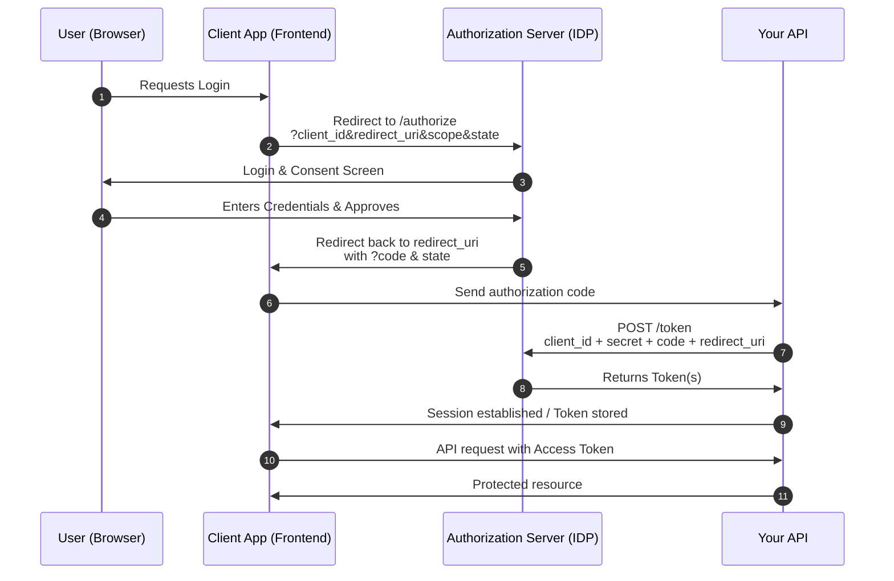

# Chapter 6: OAuth2 Scopes, Token Expiry, and Advanced Authorization

In this chapter, we deepen our understanding of authorization by introducing:

* **OAuth2 scopes** for fine-grained access control
* **Token expiration and validation workflows**
* A conceptual overview of **refresh tokens** and **token rotation**
* An introduction to **third-party identity providers (IDPs)** like Google/Auth0

We'll continue using the mock user database and JWT authentication from earlier chapters. This is a theory-heavy chapter with minimal new endpoints, focusing instead on expanding your ability to design secure and scalable auth flows.

## 6.1 OAuth 2.0 Scopes

OAuth2 scopes offer a powerful mechanism for fine-grained authorization. While roles (like `admin` or `user`) define general categories of access, scopes specify the exact **permissions** granted to a client or user. In the context of our Todo app, scopes allow us to define explicit actions—such as `read:todos` for viewing tasks and `write:todos` for creating or modifying them—thereby enabling greater control over what each token permits.

This model is particularly useful when an application integrates with third-party clients or frontend apps that don’t need full access to the user's data. For example, a mobile app might only request `read:todos`, while an internal admin dashboard could request both `read:todos` and `write:todos`. By validating these scopes on each protected route, we ensure that tokens are not only valid, but also used within the boundaries they were granted. In the upcoming chapter, we’ll demonstrate how to issue scoped tokens and enforce these constraints using FastAPI’s built-in `SecurityScopes` utility.

For additional information about OAuth2 scopes, refer to the documentation [here](https://fastapi.tiangolo.com/advanced/security/oauth2-scopes/).

## 6.2 Scopes with OAuth2PasswordBearer

FastAPI lets us define expected scopes using the `OAuth2PasswordBearer` class and `SecurityScopes`.

### 6.2.1 Defining Scopes

In the following code we are declaring the OAuth2 security scheme with three available scopes, `read:todos`, `write:todos`, and `admin`. The `scopes` parameter receives a `dict` with each key as the scope and the value representing the description of the scope.

```python
# @file app/auth/service.py
# @showLineNumbers
from fastapi.security import OAuth2PasswordBearer

oauth2_scheme = OAuth2PasswordBearer(
    tokenUrl="/token",
    scopes={
        "read:todos": "Read access to user's todos",
        "write:todos": "Write access to user's todos",
        "admin": "Admin-only operations"
    }
)
```

### 6.2.2 Issuing scoped tokens

Include the scope assigned to the user in the database as one of the JWT access token's claim.

```python
# @file app/auth/router.py
# @showLineNumbers
# @highlight 8, 20, 25
@router.post("/token", response_model=Token, response_model_exclude_none=True)
def login(
        form_data: OAuth2PasswordRequestForm = Depends(),
        user_service: UserService = Depends(get_user_service),
        auth_service: AuthService = Depends(get_auth_service)
):
    """Authenticate user and return JWT token."""
    fetched_user = user_service.get_user(form_data.username)
    
    if not fetched_user or not auth_service.verify_password(
      form_data.password, fetched_user.hashed_password):
        raise HTTPException(status_code=401, detail="Incorrect username or password")
    user = User(
        id=fetched_user.id,
        username=fetched_user.username,
        disabled=fetched_user.disabled,
        role=fetched_user.role,
        name=fetched_user.name,
        email=fetched_user.email,
        scopes=fetched_user.scopes,
    )
    access_token = auth_service.create_token(
        {
          "sub": user.username,
          "scopes": user.scopes,
          "role": user.role
        },
        expires_delta=timedelta(minutes=ACCESS_TOKEN_EXPIRE_MINUTES)
    )
    refresh_token = auth_service.create_token(
        {"sub": user.username, "scopes": user.scopes, "type": "refresh"},
        expires_delta=timedelta(days=REFRESH_TOKEN_EXPIRE_DAYS))
    return {
        "access_token": access_token,
        "token_type": "bearer",
        "expires_in": ACCESS_TOKEN_EXPIRE_MINUTES * 60,
        "refresh_token": refresh_token,
        "info": {
            "name": user.name,
            "email": user.email,
        }
    }
```

### 6.2.3 Validating Scopes from Token

Let's update the existing `get_current_user()` dependecy function to allow verifying that the user's access token has valid scopes assigned:

```python
# @file app/auth/dependencies.py
# @showLineNumbers

from fastapi import Security, HTTPException, status
from fastapi.security import SecurityScopes
from jose import JWTError, jwt

async def get_current_user(security_scopes: SecurityScopes, token: str = Depends(oauth2_scheme)):
    """Extract 'sub' (username) from JWT token."""
    payload = AuthService.decode_token(token)
    token_scopes = payload.get("scopes", [])

    for scope in security_scopes.scopes:
        if scope not in token_scopes:
            raise HTTPException(
                status_code=403,
                detail=f"Missing required scope: {scope}"
            )

    return payload  # or user object
```

### 6.2.4 Protecting Routes with Scope Checks

In the following route handlers for todo items, we are ensuring that the user has necessary permission to access the `list_todos`, and `create_todo` functions. The permissions are represented within the `scopes` array of the security dependencies.

```python
# @file app/todos/router.py
# @showLineNumbers

@router.get("", dependencies=[Security(get_current_user, scopes=["read:todos"])], response_model=List[TodoItem])
def list_todos(
        todo_service: TodoService = Depends(get_todo_service),
) -> List[TodoItem]:
    """List todos, but only if API key is valid."""
    return todo_service.list_todos()

@router.post("", dependencies=[Security(get_current_user, scopes=["write:todos"])], response_model=TodoItem)
def create_todo(
        todo: TodoCreate,
        todo_service: TodoService = Depends(get_todo_service),
) -> TodoItem:
    """Create a new Todo item."""
    return todo_service.create_todo(title=todo.title, completed=False)
```

This is identical to how Google, Microsoft, Auth0, and Amazon issue and validate scopes.

## 6.3 Token Expiration and Handling

In most modern stacks (including FastAPI), the access token is a JWT with an `exp` claim:

```json
{
  "sub": "user_123",
  "scopes": ["read:todos", "write:todos"],
  "exp": 1732403100
}
```

- The `exp` timestamp says “this token is valid until this time.”
- On each request, your FastAPI dependency decodes the token; the JWT library checks `exp`.
- If the token is expired, you should treat the client as unauthenticated and return 401 Unauthorized.

### 6.3.1 Generating token that expire and validating expiration

We are already encoding an `exp` within our JWT when we create it, we should simply aware of it when we decord the token.

```python
# @file app/auth/service.py
# @showLineNumbers
# @highlight 8-13, 26
@staticmethod
def decode_token(token: str) -> Dict:
    """Decode JWT token; raise HTTPException if invalid or expired."""
    try:
        payload = jwt.decode(token, SECRET_KEY, algorithms=[ALGORITHM])
        return payload

    except ExpiredSignatureError:
        # Token is structurally valid but expired
        raise HTTPException(
            status_code=status.HTTP_401_UNAUTHORIZED,
            detail="Token expired",
        )
    except JWTError:
        # Invalid signature, malformed token, etc.
        raise HTTPException(
            status_code=status.HTTP_401_UNAUTHORIZED,
            detail="Invalid token",
        )

@staticmethod
def create_token(data: dict, expires_delta: Optional[timedelta] = None) -> str:
    """Create JWT token with optional expiration delta."""
    to_encode = data.copy()
    expire = datetime.now(timezone.utc) + (expires_delta or timedelta(minutes=ACCESS_TOKEN_EXPIRE_MINUTES))
    to_encode.update({"exp": expire})
    encoded_jwt = jwt.encode(to_encode, SECRET_KEY, algorithm=ALGORITHM)
    return encoded_jwt
```

### 6.3.2 Testing Expiration

```bash
curl -i -X GET http://127.0.0.1:8000/api/todos \
     -H "Authorization: Bearer <expired-token>"
```

You should see a response similar to the following:

```bash
HTTP/1.1 401 Unauthorized
date: ***
server: uvicorn
content-length: 25
content-type: application/json

{"error":"Token expired"}
```

## 6.4 Refresh Tokens

If your access tokens are short-lived (e.g. 5–30 minutes), you don’t want users to log in again every time the access token expires. That’s where a refresh token comes in.

### 6.4.1 How refresh tokens fit in

- Access token
  - Short-lived (minutes)
  - Sent on every API call via `Authorization: Bearer ...`
  - If stolen, attacker has limited-time access
- Refresh token
  - Long-lived (days/weeks)
  - Used only to get a new access token
  - Often stored more securely (e.g. HttpOnly cookie)
  - If stolen, attacker can continuously mint new access tokens → must be protected carefully

Relationship:
- Access token = “ticket” to call APIs.
- Refresh token = “membership card” you bring back to the auth server to get a new ticket.

You typically issue them together at login:

```json
{
  "access_token": "<short-lived-jwt>",
  "refresh_token": "<opaque-or-longer-lived-jwt>",
  "token_type": "bearer",
  "expires_in": 1800
}
```

### 6.4.2 How to issue refresh tokens

A refresh token is generated and appended to response for login.

```python
# @file app/auth/router.py
# @showLineNumbers
# @highlight 13-15, 20
@router.post("/token", response_model=Token, response_model_exclude_none=True)
def login(
        form_data: OAuth2PasswordRequestForm = Depends(),
        user_service: UserService = Depends(get_user_service),
        auth_service: AuthService = Depends(get_auth_service)
):
    """Authenticate user and return JWT token."""
    ...
    access_token = auth_service.create_token(
        {"sub": user.username, "scopes": user.scopes, "role": user.role},
        expires_delta=timedelta(minutes=ACCESS_TOKEN_EXPIRE_MINUTES)
    )
    refresh_token = auth_service.create_token(
        {"sub": user.username, "scopes": user.scopes, "type": "refresh"},
        expires_delta=timedelta(days=REFRESH_TOKEN_EXPIRE_DAYS))
    return {
        "access_token": access_token,
        "token_type": "bearer",
        "expires_in": ACCESS_TOKEN_EXPIRE_MINUTES * 60,
        "refresh_token": refresh_token,
        "info": {
            "name": user.name,
            "email": user.email,
        }
    }
```

### 6.4.3 How clients know when to use refresh tokens

Two main strategies:

**A. Reactive: Refresh after a 401**

1. React app sends request with access token.
2. API returns 401 with `"Token expired"` detail.
3. Client catches this, calls `/auth/refresh` with refresh token.
4. If refresh succeeds, client retries the original request with the new access token.

Pros:
- Simple to implement.
- No need to track exact expiry time in the client.

Cons:
- User sees a small delay on the first expired request.
- If the refresh fails (refresh token revoked/expired), you must log the user out.

**B. Proactive: Refresh before expiration**

Client keeps track of exp and schedules a refresh a little before expiry (e.g. at `exp - 60s`):

- During login, client decodes the access token and extracts `exp`.
- Client sets a timer to call `/auth/refresh` some seconds before expiry.
- Access token is silently renewed in the background; user rarely sees a 401.

Pros:
- Smoother UX, fewer 401s.
- Better suited to SPAs and mobile apps.

Cons:
- Slightly more complex (timers, token decoding).
- Must handle edge cases where refresh token is revoked/expired anyway.

In practice, SPAs often do a hybrid: proactive refresh most of the time, reactive refresh as fallback.

## 6.5 External Identity Providers (Conceptual)

OAuth2 lets users authenticate using services like **Google, GitHub, or Auth0**.

### 6.5.1 How It Works (Simplified)

1. Your app redirects the user to an IDP login page
2. The user logs in and authorizes your app
3. The IDP sends your app an **authorization code** (via redirect)
4. Your app exchanges that code for an **access token**
5. You use the access token to fetch user info and create a local session



<p style={{width: "100%", textAlign: "center", fontWeight: "bold"}}>Fig 6.1: Authorization Code Flow</p>

## 6.6 Chapter Summary

In this chapter we took looked further into authorization by using OAuth 2. `scopes`. We also reviewed access token expiration, and using refresh token to generate access tokens in the event an access token has expired without having the user to login again.

Finally we outlined the **Autorization Code Grant** flow, which uses third party IDPs to issue access token for protecting backend resources.

The topic of authorization and OAuth is vast. Even though we reviewed a limited subset of the topics you should be able to review the documentation of other OAuth 2 grant types, and different authorization mechanisms, and be able to confidently implement them when necessary.

## 6.7 Further Reading

* FastAPI Security & Scopes: [https://fastapi.tiangolo.com/advanced/security/oauth2-scopes/](https://fastapi.tiangolo.com/advanced/security/oauth2-scopes/)
* Google Identity Docs: [https://developers.google.com/identity](https://developers.google.com/identity)
* Auth0 FastAPI integration: [https://auth0.com/docs/quickstart/backend/python](https://auth0.com/docs/quickstart/backend/python)
