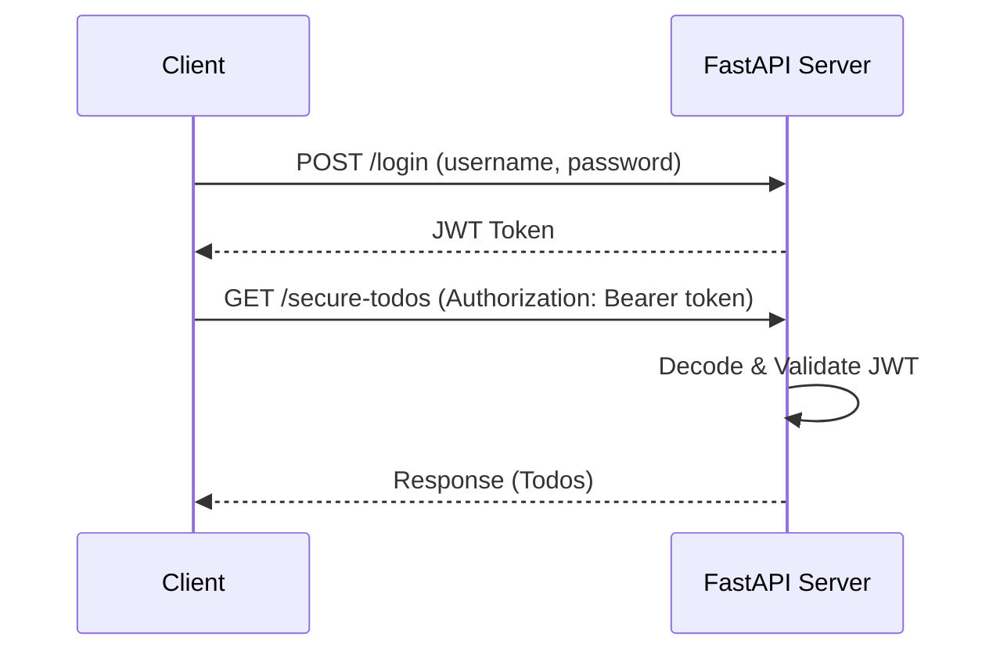

# Chapter 4: Authentication and Authorization in FastAPI

In this chapter, you will learn:

* The difference between **authentication** (who you are) and **authorization** (what you can do).
* How to implement **JWT (JSON Web Token)**-based authentication in FastAPI.
* How to protect routes with authentication.
* How to test secure endpoints using **Pytest**.

We’ll add a **user system** to our Todo API:

* `POST /login` → returns a JWT token.
* Protected routes (`/secure-todos`) → require valid JWT.

## 4.1 Install Dependencies

```bash
poetry add "python-jose[cryptography]" passlib[bcrypt]
```

* **python-jose** → JWT encoding/decoding.
* **passlib\[bcrypt]** → password hashing.

## 4.2 Create User & Auth Utilities

```python
"""
@file: fastapi_todo/auth.py
@showLineNumbers
"""
from datetime import datetime, timedelta
from typing import Optional

from jose import JWTError, jwt
from passlib.context import CryptContext

# Secret key & algorithm
SECRET_KEY = "super-secret-key"
ALGORITHM = "HS256"
ACCESS_TOKEN_EXPIRE_MINUTES = 30

# Password hashing context
pwd_context = CryptContext(schemes=["bcrypt"], deprecated="auto")

def verify_password(plain_password: str, hashed_password: str) -> bool:
    """Verify a plain password against a hashed password."""
    return pwd_context.verify(plain_password, hashed_password)

def get_password_hash(password: str) -> str:
    """Hash a plain password."""
    return pwd_context.hash(password)

def create_access_token(data: dict, expires_delta: Optional[timedelta] = None) -> str:
    """Generate a JWT access token."""
    to_encode = data.copy()
    expire = datetime.utcnow() + (expires_delta or timedelta(minutes=ACCESS_TOKEN_EXPIRE_MINUTES))
    to_encode.update({"exp": expire})
    return jwt.encode(to_encode, SECRET_KEY, algorithm=ALGORITHM)

def decode_access_token(token: str) -> dict:
    """Decode a JWT token and return its payload."""
    try:
        return jwt.decode(token, SECRET_KEY, algorithms=[ALGORITHM])
    except JWTError:
        raise ValueError("Invalid token")
```

**Explanation:**

* Passwords are hashed with **bcrypt**.
* JWTs contain user identity and expiration time.
* Invalid tokens raise an error.

## 4.3 User Model and Login Endpoint

```python
"""
@file: fastapi_todo/main.py
@showLineNumbers
"""
from fastapi import Depends, HTTPException, status
from fastapi.security import OAuth2PasswordBearer, OAuth2PasswordRequestForm
from fastapi_todo.auth import (
    create_access_token,
    decode_access_token,
    get_password_hash,
    verify_password,
)

# OAuth2 scheme
oauth2_scheme = OAuth2PasswordBearer(tokenUrl="login")

# Fake user DB
fake_users_db = {
    "alice": {
        "username": "alice",
        "hashed_password": get_password_hash("wonderland"),
    }
}


@app.post("/login")
def login(form_data: OAuth2PasswordRequestForm = Depends()) -> dict[str, str]:
    """Authenticate user and return JWT token."""
    user = fake_users_db.get(form_data.username)
    if not user or not verify_password(form_data.password, user["hashed_password"]):
        raise HTTPException(status_code=401, detail="Invalid username or password")

    access_token = create_access_token({"sub": form_data.username})
    return {"access_token": access_token, "token_type": "bearer"}
```

**Explanation:**

* `OAuth2PasswordBearer` handles `Authorization: Bearer <token>` headers.
* The `/login` route checks user credentials and issues a **JWT token**.
* For now, we use a fake in-memory user store.

## 4.4 Protect Routes with JWT

```python
"""
@file: fastapi_todo/main.py
@showLineNumbers
"""
def get_current_user(token: str = Depends(oauth2_scheme)) -> str:
    """Extract current user from JWT token."""
    try:
        payload = decode_access_token(token)
        username = payload.get("sub")
        if not username:
            raise HTTPException(status_code=401, detail="Invalid token payload")
        return username
    except Exception:
        raise HTTPException(status_code=401, detail="Invalid or expired token")

@app.get("/secure-todos")
def secure_list_todos(current_user: str = Depends(get_current_user)) -> list[Todo]:
    """Return todos for authenticated users only."""
    return todos
```

**Explanation:**

* `get_current_user` decodes JWT and validates it.
* If valid, the username is returned.
* `/secure-todos` requires a valid token to respond.

## 4.5: Tests for Authentication

```python
"""
@file: tests/test_auth.py
@showLineNumbers
"""
from fastapi.testclient import TestClient
from fastapi_todo.main import app

client = TestClient(app)


def test_login_and_secure_access() -> None:
    # Login to get a token
    response = client.post("/login", data={"username": "alice", "password": "wonderland"})
    assert response.status_code == 200
    token = response.json()["access_token"]

    # Use token to access secure route
    headers = {"Authorization": f"Bearer {token}"}
    response = client.get("/secure-todos", headers=headers)
    assert response.status_code == 200
    assert isinstance(response.json(), list)


def test_invalid_login() -> None:
    response = client.post("/login", data={"username": "alice", "password": "wrong"})
    assert response.status_code == 401


def test_secure_route_without_token() -> None:
    response = client.get("/secure-todos")
    assert response.status_code == 401
```

**Explanation:**

* Logs in, retrieves token, and uses it for authenticated requests.
* Tests **happy path** and **failure cases** (wrong password, missing token).

Run with:

```bash
poetry run pytest
```

## 4.6 JWT Authentication Flow



## 4.7 Further Reading

* [OAuth2 with FastAPI](https://fastapi.tiangolo.com/tutorial/security/oauth2-jwt/)
* [JSON Web Tokens (jwt.io)](https://jwt.io/)
* [Password Hashing in Python (Passlib)](https://passlib.readthedocs.io/)
