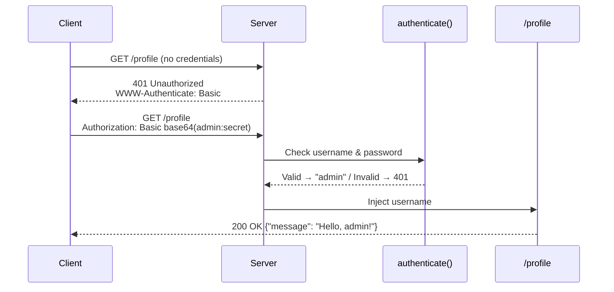
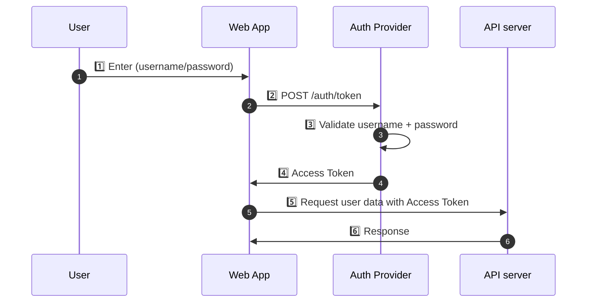

# Chapter 4: Authentication in FastAPI

In this chapter, you will learn:

* How to implement **HTTP Basic Authentication** in FastAPI.
* How to implement **JWT (JSON Web Token)**-based authentication in FastAPI.
* How to protect routes with authentication.
* How to test secure endpoints using **Pytest**.

In FastAPI, both authentication and authorization are usually implemented using dependencies that run before the route handler.

## 4.1 HTTP Basic Authentication

Let's demonstrate HTTP Basic Authentication using a simple demo.

### 4.1.1 How it is used

The code demonstrates the following auth flow:



<p style={{width: "100%", textAlign: "center", fontWeight: "bold"}}>Fig 4.1: HTTP Authentication Flow</p>

### 4.1.2 Simple Demo

```python
# @showLineNumbers
from fastapi import FastAPI, Depends, HTTPException, status
from fastapi.security import HTTPBasic, HTTPBasicCredentials
import secrets

app = FastAPI()
security = HTTPBasic()

def authenticate(credentials: HTTPBasicCredentials = Depends(security)):
    correct_username = secrets.compare_digest(credentials.username, "admin")
    correct_password = secrets.compare_digest(credentials.password, "secret")
    if not (correct_username and correct_password):
        raise HTTPException(
            status_code=status.HTTP_401_UNAUTHORIZED,
            detail="Incorrect username or password",
            headers={"WWW-Authenticate": "Basic"},
        )
    return credentials.username

@app.get("/profile")
def read_profile(username: str = Depends(authenticate)):
    return {"message": f"Hello, {username}!"}
```

The code snippet uses:

- `Depends` — a dependency injection helper that tells FastAPI:
> Hint: “When this function is called, automatically provide a value from another callable or dependency.”
In this case, it’s used to automatically extract and validate credentials from the request.
- `HTTPException` — used to stop the request and send an HTTP error response (like 401 Unauthorized).
- `status` — a collection of readable constants like `status.HTTP_401_UNAUTHORIZED` instead of hardcoding numbers (401).
- `HTTPBasic` — a FastAPI helper that handles HTTP Basic Authentication (the “username:password” sent in the Authorization header).
It automatically decodes the Base64 header and gives you the credentials.
- `HTTPBasicCredentials` — a simple data class (Pydantic model) with two attributes:
   - username: str
   - password: str<br />
   It’s what FastAPI passes into your function once the credentials are extracted.
- `secrets` — module provides functions for cryptographically secure comparisons and random numbers.
Here it’s used to prevent timing attacks when comparing sensitive strings like passwords.

The `authenticate()` function accepts the parameter `credentials`. The `credentials` parameter will **automatically be populated by FastAPI** with a `HTTPBasicCredentials` object when a route depends on it.

The function compares the provided credentials to hardcoded values (`admin` / `secret`) using `secrets.compare_digest()` is used instead of `==` because: It performs a constant-time comparison, making it harder for attackers to exploit timing side channels.

If the validation fails, it stops the request and returns an `HTTP 401 response` to the client.

The `"WWW-Authenticate": "Basic"` header tells browsers or API clients: “You need to provide Basic Auth credentials.”

### 4.1.3 Test with curl

```bash
curl -i http://127.0.0.1:8000/profile
```

This returns the following error response:

```bash
# @highlight: 1, 4, 8
# @showLineNumbers

HTTP/1.1 401 Unauthorized
date: ***
server: uvicorn
www-authenticate: Basic
content-length: 29
content-type: application/json

{"error":"Not authenticated"}
```

Now test the route with the valid login and password:

```bash
curl -i -u admin:secret http://127.0.0.1:8000/profile
```

You should see the following response:

```bash
# @highlight: 1, 7
# @showLineNumbers

HTTP/1.1 200 OK
date: ...
server: uvicorn
content-length: 27
content-type: application/json

{"message":"Hello, admin!"}
```

> Tip: Try testing the `curl` command with an invalid username and password. Also, try writing some unit tests for the scenarios tested with `curl`, such as no login, bad login, valid login.

### 4.1.4 Limitations

HTTP Basic Authentication works at the protocol level by sending user credentials — a username and password — in every HTTP request header. When a client first requests a protected resource, the server responds with:

```bash
HTTP/1.1 401 Unauthorized
WWW-Authenticate: Basic realm="Restricted"
```

The client then retries the request with a header like:

```bash
Authorization: Basic YWRtaW46c2VjcmV0
```

Here, `YWRtaW46c2VjcmV0` is the Base64-encoded form of `admin:secret`. The server decodes it, verifies the credentials, and grants access if valid.

- **Credentials are only Base64-encoded, not encrypted**, so anyone intercepting traffic can decode them easily.
- Because credentials are sent on **every request**, they are repeatedly exposed over the network.
- Without HTTPS, attackers can perform **man-in-the-middle (MITM)** attacks and steal passwords.
- There's **no session or token expiration**, so credentials remain valid until changed.

Because of these limitations, Basic Auth should only be used in certain limited scenarios:

- **Testing, internal tools, or local development**, where simplicity matters more than security.
- **Behind HTTPS** and possibly with an additional protection layer (e.g., API Gateway or reverse proxy).
- **Service-to-service communication** in tightly controlled, private networks.

In modern systems, Basic Auth is largely replaced by **token-based schemes** (e.g., OAuth2, JWT, API keys) that avoid sending raw credentials and support expiration, revocation, and finer-grained access control.


## 4.2 OAuth 2.0

OAuth is the **most common and secure approach** for implementing authentication and authorization for web applications, mobile applications, and APIs. OAuth 2.0 was designed to allow a website or applicaton to access resources hosted by another provider on behalf of a user.

OAuth 2.0 is primarily an **Authorization** protocol, as opposed to an **Authentication** protocol. Authorization determines what resources a client can access rather than who they are. That is why the responsibility of authenticating is often delegated to a separate **Identity Provider (IDP)**.

The topic of OAuth 2.0 is fairly expansive. While we are going to build several examples to demonstrate practical use cases, I'd encourage you to go through the [Further Reading](#heading-2-44-further-reading) to get a deeper understanding on all the topics related to Authentication and Authorization.

### 4.2.1 OAuth2 Concepts

OAuth 2.0 primarily has three main concepts that compose the protocols:

#### Roles

- **Resource Owner**: This is the user or the system that owns the resource 3rd parties need to access. The resource owner grants access to the resource.
- **Client**: The system that requires access to the resource in question.
- **Authorization Server**: The server that receives requests from clients for access tokens and issues them if the client's identity is met, and the resource owner grants access to the resource being requested. It does so by providing the following endpoints:
    - **The authorization endpoint** — which handles interactive authentication of the client, as well as the resource owner's consent.
    - **The token endpoint(s)** — which involves token exchange.
- **Resource Server**: The server that protects the user's resources. It accepts and _validates_ requests from clients for those resources, and returns them accordingly.

#### Scopes

In OAuth 2.0 scopes define exactly what resources may be accessed by a client. The values used to signify scopes are dependent on the resource server, meaning the scope values used within one resource server may not be identical to scope values used by another resource server, even if they deal with the same type of resource.

#### Grant Types

In OAuth 2.0 Grant Types refer to the steps a client has to perform in order to access a secure resource. The following lists the possible Grant Types:

- **Authorization Code** Grant Type
- **Implicit** Grant Type
- **Authorization Code Grant with Proof Key for Code Exchange (PKCE)**
- **Resource Owner Credentials** Grant Type
- **Client Credentials** Grant Type
- **Device Authorization Flow**
- **Refresh Token** Grant Type

I will not go into further details of each Grant Type, but I'd highly encourage you to read through the reference material in the [Further Reading](#heading-2-44-further-reading) section to get a deeper understanding.

### 4.2.2 Password Flow

The following diagram demonstrates the OAuth 2.0 **Password Flow** grant flow, also known as the **Resource Owner Credentials** grant flow. It is one of the simpler OAuth2 Grant types. However, this grant requires that the client acquires the resource owner's credentials, which are then passed on to the Authorization server.

In the following diagram, the `User` is the **Resource Owner**. The `Web App` rendered on the browser, acts as the **Client**. The `Auth Provider` is the **Authorization server**. And finally the `API server` is the **Resource server**.



<p style={{width: "100%", textAlign: "center", fontWeight: "bold"}}>Fig 4.2: Resource Owner Credentials Grant</p>

#### Password Flow Overview

1. User enters their credentials into a login form and submits it to `/auth/token`
2. Server validates credentials and returns a JWT access token
3. User sends that token in the `Authorization: Bearer <token>` header for subsequent requests
4. Server decodes and verifies token on each protected route

> Note: In order to simplify, we are going to implement both the Auth provider and the API server within the same application.

### 4.2.3 Install dependencies

```bash
poetry add "python-jose[cryptography]" passlib[bcrypt]
```

- **python-jose** → JWT encoding/decoding.
- **passlib\[bcrypt]** → password hashing.

### 4.2.4 Setup

The following code sets up the **foundation for a JWT-based authentication system** in our FastAPI application. It defines key **security and data-handling components**:
- configuration values for JWT creation (`SECRET_KEY`, `ALGORITHM`, `ACCESS_TOKEN_EXPIRE_MINUTES`)
- a **password hashing mechanism** using `passlib`’s `CryptContext` (bcrypt)
- a small **in-memory "fake" user database** that stores usernames and hashed passwords
- **Pydantic models** (`Token`, and `User`) to ensure type safety and structured data validation when exchanging tokens or user info between the client, API, and internal logic.

Together, these elements establish the conceptual backbone for secure login, password verification, and token issuance workflows typical of OAuth2 + JWT authentication systems.

```python
# @showLineNumbers

from fastapi import FastAPI, Depends, HTTPException, status
from fastapi.security import OAuth2PasswordBearer, OAuth2PasswordRequestForm
from jose import JWTError, jwt
from passlib.context import CryptContext
from datetime import datetime, timedelta
from pydantic import BaseModel

app = FastAPI()

# Config
SECRET_KEY = "supersecretkey"       # In real apps, load from env
ALGORITHM = "HS256"
ACCESS_TOKEN_EXPIRE_MINUTES = 30

# Password hashing
pwd_context = CryptContext(schemes=["bcrypt"], deprecated="auto")

def get_password_hash(password: str) -> str:
    """Hash plain password using bcrypt."""
    return pwd_context.hash(password)

# Fake DB
fake_users_db = {
    "alice": {
        "username": "alice",
        "hashed_password": get_password_hash("wonderland"),
        "name": "Alice Sharpe",
        "email": "asharpe@example.com",
        "role": "user",
        "scopes": ["read", "write"],
    }
}

# Models
class Token(BaseModel):
    access_token: str
    token_type: str

class User(BaseModel):
    username: str
    disabled: bool = False
```

### 4.2.5 Token generation utility

The following utility functions implements the **core authentication and token-generation logic** for our FastAPI security workflow.

- The `verify_password` function checks whether a user’s plaintext password matches its stored bcrypt hash using `passlib`’s secure verification.
- The `get_user` function retrieves a user record from the database (here, the fake in-memory dictionary).
- `authenticate_user` ties those pieces together: it looks up the user, verifies the password, and returns a validated `User` model if credentials are correct—or `None` otherwise—forming the heart of the login process.
- Finally, `create_access_token` generates a **JWT (JSON Web Token)** containing user-related data and an expiration timestamp (`exp`), signing it with the secret key and chosen algorithm. This token can then be sent to clients and used to authenticate future API requests securely without resending passwords.


```python
# @showLineNumbers
def verify_password(plain, hashed):
    return pwd_context.verify(plain, hashed)

def get_user(db, username: str):
    return db.get(username)

def authenticate_user(username: str, password: str):
    user = get_user(fake_users_db, username)
    if not user or not verify_password(password, user["hashed_password"]):
        return None
    return User(**user)

def create_access_token(data: dict, expires_delta: timedelta = None):
    to_encode = data.copy()
    expire = datetime.utcnow() + (expires_delta or timedelta(minutes=15))
    to_encode.update({"exp": expire})
    return jwt.encode(to_encode, SECRET_KEY, algorithm=ALGORITHM)
```

### 4.2.6 Login route

This code block defines the login endpoint (`/auth/token`) — the entry point of the OAuth2 password flow where clients exchange a username and password for a JWT access token. When a user sends a `POST` request with form data (`username`, `password`) using the `application/x-www-form-urlencoded format`, FastAPI automatically parses it into an `OAuth2PasswordRequestForm` object thanks to the `Depends()` injection.

The function then calls `authenticate_user()` to verify the credentials against the stored hashed password. If the authentication fails, a `401 Unauthorized` error is raised; if successful, it calls create_access_token() to generate a signed JWT containing the user’s identity (sub: user.username). Finally, the function returns a dictionary matching the Token response model — an access_token and its token_type ("bearer") — which clients will include in the Authorization header for subsequent requests.

```python
# @showLineNumbers
@app.post("/auth/token", response_model=Token)
def login(form_data: OAuth2PasswordRequestForm = Depends()):
    user = authenticate_user(form_data.username, form_data.password)
    if not user:
        raise HTTPException(status_code=401, detail="Invalid credentials")
    access_token = create_access_token(data={"sub": user.username})
    return {"access_token": access_token, "token_type": "bearer"}

```

### 4.2.7 Test login with curl

```bash
curl -X POST http://127.0.0.1:8000/auth/token \
     -d "username=alice&password=wonderland" \
     -H "Content-Type: application/x-www-form-urlencoded"
```

You should see the following response:

```json
{"access_token":"<JWT_TOKEN>","token_type":"bearer",...}
```

The code in the companion repository has several extra fields that we will use later for future examples.

### 4.2.8 Protected route

```python
# @showLineNumbers
def get_current_user(token: str = Depends(oauth2_scheme)):
    try:
        payload = jwt.decode(token, SECRET_KEY, algorithms=[ALGORITHM])
        username = payload.get("sub")
        if username is None:
            raise HTTPException(status_code=401, detail="Invalid token")
        user = get_user(fake_users_db, username)
        if user is None:
            raise HTTPException(status_code=401, detail="User not found")
        return User(**user)
    except JWTError:
        raise HTTPException(status_code=401, detail="Token expired or invalid")

@app.get("/api/todos", dependencies=[Depends(get_current_user)])
def secure_list_todos():
    """List todos, but only if API key is valid."""
    return todos.get_all_todos()
```

The function `get_current_user()` decodes the JWT token that is passed via a Bearer token, in the `Authorization` header, and ensures that the subject of the token is a valid user within the (fake) database. If so, the user's information is returned within a User object.

This function is then injected into the route handler for `/api/todos`, which is the secure version of our `/todos` route. Because `get_current_user()` is a route dependency, it is invoked prior to any route hanlder logic is invoked. This allows us to intercept any request being sent to the protected route to ensure only a valid user with the correct authorization has access to this route.

### 4.2.9 Test protected route with curl

```bash
TOKEN=$(curl -s -X POST http://127.0.0.1:8000/auth/token \
     -d "username=alice&password=wonderland" \
     -H "Content-Type: application/x-www-form-urlencoded" | jq -r .access_token)

curl -H "Authorization: Bearer $TOKEN" http://127.0.0.1:8000/api/todos
```

If you have been adding todo items, you should see an array with your todos within them.


## 4.3 Summary

In this chapter we've studied the uses and implementation of HTTP Basic Authentication, and OAuth 2.0 in a FastAPI application. We have only briefly touched on the usage of OAuth 2.0.

In the next few chapters, we will explore the topic of Authentication and Authorization further within the context of OAuth. We will explore how to expire access tokens correctly, how to use refresh tokens. We will also integrate our todo app with 3rd Party IDPs for tokens, and implement RBAC and ABAC policies to protect endpoints and resources. We will also review how mobile and or desktop clients can interact with secure resources using OAuth 2.0, and secure token management.


## 4.4 Further Reading

* [What is OAuth 2.0?](https://auth0.com/intro-to-iam/what-is-oauth-2)
* [OAuth2 with FastAPI](https://fastapi.tiangolo.com/tutorial/security/oauth2-jwt/)
* [OAuth 2.0 Simplified](https://www.oauth.com/)
* [JSON Web Tokens (jwt.io)](https://jwt.io/)
* [Password Hashing in Python (Passlib)](https://passlib.readthedocs.io/)
