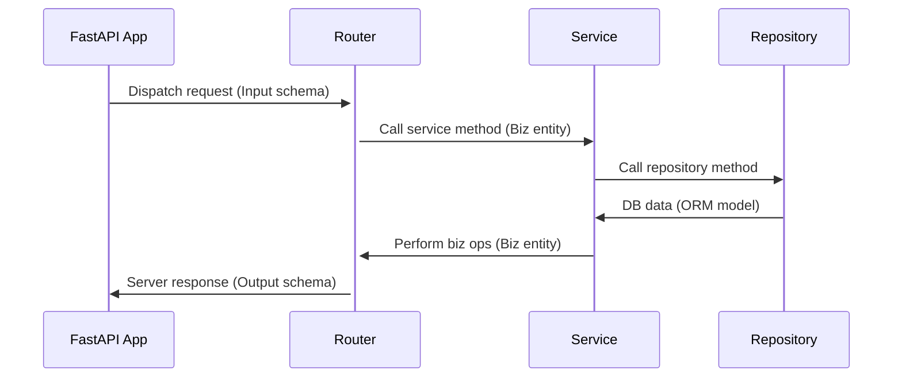

# Chapter 5: User Registration and Role-Based Authorization

This chapter builds on our authentication system from Chapter 4 by implementing:

* **User Registration**
* **Role-based authorization (RBAC)**
* An overview of **scopes and attribute-based access control (ABAC)**
* Best practices for securing endpoints based on user roles

We continue using a mock in-memory database to keep our project aligned with later chapters (where we'll introduce real databases and ORMs).

We also introduce a realistic multi-user Todo app flow and expand our test suite.

## 5.1 Preparation & Cleanup

You may have noticed that the volume of code in our Todo application is rapidly growing, and so are the number of REST endpoints. Starting from this chapter onwards, we are going to organize the code into logical directory structures similar to the one shown below.

```bash
app/
├── todo/
│   ├── schemas.py        # Pydantic request/response models
│   ├── entities.py       # Business/domain entities
│   ├── repository.py     # DB access
│   ├── service.py        # Business logic
│   ├── router.py         # FastAPI routes
│   └── __init__.py
├── auth/
│   ├── ...
├── core/
│   ├── config.py         # Application config
│   ├── constants.py      # Shared constants
│   ├── security.py       # Shared security ops
│   └── db.py             # DB connection (real/fake)
└── main.py               # Main entrypoint
```

This allows strong cohesion within modules, and loose coupling across modules.

Each module contains a `router.py` which contains the route handlers for the module. This is essentially the entry-point of the module.

```python
# @file router.py
# @showLineNumbers

# ---- Router -----
router = APIRouter(prefix="/api/todos", tags=["ToDos"])
```

The routers are then registered with the main application as follows:

```python
# @file main.py
# @showLineNumbers
# ---- Routers ----
from app.todos.router import router as todos_router

# ---- Todo CRUD Routes ----
app.include_router(todos_router)
```

This organization implements **Separation of Concerns** cleanly as shown below:



<p style={{width: "100%", textAlign: "center", fontWeight: "bold"}}>Fig 5.1: App module separation of concerns</p>


You can see the actual structure [here](https://github.com/WalidNewaz/python-web-dev/tree/main/chapter_5), or by clicking `View Code` at the top of this page.

## 5.2 User Registration

Now we have a clean repository. Let's add the user registration process. Install the optional Pydantic `email` module to validate addresses.

### 5.2.1 Install prerequisites

```bash
poetry add pydantic[email]
```

### 5.2.2 Add Input/Output schemas

Now add the input and output models for the route to register new users.

```python
# @file app/users/schemas.py
# @showLineNumbers

from pydantic import BaseModel, EmailStr

class UserRegisterSchema(BaseModel):
    username: str
    password: str
    name: str
    email: Optional[EmailStr] = None

class UserRegOutSchema(BaseModel):
    username: str
    name: str
    role: str
```

### 5.2.2 Add User Registration Route

We're going to add a new POST endpoint `/auth/register` in the router of our `auth` module.

```python
# @file app/auth/router.py
# @showLineNumbers

@router.post(
  "/register",
  response_model=UserRegOutSchema,
  response_model_exclude_none=True
)
def register_user(
        user_register: UserRegisterSchema,
        user_service: UserService = Depends(get_user_service),
):
    """Register a new user."""
    fetched_user = user_service.get_user(user_register.username)
    if fetched_user:
        raise HTTPException(status_code=400, detail="User already exists")

    created_user = user_service.register_user(
        username=user_register.username,
        password=user_register.password,
        name=user_register.name,
        email=user_register.email,
        scopes=["read", "write"]

    )
    return created_user
```

It is always a good idea to check whether a user already exists in our database prior to adding the user's data into the database. Once verified, we invoke the `UserService` to register the new user.

### 5.2.3 User registration service method

Let's update the user service method as follows so that it can invoke the repository to create the user in our in-memory database.

```python
# @file app/users/service.py
# @showLineNumbers
# @highlight 9

def register_user(
        self,
        username: str,
        password: str,
        name: Optional[str] = "",
        email: Optional[str] = "",
        scopes: Optional[List[str]] = None,
) -> UserEntity:
    hashed_password = get_password_hash(password)
    return self.repo.create_user(
        username=username,
        hashed_password=hashed_password,
        name=name,
        email=email,
        scopes=scopes,
    )
```

The only thing we are doing in the service method is hashing the password provided by the user prior to saving it in our database.

### 5.2.4 Save new user in DB

The `create_user()` repository method simply append the new user's information to our in-memory database, and advances the internal index.

```python
# @file app/users/repository.py
# @showLineNumbers

def create_user(
        self,
        username: str,
        hashed_password: str,
        name: str,
        email: str,
        scopes: List[str],
) -> UserEntity:
    """Adds a new user to the database."""
    user = UserEntity(
        id=self.next_id,
        username=username,
        hashed_password=hashed_password,
        name=name,
        email=email,
        scopes=scopes,
        role="user",
        disabled=False
    )
    self.db.users.append(user)
    self.next_id += 1
    return user
```

### 5.2.5 Add new user

Test the user registration feature by entering the following command in the terminal:

```bash
curl -X 'POST' \
  'http://127.0.0.1:8000/auth/register' \
  -H 'accept: application/json' \
  -H 'Content-Type: application/json' \
  -d '{
  "username": "jdoe",
  "password": "password",
  "name": "John Doe",
  "email": "jdoe@example.com"
}'
```

This should return the following response:

```json
{
  "username": "jdoe",
  "name": "John Doe",
  "role": "user"
}
```

### 5.2.6 Test new user

You can test the new user has been added correctly and is able to login:

```bash
curl -X 'POST' \
  'http://127.0.0.1:8000/auth/token' \
  -H 'accept: application/json' \
  -H 'Content-Type: application/x-www-form-urlencoded' \
  -d 'grant_type=password&username=jdoe&password=password&scope=&client_id=string&client_secret=********'
```

This would return a valid response with a valid assess token.

```json
{
  "access_token": "eyJ***",
  "token_type": "bearer",
  "expires_in": "***",
  ...
}
```

## 5.3 Protecting Routes with Role-Based Access Control

We can protect resources, such as endpoints based on a user's role. This is done by ensuring that the user requesting a particular resource has the proper role assigned to them at the time the resource is being requested.

We can do this in one of two ways:

- Add the user's role as a JWT claim, which is then exchanged between the client and the resource server as an access token.
- Fetch the user's current role from the database when a protected resource is requested.

### 5.3.1 Add role to access token

In order to determine the user's role from the access token used in the `Authorization` header, we need to include the user's role to the token's payload when it is created during login. Thus our login route handler needs to be updated as follows:

```python
# @file app/auth/router.py
# @showLineNumbers
# @highlight 21
@router.post("/token", response_model=Token, response_model_exclude_none=True)
def login(
        form_data: OAuth2PasswordRequestForm = Depends(),
        user_service: UserService = Depends(get_user_service),
        auth_service: AuthService = Depends(get_auth_service)
):
    """Authenticate user and return JWT token."""
    fetched_user = user_service.get_user(form_data.username)
    if not fetched_user or not auth_service.verify_password(form_data.password, fetched_user.hashed_password):
        raise HTTPException(status_code=401, detail="Incorrect username or password")
    user = User(
        id=fetched_user.id,
        username=fetched_user.username,
        disabled=fetched_user.disabled,
        role=fetched_user.role,
        name=fetched_user.name,
        email=fetched_user.email,
        scopes=fetched_user.scopes,
    )
    access_token = auth_service.create_token(
        {"sub": user.username, "scopes": user.scopes, "role": user.role},
        expires_delta=timedelta(minutes=ACCESS_TOKEN_EXPIRE_MINUTES)
    )
    refresh_token = auth_service.create_token(
        {"sub": user.username, "scopes": user.scopes, "type": "refresh"},
        expires_delta=timedelta(days=REFRESH_TOKEN_EXPIRE_DAYS))
    return {
        "access_token": access_token,
        "token_type": "bearer",
        "expires_in": ACCESS_TOKEN_EXPIRE_MINUTES * 60,
        "refresh_token": refresh_token,
        "info": {
            "name": user.name,
            "email": user.email,
        }
    }
```

### 5.3.2 Checking the user's claimed role

Let's create a route dependency method that ensures only users with the `admin` role has access to them.

```python
# @file app/auth/dependencies.py
# @showLineNumbers
# @highlight 1, 9
def get_user_role(token: str = Depends(oauth2_scheme)) -> str:
    """Extract 'sub' (username) from JWT token."""
    payload = AuthService.decode_token(token)
    role = payload.get("role")
    if not role:
        raise HTTPException(status_code=401, detail="Invalid token payload")
    return role

def require_admin(role: str = Depends(get_user_role)):
    if role != "admin":
        raise HTTPException(status_code=403, detail="Not authorized")
```

This method depends on the `get_user_role()` to decode the user's JWT token and return the user's role. The method `require_admin()` then ensures that the correct role is being used. While this strategy works, it introduces a vulnerability within the authorization mechanism.

What if a user obtains an access token by logging in, which expires in 30 minutes. A few minutes later, the administrator changes the user's role. Since the token has not expired, the user will continue to have the same access until the token expires. The situation could get worse if the **refresh token** is used to issue a new **access token** without taking the user's current status in the database, since refresh tokens generally have a long expiration time. We will discuss **refresh tokens** in a later chapter.

To eliminate such possibilities, and to ensure that user's access to protected resources is managed in real-time, we need to query the database to ensure that the user has the correct authorization at the time the resource is being requested. The following section shows how.

### 5.3.3 Checking the DB for the user's role

Instead of adding a `role` claim to the JWT, let's update our `require_admin()` dependency function so that it check's the user's current role in the database. Update the function as follows:

```python
# @file app/auth/dependencies.py
# @showLineNumbers
# @highlight 6
def require_admin(
        username: str = Depends(get_current_user),
        user_service: UserService = Depends(get_user_service),
):
    """Ensures that routes that dependent routes are only accessible to admins."""
    db_user = user_service.get_user(username=username)
    role = db_user.role
    if role != "admin":
        raise HTTPException(status_code=403, detail="Not authorized")
```

This version retrieves the user's information from the database to ensure that the user requesting the resource has the role `admin` assigned to them. This allows us to control access to protected resources in real-time regardless of the expiration of the access or refresh tokens.

### 5.3.4 Protecting admin only routes

Now that we have a function that checks a user's admin privileges, we can attach that to a route definition as a dependency.

```python
# @file app/users/router.py
# @showLineNumbers
# @highlight 6
from app.auth.dependencies import require_admin

# ---- Router -----
router = APIRouter(prefix="/api/users", tags=["Users"])

@router.get("", response_model=List[User], dependencies=[Depends(require_admin)])
def list_users(
        user_service: UserService = Depends(get_user_service),
):
    """List all users from the database."""
    fetched_users = user_service.list_users()
    return fetched_users
```

Remember, `require_admin()` is invoked before the route handler `list_users()` is executed. If a **non-admin** tries to access the route, you'll see a `Not authorized` error.

### 5.3.5 Testing role-based access

In order to test that only users with `admin` roles can access the new route, try logging in as a regular user and accessing the route:

```bash
# @showLineNumbers
# @highlight 2
TOKEN=$(curl -s -X POST http://127.0.0.1:8000/auth/token \
     -d "username=alice&password=wonderland" \
     -H "Content-Type: application/x-www-form-urlencoded" | jq -r .access_token)

curl -i -H "Authorization: Bearer $TOKEN" http://127.0.0.1:8000/api/users
```

You'll see a response similar to the following in the terminal:

```bash
# @showLineNumbers
# @highlight 1, 7
HTTP/1.1 403 Forbidden
date: ***
server: uvicorn
content-length: 26
content-type: application/json

{"error":"Not authorized"}
```

However try testing it again with a user with the admin role:

```bash
# @showLineNumbers
# @highlight 2
TOKEN=$(curl -s -X POST http://127.0.0.1:8000/auth/token \
     -d "username=admin&password=secret" \
     -H "Content-Type: application/x-www-form-urlencoded" | jq -r .access_token)

curl -i -H "Authorization: Bearer $TOKEN" http://127.0.0.1:8000/api/users
```
You should now see a valid response:

```bash
HTTP/1.1 200 OK
date: ***
server: uvicorn
content-length: 275
content-type: application/json

[{"id":1,"username":"alice","disabled":false, ...},]
```

## 5.4 Overview of ABAC and Scopes

Scopes can allow more granular access (like `read:todo`, `write:todo`), and FastAPI supports them via `SecurityScopes`.

We won’t implement ABAC fully here, but this is a good point to explain the concept:

* ABAC = access based on **attributes** (e.g., user age, department)
* RBAC = access based on **predefined roles**

You can add a `department` or `clearance_level` field to your user model and add conditional logic in your route dependencies to simulate ABAC.

## 5.5 Chapter Summary

In this chapter, we implemented role-based authorization in our FastAPI app using JWT tokens. We introduced `current_user` and `require_role` dependencies to enforce access control based on user roles, such as `user` and `admin`. By modeling user objects with attached roles, we demonstrated how route protection could be achieved with a combination of dependency injection and Pydantic validation. We also touched on the differences between authentication and authorization, and structured our `todo` endpoints to reflect real-world scenarios involving regular and elevated access.

We emphasized the importance of clear separation between identity (who you are) and permission (what you're allowed to do), providing examples where different roles result in different access levels. You should now be comfortable designing secure routes, validating tokens, and building user-aware APIs.

In the next chapter, we’ll take our authorization logic even further by introducing OAuth2 scopes for more fine-grained access control. We'll also explore how token expiration works, what refresh tokens are, and how external Identity Providers (IDPs) like Google or Auth0 integrate into modern OAuth2 flows. This will provide both the theoretical understanding and practical patterns needed to design scalable, production-grade authentication and authorization systems.

## 5.6 Chapter Assignment

Extend the todo routes to support per-user tasks:

* Only show todos created by the current user
* Add a route only accessible to admins that updates a user's info in the database.
* HINT: use the JWT's `sub` claim as the user ID
* Store todos in memory per-user
* Add tests for all new features

## 5.7 Further Reading

* FastAPI Security - [https://fastapi.tiangolo.com/tutorial/security/first-steps/](https://fastapi.tiangolo.com/tutorial/security/first-steps/)
* OAuth2 Scopes - [https://fastapi.tiangolo.com/advanced/security/oauth2-scopes/](https://fastapi.tiangolo.com/advanced/security/oauth2-scopes/)
* RBAC vs ABAC - [https://auth0.com/blog/rbac-versus-abac/](https://auth0.com/blog/rbac-versus-abac/)
* JWT.io Debugger - [https://jwt.io/](https://jwt.io/)

