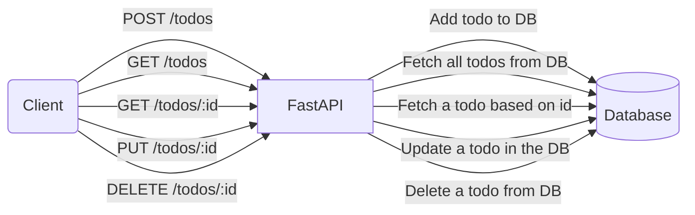

# Chapter 2: Building Your First API with FastAPI

In this chapter, we go beyond “Hello World” and build a **Todo List REST API**. You’ll learn:

* How to define **Pydantic models** for input validation.
* How to implement **CRUD endpoints** (`Create`, `Read`, `Update`, `Delete`).
* How to test API endpoints using **Pytest + HTTPX**.
* How to enforce typing with **MyPy**.

We’ll keep things **in-memory** for now (no database yet) to focus on the HTTP layer. Later chapters will swap this for a proper database backend.

## 2.1 Extending the Project

Project structure now looks like this:

```bash
fastapi-todo/
├── pyproject.toml
├── fastapi_todo/
│   ├── main.py
│   └── models.py
└── tests/
    └── test_main.py
```

## 2.2 Define Pydantic Models

```python
"""
@file: fastapi_todo/models.py
@showLineNumbers
"""
from pydantic import BaseModel, Field


class Todo(BaseModel):
    """Represents a Todo item."""
    id: int
    title: str = Field(..., min_length=1, max_length=100)
    completed: bool = False


class TodoCreate(BaseModel):
    """Model for creating a new Todo."""
    title: str = Field(..., min_length=1, max_length=100)
```

**Explanation:**

* `Todo` is the full object returned to clients.
* `TodoCreate` excludes `id` because it will be assigned by the server.
* Validation rules (`min_length`, `max_length`) prevent bad data.

## 2.3 Implement CRUD Endpoints

```python
"""
@file: fastapi_todo/main.py
@showLineNumbers
"""
from typing import List

from fastapi import FastAPI, HTTPException
from .models import Todo, TodoCreate

app = FastAPI()

# In-memory store
todos: List[Todo] = []
next_id = 1


@app.post("/todos", response_model=Todo, status_code=201)
def create_todo(todo: TodoCreate) -> Todo:
    """Create a new Todo item."""
    global next_id
    new_todo = Todo(id=next_id, title=todo.title, completed=False)
    todos.append(new_todo)
    next_id += 1
    return new_todo


@app.get("/todos", response_model=List[Todo])
def list_todos() -> List[Todo]:
    """List all Todo items."""
    return todos


@app.get("/todos/{todo_id}", response_model=Todo)
def get_todo(todo_id: int) -> Todo:
    """Retrieve a Todo by its ID."""
    for todo in todos:
        if todo.id == todo_id:
            return todo
    raise HTTPException(status_code=404, detail="Todo not found")


@app.put("/todos/{todo_id}", response_model=Todo)
def update_todo(todo_id: int, updated: TodoCreate) -> Todo:
    """Update a Todo’s title by ID."""
    for todo in todos:
        if todo.id == todo_id:
            todo.title = updated.title
            return todo
    raise HTTPException(status_code=404, detail="Todo not found")


@app.delete("/todos/{todo_id}", status_code=204)
def delete_todo(todo_id: int) -> None:
    """Delete a Todo by ID."""
    global todos
    todos = [todo for todo in todos if todo.id != todo_id]
```

**Explanation:**

* `/todos [POST]` → create new todo.
* `/todos [GET]` → list all todos.
* `/todos/{id} [GET]` → retrieve single todo.
* `/todos/{id} [PUT]` → update title.
* `/todos/{id} [DELETE]` → remove todo.

## 2.4 Write Tests

```python
"""
@file: tests/test_main.py
@showLineNumbers
"""
from fastapi.testclient import TestClient
from fastapi_todo.main import app

client = TestClient(app)


def test_create_todo() -> None:
    response = client.post("/todos", json={"title": "Learn FastAPI"})
    assert response.status_code == 201
    data = response.json()
    assert data["title"] == "Learn FastAPI"
    assert data["completed"] is False


def test_list_todos() -> None:
    response = client.get("/todos")
    assert response.status_code == 200
    todos = response.json()
    assert isinstance(todos, list)
    assert len(todos) > 0


def test_get_todo() -> None:
    response = client.get("/todos/1")
    assert response.status_code == 200
    assert response.json()["id"] == 1


def test_update_todo() -> None:
    response = client.put("/todos/1", json={"title": "Learn FastAPI deeply"})
    assert response.status_code == 200
    assert response.json()["title"] == "Learn FastAPI deeply"


def test_delete_todo() -> None:
    response = client.delete("/todos/1")
    assert response.status_code == 200
    response = client.get("/todos")
    data = response.json()
    assert len(data) == 0
```

**Explanation:**

* Tests use the same `TestClient` as before.
* Each test validates the **status code** and **response body**.
* Covers **CRUD cycle**: create → read → update → delete.

**Run tests:**

```bash
poetry run pytest
```

## 2.5 Type Checking with MyPy

```bash
poetry run mypy fastapi_todo
```

This ensures functions and models are **correctly typed**.

## 2.6 Testing the endpoints via the commandline

### 2.6.1 Launch the app

```bash
poetry run uvicorn fastapi_todo.main:app --reload
```

You can test the functionality of various routes for instance using `curl`:

```bash
curl http://127.0.0.1:8000/todos
```

This will initially return an empty list:

```bash
[]
```

### 2.6.2 Submit a new todo item

Enter the following command to add a to-do item:

```bash
curl -X POST \
  -H "Content-Type: application/json" \
  -d '{"title": "Learn FastAPI deeply"}' \
  http://127.0.0.1:8000/todos
```

The server returns the complete to-do item as a response:

```bash
{"id":1,"title":"Learn FastAPI deeply","completed":false}
```

This adds a to-do item to the app's memory. To verify, run:

```bash
curl http://127.0.0.1:8000/todos
```

Now you should see something like this as a response in your console:

```bash
[{"id":1,"title":"Learn FastAPI deeply","completed":false}]
```

If you are familiar with how REST works, you should be able to play around with all the routes and test their functionality.

## 2.7 API Endpoints and Flow

The following diagram depicts the information flow related to requestes made to the to-do application.



## 2.8 Further Reading

* [FastAPI Request Handling](https://fastapi.tiangolo.com/tutorial/body/)
* [Pydantic Models](https://docs.pydantic.dev/)
* [REST API Design Guidelines](https://restfulapi.net/)

