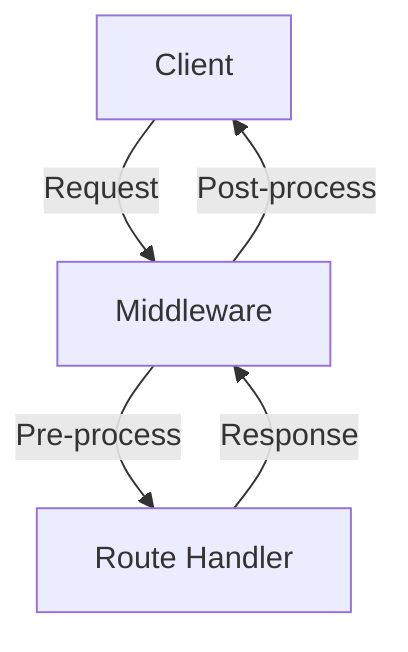
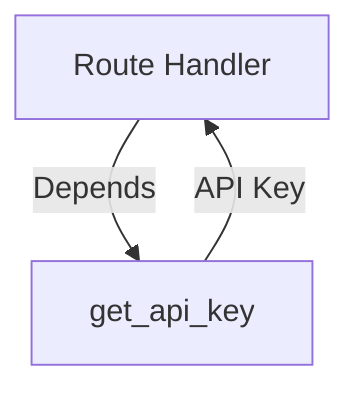

# Chapter 3: Middleware, Dependencies, and Error Handling

In this chapter, you will learn:

* What **middleware** is and how to use it in FastAPI.
* How to apply **dependencies** for cleaner, reusable logic.
* How to handle **errors and exceptions** in a structured way.
* How to test error responses with **Pytest**.

We will extend our **Todo API** from Chapter 2 by:

1. Adding middleware for request logging.
2. Creating a dependency to simulate authentication.
3. Implementing custom error handling for invalid operations.

## 3.1 Middleware in FastAPI

In FastAPI, a middleware is a function that runs for every request and response in your application. They provide a central point to perform actions that affect your entire application.

It sits in the "middle" the request-response cycle, allowing you to execute code both before and after the response is generated, but before it's sent back to the client.

### 3.1.1 Key functions of middleware

Middleware is used to handle cross-cutting concerns that apply globally, preventing you from having to repeat the same code every single endpoint. This is a common an well known design pattern used in [Express.js](https://expressjs.com/), a popular `NodeJS` application framework.

### 3.1.2 Common use cases

- **Logging**: Recodging details about each request, such as the path, method, and processing time.
- **CORS (Cross-Origin Resource Sharing)**: Adding appropriate CORS headers to allow requests from different origins.
- **Caching/Compression**: Compressing large responses with GZip or adding custom or cache header headers.
- **Security**: Rate limit based on IP addresses.

### 3.1.3 How it works

In FastAPI, you define a middleware by using a function with the `@app.middleware("http")` decorator. This function receives the incoming `request` and a `call_next` function. The `call_next` function passes the request down the chain to the intended path operation, and your middleware can then capture and modify the response before it is returned.

### 3.1.4 Example: Request logging middleware

The following code demonstrates a middleware that logs a request, `method`, `path`, and `duration` prior to sending the response back to the client. 

```python
"""
@file: fastapi_todo/main.py
@showLineNumbers
"""
import time
from fastapi import FastAPI, Request

app = FastAPI()

@app.middleware("http")
async def log_requests(request: Request, call_next):
    """Middleware to log request method, path, and execution time."""
    start_time = time.time()
    response = await call_next(request)
    duration = time.time() - start_time
    print(f"{request.method} {request.url.path} completed in {duration:.4f}s")
    return response

@app.get("/")
async def read_root():
    return {"message": "Hello FastAPI!"}
```

Run your app in a terminal, and issue the following command in another terminal:

```bash
curl http://127.0.0.1:8000/
```

You should see an output similar to the following on the terminal window running your app:

```bash
2025-10-29 12:52:10,837 - INFO - GET / completed in 0.0012s
```

The middleware generated the text `GET / completed in 0.0012s` in the printed log line.

### 3.1.5 Example: Adding a custom header

The following code demonstrates a middleware that adds a custom header, `X-Processed-By-Middleware`, to every request.

```python
"""
@file: fastapi_todo/main.py
@showLineNumbers
"""
import time
from fastapi import FastAPI, Request

app = FastAPI()

@app.middleware("http")
async def add_process_time_header(request: Request, call_next):
    # This part runs BEFORE the request is processed by the path operation.
    # The `request` object can be modified here.
    request.state.start_time = time.time()
    
    # Pass the modified request to the next function in the chain
    # (e.g., the endpoint).
    response = await call_next(request)
    
    # This part runs AFTER the path operation has returned a response.
    process_time = time.time() - request.state.start_time
    response.headers["X-Processed-By-Middleware"] = f"{process_time:.4f}s"
    
    # Return the modified response.
    return response

@app.get("/")
async def read_root():
    return {"message": "Hello FastAPI!"}
```

If you issued the following command in the terminal:

```bash
curl -i http://127.0.0.1:8000/
```

You should see an output similar to the following on the terminal window:

```bash
# @showLineNumbers
# @highlight 6

HTTP/1.1 200 OK
date: Wed, 29 Oct 2025 18:57:37 GMT
server: uvicorn
content-length: 33
content-type: application/json
x-processed-by-middleware: 0.0010s

{"message":"Hello FastAPI!"}
```

## 3.2 Dependencies in FastAPI

Dependencies are functions that can be **injected** into routes to provide shared logic, like authentication, DB connections, etc. In `FastAPI`, dependencies and middleware both address cross-cutting concerns, but they operate at different levels of granularity and serve distinct purposes.

While middleware affects the entire application, dependencies are specific to particular route handlers or groups of handlers, and they inject values diectly into your functions.

### 3.2.1 Key characteristics

- **Scoped**: Dependencies are tied to a specific path operation, router, or the entire application, giving you fine-grained control.
- **Input-focused**: They are primarily used for preparing input data, such as parsing requests headers, querying a database for a user object, or validating a token.
- **Integrated**: The return value of a dependency is passed as a parameter directly into your endpoint function, making it a clean and clean and intuitive way to access shared resources.
- **Can interrupt**: If a dependency raises an `HTTPException`, it stops the request and returns an error response immediately, preventing the path operation from running.

### 3.2.2 Common use cases

- **Authentication**: Getting the current user from a token in the request header.
- **Database sessions**: Providing a database session object to a route handler.
- **Validation**: Checking permissions for business logic that must pass before the main logic runs.

### 3.2.3 Example: Authentication

Here we simulate a simple **API key authentication**:

```python
"""
@file: fastapi_todo/main.py
@showLineNumbers
"""
from fastapi import Header, HTTPException, Depends

def get_api_key(x_api_key: str = Header(...)) -> str:
    """Simple dependency to check for API key header."""
    if x_api_key != "secret-key":
        raise HTTPException(status_code=403, detail="Forbidden: Invalid API Key")
    return x_api_key

@app.get("/secure-todos", dependencies=[Depends(get_api_key)])
def secure_list_todos() -> list[Todo]:
    """List todos, but only if API key is valid."""
    return todos
```


**Explanation:**

* Any request to `/secure-todos` must send a header (case insensitive):
```bash
X-API-Key: secret-key
```
* Otherwise, it will return **403 Forbidden**.
* Dependencies reduce code duplication and enforce **security rules**.

## 3.3 Error Handling

FastAPI offers a powerful and flexible system for handling errors, from simple HTTP errors to complex custom exceptions. By providing a clear and consistent way to communicate failures, it ensures your API is robust and developer-friendly. FastAPI's error handling can be broken down into these primary mechanisms:

### 3.3.1 HTTPException

This is the most common way to raise HTTP-specific errors in FastAPI. It is a standard Python exception with extra information for APIs, allow you to specify the HTTP status code and a detail message. When you raise an `HTTPException`, FastAPI automatically catches it and returns an appropriate JSON response.

In an earlier example, we raised an `HTTPException` for a missing request header `x_api_key` with the value `secret-key`.

In the following example, if a requested item is not found, you can raise an `HTTPException` with a `404 Not Found` status code.

```python
"""
@file: fastapi_todo/main.py
@showLineNumbers
"""
from fastapi import HTTPException

@app.get("/todos/{todo_id}", response_model=TodoItem)
def get_todo(todo_id: int) -> TodoItem:
    """Retrieve a Todo item by ID."""
    for todo in todos:
        if todo.id == todo_id:
            return todo
    raise HTTPException(status_code=404, detail="Todo item not found")
```

### 3.3.2 Pydantic based

FastAPI's tight integration with Pydantic means it provides automatic data validation for requests. If a client dens invalid data (e.g., a string instead of a number), Pydantic raises a `ValidationError`, which FastAPI then transforms into a standard `422 Unprocessable Entity` HTTP response.

```python
"""
@file: fastapi_todo/main.py
@showLineNumbers
"""
from pydantic import BaseModel, Field

class TodoItem(BaseModel):
    """Represents a Todo item."""
    id: int
    title: str = Field(..., min_length=1, max_length=100)
    completed: bool = False

# If a POST request to this endpoint sends a `id` that is not a number,
# or non-string `title` FastAPI will automatically return a 422 error response.
@app.post("/todos", response_model=TodoItem, status_code=201)
def create_todo(todo: TodoCreate) -> TodoItem:
    """Create a new Todo item."""
    global next_id
    new_todo = TodoItem(id=next_id, title=todo.title, completed=False)
    todos.append(new_todo)
    next_id += 1
    return new_todo
```

Try the following command in a terminal window:

```bash
curl -X POST http://127.0.0.1:8000/todos \
     -H "Content-Type: application/json" \
     -d '{"title": ""}'
```

You should see something like the following in the terminal as a reponse from the server:

```json
{"error":"Validation failed","details":[{"type":"string_too_short","loc":["body","title"],"msg":"String should have at least 1 character","input":"","ctx":{"min_length":1}}]}
```

### 3.3.3 Global Exception Handlers

Register a handler for a specific exception type. When raised anywhere in the app, FastAPI will invoke this handler and return its result.

```python
"""
@file: fastapi_todo/main.py
@showLineNumbers
"""
from fastapi.responses import JSONResponse
from fastapi.exception_handlers import RequestValidationError
from fastapi.exceptions import RequestValidationError

@app.exception_handler(RequestValidationError)
async def validation_exception_handler(request, exc):
    """Custom handler for validation errors."""
    return JSONResponse(
        status_code=422,
        content={"error": "Validation failed", "details": exc.errors()},
    )
```

You can also handle custom Python exceptions:

```python
"""
@file: fastapi_todo/main.py
@showLineNumbers
"""
class DatabaseError(Exception):
    pass

@app.exception_handler(DatabaseError)
async def db_error_handler(request: Request, exc: DatabaseError):
    return JSONResponse(status_code=500, content={"detail": "Database failure"})
```

### 3.3.4 Custom Exception Classes

Create your own exception class and corresponding handler for rich error information.

```python
"""
@file: fastapi_todo/main.py
@showLineNumbers
"""
class APIError(Exception):
    def __init__(self, code: int, message: str, details: dict = None):
        self.code = code
        self.message = message
        self.details = details or {}

@app.exception_handler(APIError)
async def api_error_handler(request: Request, exc: APIError):
    return JSONResponse(
        status_code=exc.code,
        content={"message": exc.message, "details": exc.details}
    )

@app.get("/divide")
def divide(a: float, b: float):
    if b == 0:
        raise APIError(
            code=400,
            message="Division by zero is not allowed",
            details={"a": a, "b": b}
        )
    return {"result": a / b}
```

This tells FastAPI Whenever an `APIError` is raised anywhere in a request handler, use this function to produce the response. The handler converts the exception into a structured `JSONResponse`.

To try to trigger the custom error, you can use the following command:

```bash
curl "http://127.0.0.1:8000/divide?a=10&b=0"
```

You should see an error response similar to the following in your console:

```json
{"message":"Division by zero is not allowed","details":{"a":10.0,"b":0.0}}
```

## 3.4 Tests for Middleware, Dependencies, and Errors

```python
"""
@file:
@showLineNumbers
"""
from fastapi.testclient import TestClient
from fastapi_todo.main import app

client = TestClient(app)


def test_secure_todos_without_key() -> None:
    response = client.get("/secure-todos")
    assert response.status_code == 403
    assert response.json() == {"error": "Forbidden: Invalid API Key"}


def test_secure_todos_with_key() -> None:
    response = client.get("/secure-todos", headers={"X-API-Key": "secret-key"})
    assert response.status_code == 200
    assert isinstance(response.json(), list)


def test_validation_error() -> None:
    response = client.post("/todos", json={})  # missing required "title"
    assert response.status_code == 422
    body = response.json()
    assert body["error"] == "Validation failed"
    assert "details" in body
```

**Explanation:**

* Verifies that the **dependency (API key)** works correctly.
* Confirms that validation errors return **custom JSON responses**.

## 3.5 Middleware Flow



## 3.6 Dependency Injection



## 3.7 Further Reading

* [FastAPI Middleware Docs](https://fastapi.tiangolo.com/tutorial/middleware/)
* [FastAPI Dependencies](https://fastapi.tiangolo.com/tutorial/dependencies/)
* [Custom Exception Handlers](https://fastapi.tiangolo.com/tutorial/handling-errors/)
