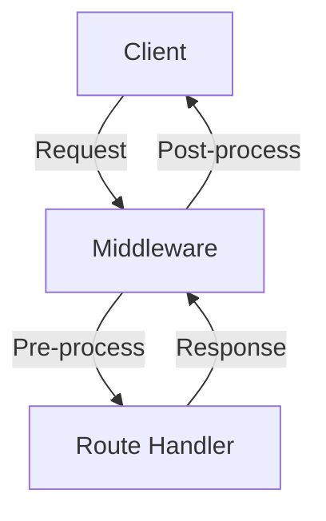
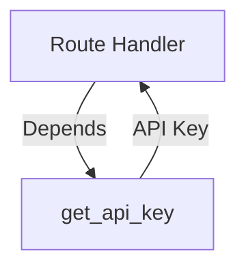

# Chapter 3: Middleware, Dependencies, and Error Handling

In this chapter, you will learn:

* What **middleware** is and how to use it in FastAPI.
* How to apply **dependencies** for cleaner, reusable logic.
* How to handle **errors and exceptions** in a structured way.
* How to test error responses with **Pytest**.

We will extend our **Todo API** from Chapter 2 by:

1. Adding middleware for request logging.
2. Creating a dependency to simulate authentication.
3. Implementing custom error handling for invalid operations.

## 3.1 Middleware in FastAPI

Middleware allows you to **run logic before and after each request**.

```python
"""
@file: fastapi_todo/main.py
@showLineNumbers
"""
import time
from fastapi import FastAPI, Request

app = FastAPI()

@app.middleware("http")
async def log_requests(request: Request, call_next):
    """Middleware to log request method, path, and execution time."""
    start_time = time.time()
    response = await call_next(request)
    duration = time.time() - start_time
    print(f"{request.method} {request.url.path} completed in {duration:.4f}s")
    return response
```

**Explanation:**

* The middleware intercepts every HTTP request.
* It logs request method + path and how long it took to process.
* Useful for **observability** and **performance monitoring**.

## 3.2 Dependencies in FastAPI

Dependencies are functions that can be **injected** into routes to provide shared logic, like authentication, DB connections, etc.

Here we simulate a simple **API key authentication**:

```python
"""
@file: fastapi_todo/dependencies.py
@showLineNumbers
"""
from fastapi import Header, HTTPException

def get_api_key(x_api_key: str = Header(...)) -> str:
    """Simple dependency to check for API key header."""
    if x_api_key != "secret-key":
        raise HTTPException(status_code=403, detail="Forbidden: Invalid API Key")
    return x_api_key
```

Use it in routes:

```python
"""
@file: fastapi_todo/main.py
@showLineNumbers
"""
from fastapi import Depends
from fastapi_todo.dependencies import get_api_key

@app.get("/secure-todos", dependencies=[Depends(get_api_key)])
def secure_list_todos() -> list[Todo]:
    """List todos, but only if API key is valid."""
    return todos
```

**Explanation:**

* Any request to `/secure-todos` must send a header (case insensitive):
  ```bash
  X-API-Key: secret-key
  ```
* Otherwise, it will return **403 Forbidden**.
* Dependencies reduce code duplication and enforce **security rules**.

## 3.3 Error Handling

FastAPI provides `HTTPException` for structured error responses.
Let’s add **custom error handlers**.

```python
"""
@file: fastapi_todo/main.py
@showLineNumbers
"""
from fastapi.responses import JSONResponse
from fastapi.exception_handlers import RequestValidationError
from fastapi.exceptions import RequestValidationError

@app.exception_handler(RequestValidationError)
async def validation_exception_handler(request, exc):
    """Custom handler for validation errors."""
    return JSONResponse(
        status_code=422,
        content={"error": "Validation failed", "details": exc.errors()},
    )


@app.exception_handler(HTTPException)
async def http_exception_handler(request, exc):
    """Custom handler for HTTP errors."""
    return JSONResponse(
        status_code=exc.status_code,
        content={"error": exc.detail},
    )
```

**Explanation:**

* `RequestValidationError` → catches bad inputs (e.g., missing fields).
* `HTTPException` → catches all explicit HTTP exceptions.
* Both return **JSON responses** with clear error info.

Now if you try to access the route `/todos/1`, when the app server is restarted, rather than getting a simple **404** error response, you'll get the following in the response body as well:

```json
{
    "error": "Todo item not found"
}
```

If you try to create a todo item using an `int` as the value of `title` instead of a `str`, you may get something like the following:

```json
/**
 * @showLineNumbers
 */
{
    "error": "Validation failed",
    "details": [
        {
            "type": "string_type",
            "loc": [
                "body",
                "title"
            ],
            "msg": "Input should be a valid string",
            "input": 25
        }
    ]
}
```

This vastly improves debugging when using the API routes.

## 3.4 Tests for Middleware, Dependencies, and Errors

```python
"""
@file: tests/test_errors.py
@showLineNumbers
"""
from fastapi.testclient import TestClient
from fastapi_todo.main import app

client = TestClient(app)


def test_secure_todos_without_key() -> None:
    response = client.get("/secure-todos")
    assert response.status_code == 403
    assert response.json() == {"error": "Forbidden: Invalid API Key"}


def test_secure_todos_with_key() -> None:
    response = client.get("/secure-todos", headers={"X-API-Key": "secret-key"})
    assert response.status_code == 200
    assert isinstance(response.json(), list)


def test_validation_error() -> None:
    response = client.post("/todos", json={})  # missing required "title"
    assert response.status_code == 422
    body = response.json()
    assert body["error"] == "Validation failed"
    assert "details" in body
```

**Explanation:**

* Verifies that the **dependency (API key)** works correctly.
* Confirms that validation errors return **custom JSON responses**.

## 3.5 Middleware Flow



## 3.6 Dependency Injection



## 3.7 Further Reading

* [FastAPI Middleware Docs](https://fastapi.tiangolo.com/tutorial/middleware/)
* [FastAPI Dependencies](https://fastapi.tiangolo.com/tutorial/dependencies/)
* [Custom Exception Handlers](https://fastapi.tiangolo.com/tutorial/handling-errors/)
