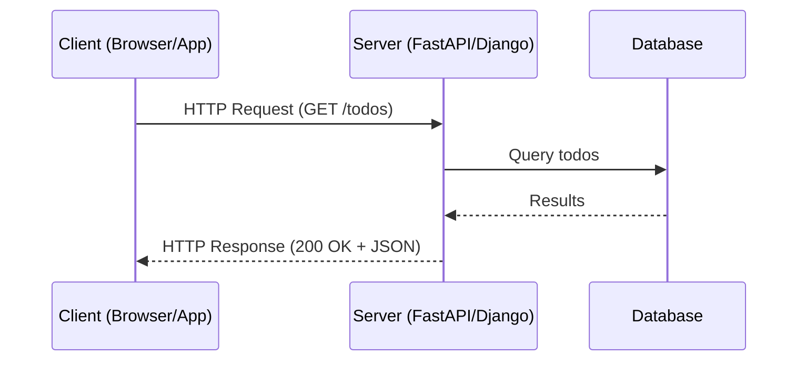

# Chapter 1: Introduction to Web Development with Python

In this chapter, we set the stage for building modern web applications with Python. You will learn:

* The **client-server model** and how web apps communicate.
* The basics of **HTTP** (requests, responses, headers, status codes).
* Why Python is a strong choice for web development (FastAPI, Django).
* How to set up your first **web project environment** with **Poetry**, **MyPy**, and **Pytest**.
* How to run a **hello world FastAPI server** and test it.

This foundation ensures that all upcoming chapters build on a clean, reproducible, and testable development environment.

## 1.1 The Client-Server Model Refresher

A web app is fundamentally about **clients** (browsers, mobile apps, scripts) talking to a **server** (your backend app) over the internet.

The following diagram depicts the interaction between a client and a server, in the context of a Python web application.



**Explanation:**

1. The client sends an HTTP request.
2. The server processes it and fetches data from the database.
3. The database responds.
4. The server formats the response (e.g., JSON) and sends it back to the client.

## 1.2 Why Python for Web Development?

Python is one of the most popular languages for web apps because:

* **FastAPI** → modern, async-first, great for APIs.
* **Django** → batteries-included, great for full-stack apps.
* **Large ecosystem** → ORMs, testing libraries, data/ML integration.
* **Developer productivity** → readable syntax, strong typing (via MyPy), excellent testing tools.

## 1.3 Project Setup with Poetry, MyPy, and Pytest

We’ll use **Poetry** as our dependency manager, and from the start integrate **MyPy** for type checking and **Pytest** for testing.

### Step 1: Initialize a new project

```bash
mkdir fastapi-todo
cd fastapi-todo
poetry init --name fastapi-todo --dependency fastapi --dependency uvicorn
```

Add dev tools:

```bash
poetry add --group dev pytest mypy httpx
```

### Step 2: Basic project structure

```
fastapi-todo/
├── pyproject.toml
├── fastapi_todo/
│   └── main.py
└── tests/
    └── test_main.py
```

## 1.4 Hello World in FastAPI

```python
# filename: fastapi_todo/main.py
from fastapi import FastAPI

app = FastAPI()


@app.get("/")
def read_root() -> dict[str, str]:
    """Root endpoint returning a welcome message.

    Returns:
        dict[str, str]: JSON response with a message.
    """
    return {"message": "Hello, FastAPI world!"}
```

**Explanation:**

* `FastAPI()` creates an app instance.
* `@app.get("/")` defines a route (`GET /`).
* `read_root` returns a JSON dictionary.
* Type hints (`dict[str, str]`) allow **MyPy** to catch typing issues.

Run it with:

```bash
poetry run uvicorn fastapi_todo.main:app --reload
```

Visit: `http://127.0.0.1:8000/` → you’ll see `{"message": "Hello, FastAPI world!"}`.

## 1.5 Writing Tests with Pytest + HTTPX

```python
# filename: tests/test_main.py
from fastapi.testclient import TestClient
from fastapi_todo.main import app

client = TestClient(app)


def test_read_root() -> None:
    """Test that the root endpoint returns the correct JSON response."""
    response = client.get("/")
    assert response.status_code == 200
    assert response.json() == {"message": "Hello, FastAPI world!"}
```

**Explanation:**

* `TestClient` simulates HTTP requests.
* We assert status code (`200 OK`) and response body.
* Run tests:

```bash
poetry run pytest
```

---

## 1.6 Static Type Checking with MyPy

Run:

```bash
poetry run mypy fastapi_todo
```

If all type hints are correct, MyPy will report no errors. This helps catch mismatches **before runtime**.

## 1.7 Further Reading / References

* [FastAPI Docs](https://fastapi.tiangolo.com/)
* [Poetry Docs](https://python-poetry.org/docs/)
* [MyPy Docs](https://mypy.readthedocs.io/)
* [Pytest Docs](https://docs.pytest.org/)

