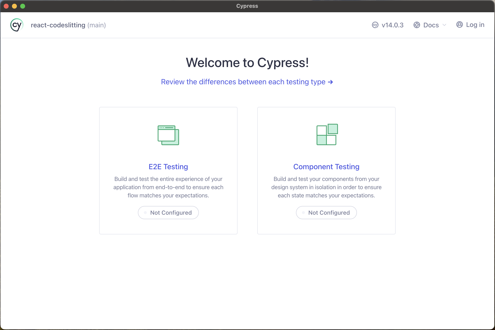
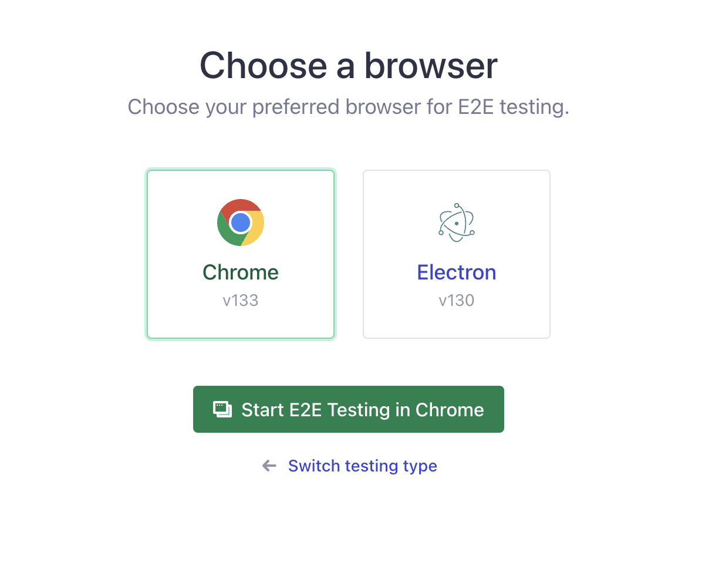
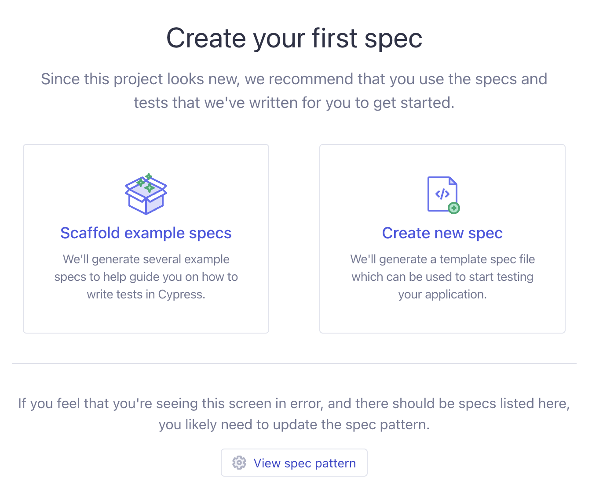
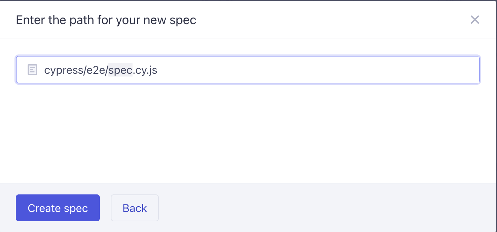
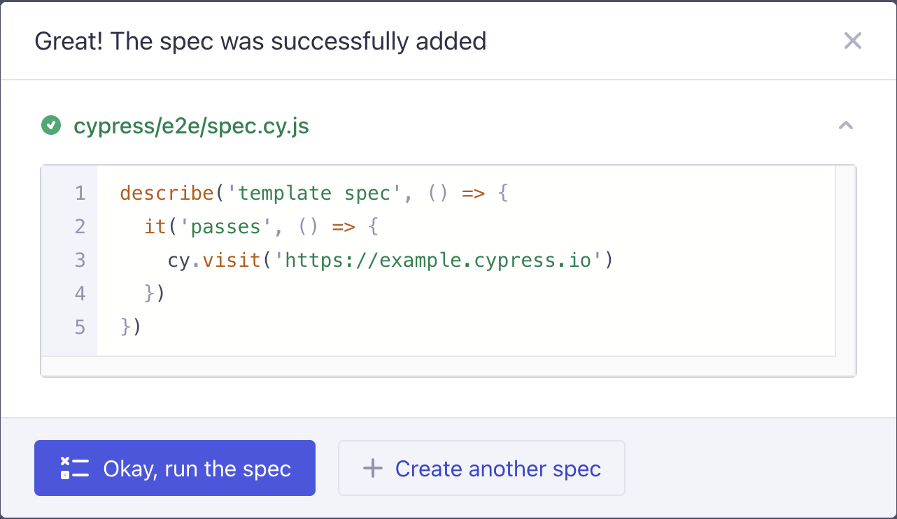
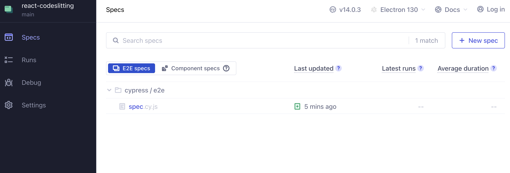
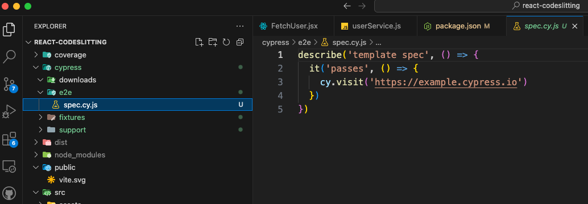

# End-to-End Testing with Cypress

End-to-end (E2E) testing is a crucial aspect of modern web development, ensuring that applications function correctly from the user's perspective. Cypress is a powerful and user-friendly JavaScript testing framework that simplifies E2E testing for React applications. This article will walk through the fundamentals of Cypress, setup instructions, writing tests, and best practices for effective E2E testing.

## Why Choose Cypress for E2E Testing?

Cypress offers several advantages that make it a popular choice for end-to-end testing:

- **Fast and Reliable**: Runs directly in the browser, providing real-time feedback.
- **Easy Setup**: No additional dependencies like Selenium WebDriver are required.
- **Automatic Waiting**: Handles waiting for elements to load, reducing the need for manual `wait` commands.
- **Time-travel Debugging**: Captures snapshots at each test step for easy debugging.
- **Great API**: Offers simple, chainable commands for intuitive test writing.

## Setting Up Cypress in a React Project

### Install Cypress

To get started, install Cypress as a development dependency:

```bash
npm install cypress --save-dev
```

Or with Yarn:

```bash
yarn add cypress --dev
```

### Open Cypress Test Runner

After installation, you can open Cypress using:

```bash
npx cypress open
```

This command launches the Cypress Test Runner, where you can create and execute tests.

You can also add a script to your package.json file to invoke Cypress:

```javascript
{
   ///...
   "scripts": {
      "cy:open": "cypress open"
   },
}
```

Once Cypress is launched, and this is your first time launching Cypress, you’ll be presented with the Cypress Welcome screen.



Choose E2E Testing on this screen. In the next step the launchpad will scaffold out a set of configuration files.



Finally the launchpad allows you to select a browser to run the tests on. Pick one you like, and start.

## Writing Cypress Tests

To create a test/spec, click the `Create new spec` button, and follow the prompt.



Choose the path where the spec is generated.



The newly generated spec is displayed in a dialog box.



You may find the newly generated spec in the specs tab within Cypress.



And also within your project source.



### Writing your own tests

Ensure your React application is running before running Cypress tests.

Cypress uses a simple syntax to interact with UI elements and verify expected behaviors. Let's explore different types of Cypress tests.

### Basic Test Structure

Create a test file inside `cypress/e2e/` (e.g., `app.cy.js`) and write a simple test:

```jsx
/**
 * @file:
 * @showLineNumbers
 * @highlight
 * @copy
 * @exec
 */
describe("React App Test", () => {
  it("should visit the homepage", () => {
    cy.visit("http://localhost:3000");
    cy.contains("Welcome to React");
  });
});
```

### Interacting with Elements

You can simulate user interactions such as clicking buttons and typing text:

```jsx
/**
 * @file:
 * @showLineNumbers
 * @highlight
 * @copy
 * @exec
 */
describe("Login Form", () => {
  it("should allow a user to log in", () => {
    cy.visit("/login");
    cy.get("input[name='email']").type("test@example.com");
    cy.get("input[name='password']").type("password123");
    cy.get("button[type='submit']").click();
    cy.contains("Dashboard");
  });
});
```

### Testing Navigation

Ensure that navigation between pages works as expected:

```jsx
/**
 * @file:
 * @showLineNumbers
 * @highlight
 * @copy
 * @exec
 */
describe("Navigation", () => {
  it("should navigate to the product details page", () => {
   cy.visit("http://localhost:5173");
   cy.contains("Electronics").click();
   cy.contains("Electronics");
   cy.contains("Samsung").click();
   cy.contains("Product ID: Samsung");
 });
});
```

### Reusing code with custom commands

Let’s say in your app during login, the server returns a cookie with the auth token and redirects the browser to the dashboard. The following may describe the flow:

```javascript
cy.visit('/login')

cy.get('input[name=username]').type(username)

// {enter} causes the form to submit
cy.get('input[name=password]').type(`${password}{enter}`, { log: false })

// we should be redirected to /dashboard
cy.url().should('include', '/dashboard')

// our auth cookie should be present
cy.getCookie('your-session-cookie').should('exist')

// UI should reflect this user being logged in
cy.get('h1').should('contain', username)
```

You may want to reuse this flow while testing other parts of your application. You can wrap these steps into a reusable `command` as shown below:

```jsx
/**
 * @file: cypress/support/commands.js
 * @showLineNumbers
 * @highlight
 * @copy
 * @exec
 */
Cypress.Commands.add('login', (username, password) => {
 cy.session(
   username,
   () => {
     cy.visit('/login')
     cy.get('input[name=username]').type(username)
     cy.get('input[name=password]').type(`${password}{enter}`, { log: false })
     cy.url().should('include', '/dashboard')
     cy.get('h1').should('contain', username)
   },
   {
     validate: () => {
       cy.getCookie('your-session-cookie').should('exist')
     },
   }
 )
})

// In your spec file
it('does something on a secured page', function () {
 const { username, password } = this.currentUser
 cy.login(username, password)

 // ...rest of test
})
```

`cy.session()` is used to cache the session cookie, which can then be reused across multiple tests, as a way of optimizing the command.


## Using Fixtures

Fixtures in Cypress allow you to load static test data from JSON files. This helps simulate real-world scenarios without hardcoding values inside your tests.

```javascript
/**
 * @file: cypress/fixtures/user.json
 * @showLineNumbers
 * @highlight
 * @copy
 * @exec
 */
{
  "username": "testuser",
  "email": "testuser@example.com"
}
```

```javascript
/**
 * @file
 * @showLineNumbers
 * @highlight
 * @copy
 * @exec
 */
// In your spec file
describe("User login test", () => {
  beforeEach(() => {
    cy.fixture("user").as("userData");
  });

  it("should login with fixture data", function () {
    const { username, password } = this.userData
    cy.login(username, password)

    // ...rest of test
  });
});
```

This approach makes tests reusable and maintainable, as test data is centralized and easy to update.

### Running Tests in Headless Mode

For CI/CD integration or automation, run Cypress in headless mode:

```bash
npx cypress run
```

The topic of running Cypress during CI/CD is expansive, and is beyond the scope of this tutorial. You should review the <a href="https://docs.cypress.io/app/continuous-integration/overview" target="_blank">Cypress documentation for detailed instructions</a>.


## Best Practices for Cypress E2E Testing

- **Use Selectors Wisely**: Prefer `data-testid` attributes over element classes or IDs to make tests more resilient.
- **Avoid Hardcoded Waits**: Cypress automatically waits for elements, so avoid `cy.wait()` unless necessary.
- **Use Fixtures for Test Data**: Store reusable JSON data in `cypress/fixtures/` to simplify testing.
- **Organize Tests Logically**: Separate tests into meaningful suites using `describe` blocks.
- **Run Tests in Parallel**: Speed up execution using Cypress Dashboard parallelization.

## Additional Resources
- [Cypress Documentation](https://docs.cypress.io)
- [Best Practices in Cypress](https://docs.cypress.io/guides/references/best-practices.html)
- [Testing Library with Cypress](https://testing-library.com/docs/cypress-testing-library/intro/)

By incorporating Cypress into your development workflow, you can catch issues early and ensure a smooth user experience. Happy testing! 🚀
