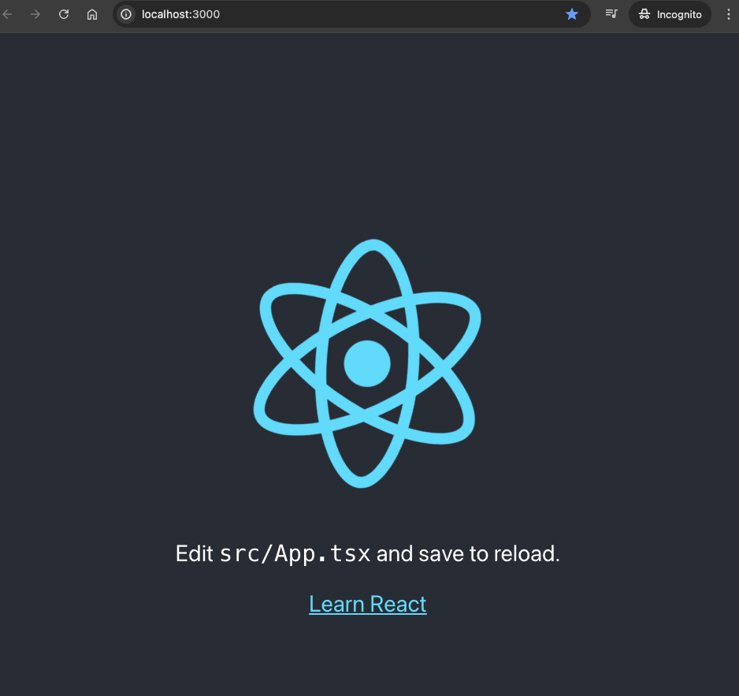
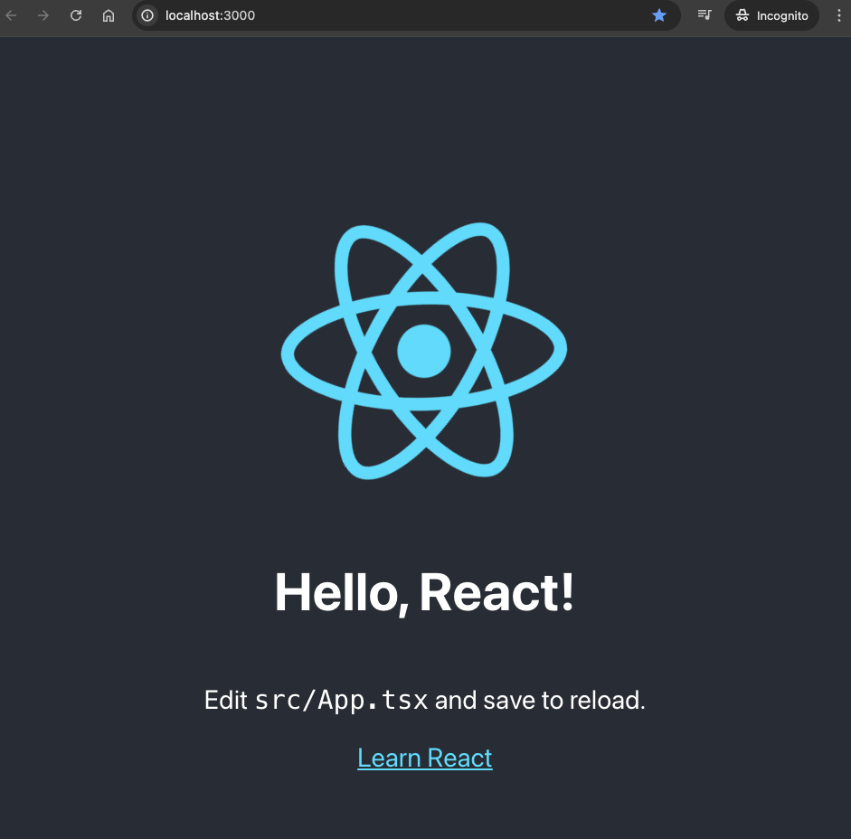
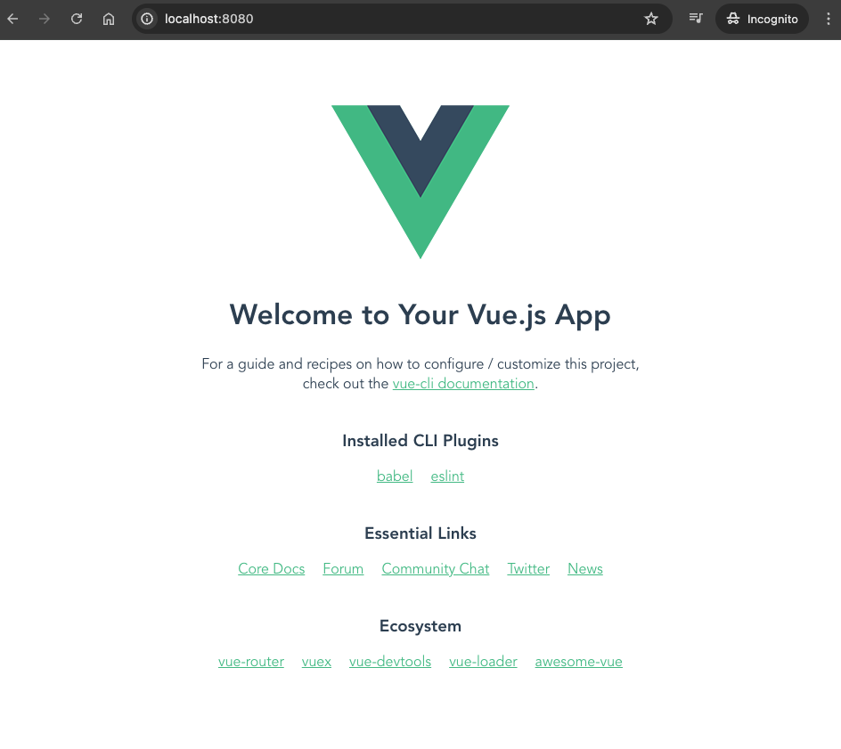
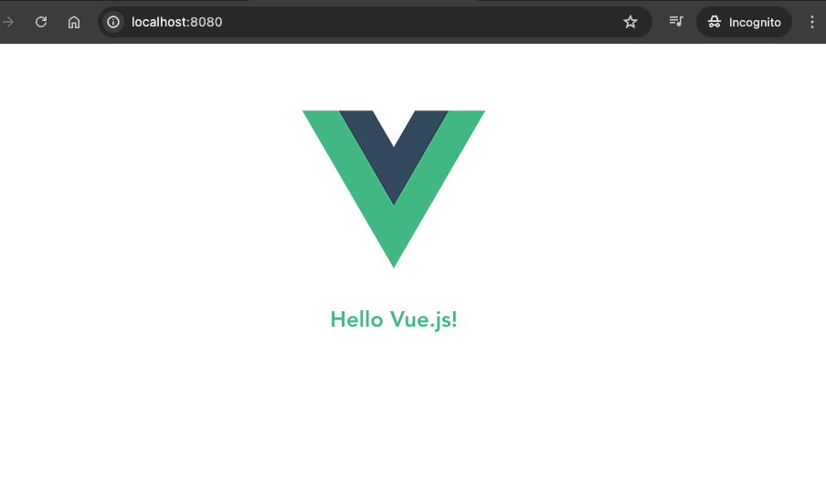
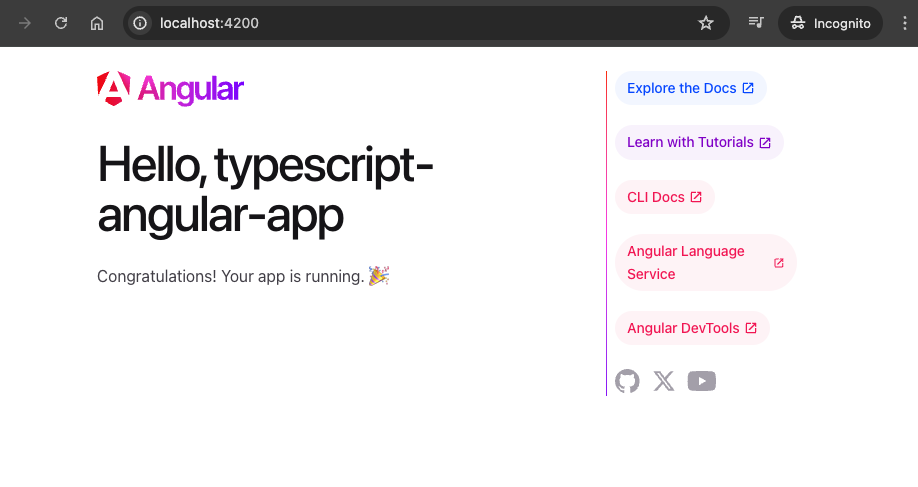
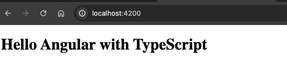

# Using TypeScript with Popular Frameworks: React, Vue, and Angular

TypeScript, a superset of JavaScript, offers static typing, classes, and interface features. When used with popular frameworks like React, Vue, and Angular, it enhances the development experience with better tooling, improved maintainability, and easier code management. This article explores how to integrate TypeScript with these three major frameworks, providing examples and setup instructions for each.

## TypeScript with React

React's component-based architecture works seamlessly with TypeScript, offering a robust setup for building user interfaces.

### Setup and Installation

Create a new React application with TypeScript:

```bash
npx create-react-app my-react-app --template typescript
```

This command sets up a new React project named `my-react-app` with TypeScript configured.

### Launch the Application

```bash
cd typescript-react-app
npm run build
npm start
```

This will automatically open up your default web browser to `http://localhost:3000/` and display the following:



### Example: A Simple Component

Create a functional component `Greeting.tsx` that accepts props:

```tsx {numberLines}
import React from 'react';

interface GreetingProps {
  name: string;
}

const Greeting: React.FC<GreetingProps> = ({ name }) => {
  return <h1>Hello, {name}!</h1>;
}

export default Greeting;
```

In this example, `GreetingProps` is an interface that specifies the expected structure of the props.

Update the `App.tsx` file to incorporate the new `Greeting` component.

```tsx {numberLines 4, 11}
import React from 'react';
import logo from './logo.svg';
import './App.css';
import Greeting from './Greeting';

function App() {
  return (
    <div className="App">
      <header className="App-header">
        
        <Greeting name="React" />
        <p>
          Edit <code>src/App.tsx</code> and save to reload.
        </p>
        <a
          className="App-link"
          href="https://reactjs.org"
          target="_blank"
          rel="noopener noreferrer"
        >
          Learn React
        </a>
      </header>
    </div>
  );
}

export default App;
```

The browser would display the following updated page:



### React and TypeScript References

- <a href="https://react-typescript-cheatsheet.netlify.app/" target="blank">React TypeScript Cheatsheet</a>
- <a href="https://create-react-app.dev/docs/adding-typescript/" target="blank">Create React App Documentation</a>

## TypeScript with Vue

Vue 3 embraces TypeScript, providing built-in types that make it easier to build and manage large-scale applications.

### Setup and Installation

To start a new Vue project with TypeScript support:

```bash
npm install -g @vue/cli
vue create typescript-vue-app
```

### Launch the Vue Application

```bash
cd typescript-vue-app
npm run serve
```

The vue application will be launched at `http://localhost:8000/`. The following would be visible on the browser.



### Example: A Simple Component

Create a `GreetUser.vue` component in the `components` directory:

```html {numberLines}
<template>
  <h2>Hello {{ name }}!</h2>
</template>

<script>
export default {
  name: 'GreetUser',
  props: {
    name: String
  }
}
</script>

<!-- Add "scoped" attribute to limit CSS to this component only -->
<style scoped>
h2 {
  color: #42b983;
}
</style>
```

### Update the `App.vue` file to incorporate the new `GreetUser` component.

```html {numberLines}
<template>
  
  <GreetUser name="Vue.js"/>
</template>

<script>
import GreetUser from './components/GreetUser.vue'

export default {
  name: 'App',
  components: {
    GreetUser
  }
}
</script>
```

The browser would display the following updated page:



### Vue and TypeScript References

- <a href="https://v3.vuejs.org/guide/typescript-support.html" target="blank">Vue 3 TypeScript Documentation</a>
- <a href="https://github.com/bezkoder/vue-3-typescript-example" target="blank">Vue TypeScript Demos</a>

## TypeScript with Angular

Angular was built with TypeScript in mind, and it uses TypeScript as its primary language, making it a perfect fit.

### Setup and Installation

Generate a new Angular project with TypeScript by default:

```bash
npm install -g @angular/cli@17
ng new my-angular-app
```

Angular CLI sets up everything needed for TypeScript development.

### Launch the Angular Application

```bash
cd typescript-angular-app
npm start
```

The vue application will be launched at `http://localhost:4200/`. The following would be visible on the browser.



### Example: A Simple Component

Modify the `app.component.ts` file in your Angular project:

```typescript {numberLines}
import { Component } from '@angular/core';

Component({
  selector: 'app-root',
  standalone: true,
  template: `<h1>Hello {{ title }}</h1>`,
  styleUrls: ['./app.component.css']
})
export class AppComponent {
  title = 'Angular with TypeScript';
}
```

This is a basic Angular component using the `Component` decorator, where `title` is a class property used in the component's template.



### Angular and TypeScript References

- <a href="https://angular.io/guide/typescript-configuration" target="blank">Angular TypeScript Documentation</a>
- <a href="https://angular.dev/cli" target="blank">Angular CLI Documentation</a>

## Conclusion

TypeScript brings powerful type-checking to JavaScript frameworks, making the code more predictable and less prone to runtime errors. Each of these frameworks—React, Vue, and Angular—has its unique way of integrating with TypeScript, enhancing their capabilities and making them more robust for enterprise-level applications. By following the examples and guidelines provided, developers can leverage TypeScript's features to build efficient, scalable, and maintainable web applications.

