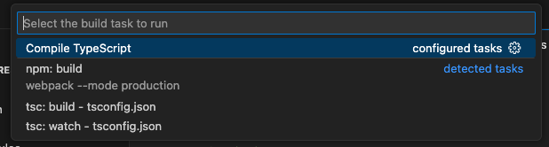
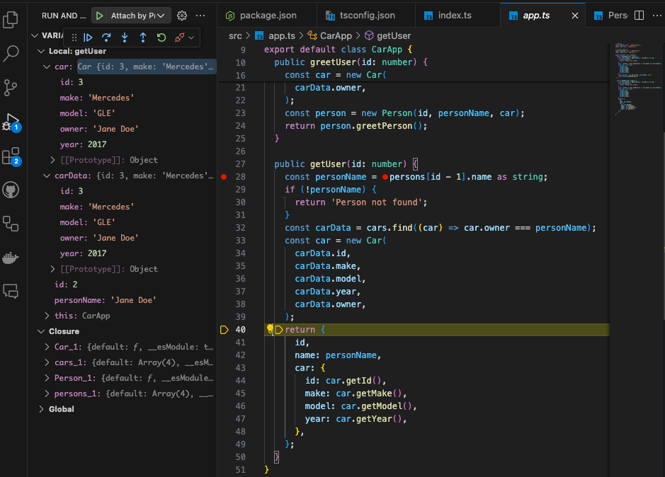

# TypeScript and VSCode: Tips and Tricks for Efficient Development

Visual Studio Code (VSCode) is a highly popular editor among TypeScript developers due to its robust features, extensibility, and excellent support for TypeScript out of the box. This article will explore several tips and tricks to leverage VSCode's capabilities fully to enhance your productivity and efficiency when working with TypeScript projects.

## Leveraging TypeScript IntelliSense

**IntelliSense** is one of VSCode's most powerful features, providing smart completions based on variable types, function definitions, and imported modules.

### Tip: Improve Your IntelliSense Experience

To make the most out of IntelliSense with TypeScript, ensure your `jsconfig.json` or `tsconfig.json` files are correctly set up. This helps VSCode to understand the project context better:

```json {numberLines}
{
  "compilerOptions": {
    "module": "commonjs",
    "target": "es6",
    "baseUrl": "./",
    "paths": {
      "*": ["types/*"]
    }
  },
  "include": ["src/**/*"]
}
```

This configuration helps VSCode resolve modules and provide accurate suggestions and navigations.

## Efficient Navigation and Refactoring

TypeScript's strong typing allows VSCode to offer powerful refactoring tools that you can leverage to write clean code quickly.

### Tip: Use Refactoring Shortcuts

- **Rename Symbol**: Right-click on a variable or function and select "Rename Symbol" or press `F2`. This will rename the symbol across all files.
- **Go to Definition/References**: Right-click on a function or variable and select "Go to Definition" or "Peek Definition". You can also use `F12` for direct navigation or `Shift + F12` to see all references.



## Customizing TypeScript Compilation

VSCode allows you to customize how TypeScript is compiled through `tasks.json`, enabling you to run the TypeScript compiler from within VSCode.

### Tip: Setup a Build Task

Create a `tasks.json` in the `.vscode` directory:

```json {numberLines}
{
  "version": "2.0.0",
  "tasks": [
    {
      "label": "Compile TypeScript",
      "type": "shell",
      "command": "tsc",
      "args": ["-p", "tsconfig.json"],
      "group": "build",
      "presentation": {
        "reveal": "always"
      },
      "problemMatcher": "$tsc"
    }
  ]
}
```

This task lets you compile your project using `Ctrl + Shift + B`.

## Debugging TypeScript

VSCode's built-in debugger is incredibly powerful for debugging TypeScript applications.

### Tip: Configure the Debugger

Set up your `.vscode/launch.json`:

```json {numberLines}
{
  "version": "0.2.0",
  "configurations": [
    {
      "name": "Attach by Process ID",
      "processId": "${command:PickProcess}",
      "request": "attach",
      "skipFiles": ["<node_internals>/**"],
      "type": "node"
    }
  ]
}
```

This configuration allows attaching the VS Code debugger to be attached to a running node process. In order to do that, the node.js application needs to be executed with the `--inspect` flag:

```bash
node --inspect dist/index.js
```

This would allow you to add breaking points to a program to debug a running program:



## Using Extensions

Extend VSCode's functionality by installing extensions specifically beneficial for TypeScript development.

## Conclusion

By integrating these tips and tricks into your development routine, you can significantly enhance your efficiency and productivity when working with TypeScript in VSCode. Whether it's leveraging powerful IntelliSense, efficient navigation tools, or robust debugging features, VSCode offers a comprehensive environment tailored for TypeScript development.

For more information, visit the [official VSCode documentation](https://code.visualstudio.com/docs) and explore the [TypeScript section](https://code.visualstudio.com/docs/languages/typescript) for detailed guides on using TypeScript with VSCode.
