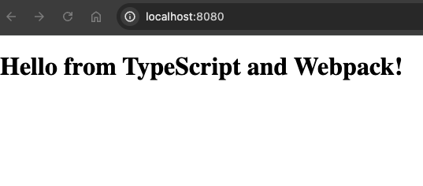

# Setting Up a TypeScript Project with Webpack and Babel

Developing web applications in TypeScript offers numerous benefits, including strong typing and the use of modern JavaScript features. However, to leverage TypeScript fully in a web environment, it's essential to integrate it with tools like Webpack and Babel. This setup not only ensures that your code is compatible across different browsers but also optimizes it for better performance. This article will guide you through setting up a TypeScript project with Webpack and Babel, with additional insights into module bundling and optimizations.

## Understanding Module Bundling

### What is Module Bundling?

Module bundling is the process of merging, minifying, and optimizing a number of modules (files) into a single file (or a few files) that can be loaded by the browser. This is particularly important for web applications developed using modern JavaScript frameworks and libraries, where the application is split into multiple modules and files.

### Why is Module Bundling Necessary?

- **Performance**: Bundling reduces the number of HTTP requests required to load different scripts and stylesheets, significantly improving load times.
- **Scope Management**: It ensures that modules are isolated in their own scopes, avoiding global variables that can lead to conflicts.
- **Dependency Resolution**: Bundlers can resolve and order dependencies correctly so that scripts that depend on other scripts can function correctly.
- **Optimization**: Bundlers can minify code (remove unnecessary characters), compress, and apply various optimizations to reduce file size and enhance performance.

## The Role of Webpack and Babel

### Webpack

Webpack is a powerful module bundler and build tool that manages, bundles, and processes JavaScript applications.

- **Loaders and Plugins**: Webpack uses loaders to preprocess files as they are imported. For TypeScript, `babel-loader` is used to integrate Babel. It also supports a vast array of plugins that can optimize the output, manage assets, and inject environment variables.
- **Code Splitting**: Webpack can split code into different bundles which can then be loaded on demand or in parallel, improving performance.
- **Tree Shaking**: This is a form of dead-code elimination. Webpack can remove unused code when creating bundles, significantly reducing the size of the resulting files.

### Babel

Babel is a JavaScript compiler that converts ECMAScript 2015+ code into a backwards compatible version of JavaScript.

- **Transpilation**: Babel transforms newer JavaScript and TypeScript syntax into a format that older browsers can understand.
- **Polyfilling**: Babel can add specific code to emulate missing features on target environments (older browsers), ensuring that modern functions work universally.
- **Plugins**: Babel supports plugins that enable transformation features, such as JSX for React applications or experimental JavaScript features.

## Setting Up Your Project

Follow these steps to integrate TypeScript with Webpack and Babel, configuring them to optimize your project.

### Prerequisites

- Node.js and npm installed from [nodejs.org](https://nodejs.org/).
- Basic familiarity with npm and the command line.

### Step 1: Initialize the Project

```bash
# @showLineNumbers
mkdir typescript-webpack-babel
cd typescript-webpack-babel
npm init -y
```

### Step 2: Install Dependencies

```bash
npm install --save-dev typescript webpack webpack-cli babel-loader @babel/core @babel/preset-env @babel/preset-typescript html-webpack-plugin webpack-dev-server
```

### Step 3: Configure TypeScript

```json
/**
 * @file: tsconfig.json
 * @showLineNumbers
 * @highlight
 * @copy
 * @exec
 */
{
  "compilerOptions": {
    "outDir": "./dist/",
    "module": "esnext",
    "target": "es5",
    "lib": ["dom", "esnext"],
    "moduleResolution": "node",
    "allowJs": true,
    "sourceMap": true,
    "esModuleInterop": true
  },
  "include": ["./src/**/*"]
}
```

### Step 4: Configure Babel

```json
/**
 * @file: .babelrc
 * @showLineNumbers
 * @highlight
 * @copy
 * @exec
 */
{
  "presets": ["@babel/preset-env", "@babel/preset-typescript"]
}
```

### Step 5: Configure Webpack

```javascript
/**
 * @file: webpack.config.js
 * @showLineNumbers
 * @highlight
 * @copy
 * @exec
 */
const path = require("path");
const HtmlWebpackPlugin = require("html-webpack-plugin");

module.exports = {
  entry: "./src/index.ts",
  devtool: "inline-source-map",
  module: {
    rules: [
      {
        test: /\.tsx?$/,
        use: "babel-loader",
        exclude: /node_modules/,
      },
    ],
  },
  resolve: {
    extensions: [".tsx", ".ts", ".js"],
  },
  output: {
    filename: "bundle.js",
    path: path.resolve(__dirname, "dist"),
  },
  plugins: [
    new HtmlWebpackPlugin({
      template: "src/index.html",
    }),
  ],
  devServer: {
    static: "./dist",
    hot: true,
  },
};
```

#### HtmlWebpackPlugin

This plugin simplifies the creation of HTML files to serve your webpack bundles. It automatically injects script tags for your bundles into an HTML template.

#### Entry

```javascript
entry: './src/index.ts',
```

This specifies the entry point of your application. Webpack will start here when it begins to build your application. In this case, it points to a TypeScript file, `index.ts`, in the `src` directory.

#### Devtool

```javascript
devtool: 'inline-source-map',
```

This option controls if and how source maps are generated. An `inline-source-map` option is used here, which is a development option that helps in debugging by mapping the compiled code back to the original source code in the browser.

#### Module

```javascript
/**
 * @file: webpack.config.js
 * @showLineNumbers
 * @highlight
 * @copy
 * @exec
 */
module: {
  rules: [
    {
      test: /\.tsx?$/,
      use: 'babel-loader',
      exclude: /node_modules/,
    }
  ]
},
```

- `rules`: These are conditions, each of which applies a specific rule set to modules that meet the condition. Here, it tests files for `.ts` or `.tsx` extensions (the `test: /\.tsx?$/` regex).
- `babel-loader`: This is used to transpile JavaScript files using Babel. It's configured here to apply to TypeScript files, integrating Babel's capabilities with TypeScript compilation.
- `exclude: /node_modules/`: This prevents Babel from transpiling the Node modules, optimizing the build process by skipping unnecessary files.

#### Resolve

```javascript
/**
 * @file: webpack.config.js
 * @showLineNumbers
 * @highlight
 * @copy
 * @exec
 */
output: {
  filename: 'bundle.js',
  path: path.resolve(__dirname, 'dist')
},
```

This defines the output file's name and location. The compiled code will be output to a file named `bundle.js` in a `dist` directory in your project root. The `path.resolve` ensures that the path is correctly resolved to an absolute path.

#### Plugins

```javascript
/**
 * @file: webpack.config.js
 * @showLineNumbers
 * @highlight
 * @copy
 * @exec
 */
plugins: [
  new HtmlWebpackPlugin({
    template: 'src/index.html'
  })
],
```

The `HtmlWebpackPlugin` plugin takes the `src/index.html` file as a template and automatically injects the output bundles into this file. The resulting HTML is written to the `dist` folder.

#### DevServer

```javascript
/**
 * @file: webpack.config.js
 * @showLineNumbers
 * @highlight
 * @copy
 * @exec
 */
devServer: {
  static: './dist',
  hot: true
}
```

- `static: './dist'`: This tells the webpack-dev-server to serve files from the `dist` directory.
- `hot: true`: This enables Hot Module Replacement (HMR), which allows modules to be updated in place without requiring a full refresh of the page, enhancing the development experience.

This configuration provides a robust setup for developing a TypeScript-based web application with efficient development tools and optimized output handling.

### Step 6: HTML and TypeScript Code

#### Create an `index.html` file inside the `src` directory

```html
<!--
@file: index.html
@showLineNumbers
@highlight
@copy
@exec
-->
<!doctype html>
<html lang="en">
  <head>
    <meta charset="UTF-8" />
    <meta name="viewport" content="width=device-width, initial-scale=1.0" />
    <title>TypeScript with Webpack</title>
  </head>
  <body>
    <div id="app"></div>
    <script src="bundle.js"></script>
  </body>
</html>
```

#### Create an `index.ts` file inside the `src` directory

```javascript
document.getElementById('app')!.innerHTML = `<h1>Hello from TypeScript and Webpack!</h1>`;
```

### Step 7: Add npm Scripts

Modify `package.json`:

```json
/**
 * @file: package.json
 * @showLineNumbers
 * @highlight
 * @copy
 * @exec
 */
"scripts": {
  "build": "webpack --mode production",
  "start": "webpack serve --open --mode development"
}
```

### Step 8: Build and Run

```bash
npm run build
npm start
```

This will automatically open up your default web browser to `http://localhost:8080/` and display "Hello from TypeScript and Webpack!"



This setup demonstrates a basic integration of TypeScript with Webpack and Babel, highlighting how they work together to develop, build, and serve modern web applications. You now have a simple yet powerful environment ready for further development.

### Conclusion

You now have a fully functional setup for developing and building web applications using TypeScript with Webpack and Babel. This configuration not only makes your development process smoother but also optimizes your application for performance and compatibility.

For more detailed information on Webpack and Babel:

- [Webpack Documentation](https://webpack.js.org/concepts/)
- [Babel Documentation](https://babeljs.io/docs/en/)

With these tools, you're well-equipped to build robust, efficient, and scalable web applications. Happy coding!
