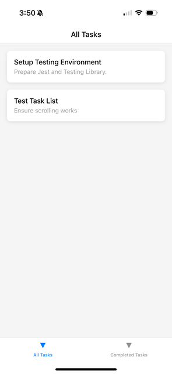
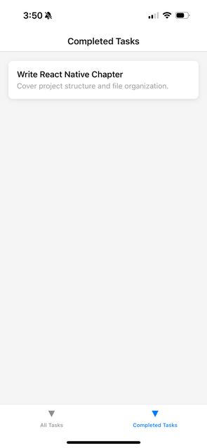

# Chapter 5: Navigation and Routing

Your **Task Tracker Mobile** app now has styled screens and components—but it’s still stuck on a single screen.

In this chapter, we’ll tackle one of the most essential parts of mobile app development: **Navigation**.

You’ll learn:

* Why web-style routing doesn’t work for React Native
* How React Navigation (the de facto standard) works
* Setting up Stack, Tab, and Drawer navigation
* Passing data between screens
* Navigating with parameters and props
* Navigating programmatically (after a button click)

By the end of this chapter, your app will support **multi-screen navigation**.

## 5.1 How Navigation in React Native Differs from the Web

In React.js, you’re used to **React Router DOM** with concepts like URLs and query params.

In React Native:

* There’s **no browser history**,
* **No URL bar**,
* Navigation is based on **screen stacks**, tabs, and gestures—just like native iOS/Android apps.

## 5.2 Introducing React Navigation

The most popular library for navigation in React Native is:

```bash
npm install @react-navigation/native
```

Also install dependencies for mobile platforms:

```bash
npx expo install react-native-screens react-native-safe-area-context react-native-gesture-handler react-native-reanimated
```

For Stack navigation:

```bash
npm install @react-navigation/native-stack
```

For Tab navigation (later in the chapter):

```bash
npm install @react-navigation/bottom-tabs
```

## 5.3 Setting Up Navigation Container

In your `App.jsx`:

```javascript
import * as React from 'react';
import { NavigationContainer } from '@react-navigation/native';
import { createNativeStackNavigator } from '@react-navigation/native-stack';

import TaskListScreen from './src/screens/TaskListScreen';
import TaskDetailScreen from './src/screens/TaskDetailScreen';

const Stack = createNativeStackNavigator();

export default function App() {
  return (
    <NavigationContainer>
      <Stack.Navigator>
        <Stack.Screen name="TaskList" component={TaskListScreen} />
        <Stack.Screen name="TaskDetail" component={TaskDetailScreen} />
      </Stack.Navigator>
    </NavigationContainer>
  );
}
```

## 5.4 Creating the Second Screen: TaskDetailScreen

**File:** `src/screens/TaskDetailScreen.jsx`

```javascript
import React from 'react';
import { View, Text, StyleSheet } from 'react-native';

export default function TaskDetailScreen({ route }) {
  const { task } = route.params;

  return (
    <View style={styles.container}>
      <Text style={styles.title}>{task.title}</Text>
      <Text style={styles.description}>{task.description}</Text>
    </View>
  );
}

const styles = StyleSheet.create({
  container: {
    flex: 1,
    padding: 20,
    backgroundColor: '#f0f0f0',
  },
  title: {
    fontSize: 24,
    fontWeight: 'bold',
  },
  description: {
    fontSize: 16,
    marginTop: 10,
  },
});
```

**What’s Happening Here?**

We’re **receiving route parameters (the task data)** passed from the first screen.

## 5.5 Navigating Between Screens with Parameters

Let’s update our `TaskCard` to support navigation.

Modify `TaskCard.jsx`:

```javascript
import React from 'react';
import { View, Text, StyleSheet, TouchableOpacity } from 'react-native';
import Colors from '../constants/Colors';
import { useNavigation } from '@react-navigation/native';

export default function TaskCard({ task }) {
  const navigation = useNavigation();

  const handlePress = () => {
    navigation.navigate('TaskDetail', { task });
  };

  return (
    <TouchableOpacity onPress={handlePress}>
      <View style={[styles.card, { backgroundColor: Colors.primary }]}>
        <Text style={styles.title}>{task.title}</Text>
        <Text style={styles.description}>{task.description}</Text>
      </View>
    </TouchableOpacity>
  );
}

const styles = StyleSheet.create({
  card: {
    padding: 15,
    marginVertical: 8,
    marginHorizontal: 16,
    borderRadius: 8,
  },
  title: {
    color: '#fff',
    fontSize: 18,
    fontWeight: '600',
  },
  description: {
    color: '#fff',
    fontSize: 14,
    marginTop: 4,
  },
});
```

### Update FlatList render in `TaskListScreen.js`

```javascript
import React from 'react';
import { FlatList, SafeAreaView } from 'react-native';
import TaskCard from '../components/TaskCard';

const TASKS = [
  { id: '1', title: 'Write Chapter 5', description: 'Cover Navigation and Routing' },
  { id: '2', title: 'Add Task Detail Screen', description: 'Show task description' },
];

export default function TaskListScreen() {
  return (
    <SafeAreaView style={{ flex: 1 }}>
      <FlatList
        data={TASKS}
        keyExtractor={(item) => item.id}
        renderItem={({ item }) => <TaskCard task={item} />}
      />
    </SafeAreaView>
  );
}
```

## 5.6 Adding Tab Navigation

Now let’s add a **Bottom Tab Navigator** for switching between different main screens (e.g., All Tasks vs Completed Tasks).

### Step 1: Install Tabs Package

```bash
npm install @react-navigation/bottom-tabs
```

### Step 2: Update `App.js`:

```javascript
import * as React from 'react';
import { NavigationContainer } from '@react-navigation/native';
import { createBottomTabNavigator } from '@react-navigation/bottom-tabs';
import TaskListScreen from './src/screens/TaskListScreen';
import CompletedTasksScreen from './src/screens/CompletedTasksScreen';

const Tab = createBottomTabNavigator();

export default function App() {
  return (
    <NavigationContainer>
      <Tab.Navigator>
        <Tab.Screen name="All Tasks" component={TaskListScreen} />
        <Tab.Screen name="Completed Tasks" component={CompletedTasksScreen} />
      </Tab.Navigator>
    </NavigationContainer>
  );
}
```

**Now:**
Your app shows bottom tabs for navigation.





## 5.7 Combining Stack and Tab Navigation

In real apps, you’ll often **nest Stack Navigators inside Tab Navigators**.

Example architecture:

```
NavigationContainer
├── TabNavigator
    ├── StackNavigator for Tab 1 (All Tasks)
    └── StackNavigator for Tab 2 (Completed Tasks)
```

We’ll build this pattern in a later chapter when adding more screens.

## 5.8 Programmatic Navigation

You can navigate from anywhere in your component tree using the `useNavigation` hook.

### Example: Navigate after a Button Press

```javascript
import React from 'react';
import { Button } from 'react-native';
import { useNavigation } from '@react-navigation/native';

export default function AddTaskButton() {
  const navigation = useNavigation();

  return (
    <Button
      title="Add New Task"
      onPress={() => navigation.navigate('TaskDetail', { task: { title: 'New Task', description: 'Newly created task' } })}
    />
  );
}
```

## 5.9 Navigation Errors and Fixes

| Error                                      | Fix                                                                           |
| ------------------------------------------ | ----------------------------------------------------------------------------- |
| NavigationContainer not defined            | Wrap your root app in `<NavigationContainer>`                                 |
| Screen not registered                      | Double-check your Stack or Tab registration                                   |
| Params undefined                           | Ensure you’re passing params when navigating                                  |
| Trying to use navigation outside navigator | Use `useNavigation()` inside components that are part of navigation hierarchy |

## Assignment

**✅ Task:**

1. Create a **CompletedTasksScreen** in `/screens`.
2. Add a tab for **Completed Tasks**.
3. Make each task in the completed list clickable, navigating to the detail screen.

Bonus: Pass a `status` field in the task object and display it in the detail screen.

## Chapter Summary

You’ve learned:

* The difference between web routing and React Native navigation
* How to set up **Stack Navigators** and **Tab Navigators**
* How to pass data between screens
* How to navigate programmatically
* How to build a multi-screen, multi-tab navigation flow

## What is Next?

In **Chapter 6**, we’ll jump into **State Management Approaches** for React Native:

* Context API
* Redux Toolkit
* State persistence with AsyncStorage

You’ll learn how to **manage global task state**, including **adding**, **updating**, and **deleting tasks across screens**.
