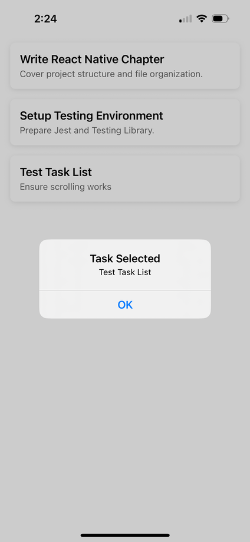

# Chpater 3: UI Building Blocks

Now that your project structure is in place, it’s time to dive into the **core UI components** that power every React Native app.

In React.js, you’ve worked with `div`, `span`, and CSS for layout and styling. React Native replaces those with its own component set, designed for mobile platforms.

In this chapter, you’ll learn:

* How to layout UI with `View` and `Text`
* Building scrollable lists using `ScrollView` and `FlatList`
* Making components interactive using `TouchableOpacity` and `Pressable`
* Creating a functional **Task List Screen**

## 3.1 View: The Div of React Native

`View` is the most fundamental building block. It’s like a `div` in React.js.

* A layout container, not interactive by default.
* Used for grouping and styling UI elements.
* It **doesn’t respond to user taps**.

**Usage:**

```javascript
import React from 'react';
import { View, StyleSheet } from 'react-native';

export default function BoxExample() {
  return (
    <View style={styles.container}>
      <View style={styles.box} />
    </View>
  );
}

const styles = StyleSheet.create({
  container: {
    flex: 1,
    justifyContent: 'center',
    alignItems: 'center',
  },
  box: {
    width: 100,
    height: 100,
    backgroundColor: '#3498db',
  },
});
```

**What it does:**
Renders a centered blue box.

## 3.2 Text: Displaying Text Content

Unlike React.js where any tag can hold text, React Native **requires all text to be inside a `<Text>` component**.

* Displays textual content.
* Can optionally be **pressable**, but only when using the `onPress` prop.
* Limited in flexibility for interaction.

**Example:**

```javascript
import React from 'react';
import { Text, View } from 'react-native';

export default function Greeting() {
  return (
    <View style={{ padding: 20 }}>
      <Text style={{ fontSize: 18 }}>Hello from React Native!</Text>
    </View>
  );
}
```

## 3.3 ScrollView: Basic Scrollable Container

`ScrollView` renders all its children at once and is useful for small scrollable content.

**Example:**

```javascript
import React from 'react';
import { ScrollView, Text } from 'react-native';

export default function SimpleScroll() {
  return (
    <ScrollView style={{ margin: 20 }}>
      {Array.from({ length: 30 }, (_, i) => (
        <Text key={i}>Item {i + 1}</Text>
      ))}
    </ScrollView>
  );
}
```

> ⚠️ This renders all 30 items at once — even those off-screen.

**Warning:**
For large datasets, use `FlatList` instead (covered next).

## 3.4 FlatList: Performance-Friendly Lists

`FlatList` is a **performance-optimized component for rendering large lists of data**. It renders items lazily and efficiently using **windowed rendering**, meaning it **only renders what's visible on screen + a buffer**, recycling views as you scroll.

**Pros:**

* Ideal for large, scrollable lists
* Supports built-in performance optimizations like lazy loading, view recycling
* Highly customizable via props like `renderItem`, `keyExtractor`, `ItemSeparatorComponent`, `ListHeaderComponent`, etc.

**Cons:**

* Slightly more setup than `ScrollView`
* Only supports vertical scrolling by default

### Key Props of `FlatList`

```javascript
<FlatList
  data={yourDataArray}                 // Array of items
  renderItem={({ item }) => ...}       // How to render each item
  keyExtractor={(item) => item.id}     // Unique key for each item
  ListHeaderComponent={...}            // Optional header
  ListFooterComponent={...}            // Optional footer
  ItemSeparatorComponent={...}         // Separator between items
  onEndReached={...}                   // Triggered when list is near the end
  refreshing={boolean}                 // Pull-to-refresh loading state
  onRefresh={...}                      // Refresh function
/>
```

We’ll now build a **Task List Screen** using `FlatList` and the `TaskCard` component from Chapter 2.

### File: `src/screens/TaskListScreen.jsx`

```javascript
import React from 'react';
import { FlatList, SafeAreaView } from 'react-native';
import TaskCard from '../components/TaskCard';

/**
 * This is the Task List Screen which displays a list of tasks using FlatList.
 * @param props
 * @param props.data An optional array of task objects, each containing id, title, and description.
 * @returns 
 */
export default function TaskListScreen({
  data,
}) {
  return (
    <SafeAreaView style={{ flex: 1 }}>
      <FlatList
        data={data}
        keyExtractor={(item) => item.id}
        renderItem={({ item }) => (
          <TaskCard title={item.title} description={item.description} />
        )}
      />
    </SafeAreaView>
  );
}
```

### Update `App.js` to Use This Screen:

```javascript
/** Components */
import { StyleSheet } from "react-native";
import TaskListScreen from "./src/screens/TaskListScreen";

const DATA = [
  {
    id: "1",
    title: "Write React Native Chapter",
    description: "Cover project structure and file organization.",
  },
  {
    id: "2",
    title: "Setup Testing Environment",
    description: "Prepare Jest and Testing Library.",
  },
  { id: "3", title: "Test Task List", description: "Ensure scrolling works" },
];

const DATA = [
  { id: '1', title: 'Write React Native Chapter', description: 'Cover project structure and file organization.' },
  { id: '2', title: 'Setup Testing Environment', description: 'Prepare Jest and Testing Library.' },
  { id: '3', title: 'Test Task List', description: 'Ensure scrolling works' },
];

/**
 * The main App component which renders the TaskListScreen with sample data.
 * @returns JSX.Element
 */
export default function App() {
  return <TaskListScreen data={DATA} />;
}

const styles = StyleSheet.create({
  container: {
    flex: 1,
    backgroundColor: "#fff",
    alignItems: "center",
    justifyContent: "center",
  },
});
```

### Performance Tips with FlatList

1. **Use `keyExtractor`** with unique keys (avoid using index).
2. **Avoid anonymous functions in `renderItem`** to prevent unnecessary re-renders.
3. Use `initialNumToRender` to control how many items load initially.
4. Use `windowSize`, `maxToRenderPerBatch`, `removeClippedSubviews` for tuning memory/performance.
5. Consider `SectionList` if your data is grouped into sections.

## 3.5 TouchableOpacity: Making Things Clickable

`TouchableOpacity` is a core component used to **create pressable UI elements** (buttons, links, etc.) that **respond visually to user interaction** by reducing their opacity when touched.

* A **wrapper that makes anything pressable**.
* Provides **visual feedback** (fades the component’s opacity when touched).
* Works with any child: `Text`, `Image`, `View`, etc.
* Best used when you need a **custom-styled button or link**.

### Visual Feedback Behavior

When you tap a `TouchableOpacity`, it momentarily reduces its **opacity** (fades out slightly), giving the user feedback that the touch was registered.

## Key Props of `TouchableOpacity`

| Prop            | Purpose                                        |
| --------------- | ---------------------------------------------- |
| `onPress`       | Function to run when pressed                   |
| `activeOpacity` | Controls how much the opacity changes (0 to 1) |
| `disabled`      | Disables interaction                           |
| `style`         | Apply custom styles to the wrapper             |

### Example: Making TaskCard Clickable

Modify `TaskCard.jsx`:

```javascript
import React from 'react';
import { View, Text, StyleSheet, TouchableOpacity, Alert } from 'react-native';

/**
 * A card component to display individual task details.
 * @param props
 * @param props.title The title of the task.
 * @param props.description A brief description of the task.
 * @returns JSX.Element
 */
export default function TaskCard({ title, description }) {
  const handlePress = () => {
    Alert.alert('Task Selected', `${title}`);
  };

  return (
    <TouchableOpacity onPress={handlePress}>
      <View style={styles.card}>
        <Text style={styles.title}>{title}</Text>
        <Text style={styles.description}>{description}</Text>
      </View>
    </TouchableOpacity>
  );
}

const styles = StyleSheet.create({
  card: {
    backgroundColor: '#ffffff',
    padding: 15,
    marginVertical: 8,
    marginHorizontal: 16,
    borderRadius: 8,
    shadowColor: '#000',
    shadowOffset: { width: 0, height: 2 },
    shadowOpacity: 0.1,
    shadowRadius: 4,
    elevation: 3,
  },
  title: {
    fontSize: 18,
    fontWeight: '600',
  },
  description: {
    fontSize: 14,
    color: '#666',
    marginTop: 4,
  },
});
```
**What happens now?**
When you tap a task card, it shows an alert with the task title.




### Alternatives to `TouchableOpacity`

| Component                  | Best For                                                 | Notes                    |
| -------------------------- | -------------------------------------------------------- | ------------------------ |
| `TouchableHighlight`       | Buttons that highlight (usually with a background color) | Good for iOS             |
| `Pressable`                | More advanced, supports `onPressIn`, `onPressOut`, etc.  | Preferred in newer apps  |
| `TouchableWithoutFeedback` | Custom gestures or dismissing keyboard                   | Doesn’t provide feedback |
| `Button`                   | Basic button with native styling                         | Not very customizable    |

## 3.6 Pressable: More Control Over Touch Feedback

`Pressable` is a core component that lets you detect **a variety of press interactions** (not just a simple tap). It’s highly customizable and can handle states like:

* `pressed`
* `hovered` (on web)
* `focused`
* `long press`
* `disabled`

It allows you to **change styles dynamically** based on these interaction states.

### How is `Pressable` different from `TouchableOpacity` and `TouchableHighlight`?

| Feature            | `TouchableOpacity`    | `TouchableHighlight`      | `Pressable`                                               |
| ------------------ | --------------------- | ------------------------- | --------------------------------------------------------- |
| **Touch feedback** | Reduces opacity       | Adds background highlight | Fully customizable                                        |
| **State access**   | No                    | No                        | Yes (`pressed`, etc.)                                     |
| **Style control**  | Limited               | Limited                   | Dynamic styles via function                               |
| **Event support**  | `onPress`             | `onPress`, `onLongPress`  | `onPress`, `onPressIn`, `onPressOut`, `onLongPress`, etc. |
| **Preferred for**  | Simple custom buttons | Highlight-on-touch UIs    | Modern, dynamic touch UIs                                 |

### Supported Event Props

| Prop          | Trigger                        |
| ------------- | ------------------------------ |
| `onPress`     | When the press is released     |
| `onPressIn`   | When the press starts          |
| `onPressOut`  | When the press ends            |
| `onLongPress` | After a delay (default: 500ms) |
| `disabled`    | Disables interaction           |

### Example: Making TaskCard Clickable using Pressable

Modify `TaskCard.jsx`:

```javascript {numberLines 2,18,19,20,21,22,23,24,25,29,46,47,48}
import React from 'react';
import { View, Text, StyleSheet, Pressable, Alert } from 'react-native';


/**
 * A card component to display individual task details.
 * @param props
 * @param props.title The title of the task.
 * @param props.description A brief description of the task.
 * @returns JSX.Element
 */
export default function TaskCard({ title, description }) {
  const handlePress = () => {
    Alert.alert('Task Selected', `${title}`);
  };

  return (
    <Pressable
      onPress={handlePress}
      style={({ pressed }) => [
        styles.card,
        pressed && styles.cardPressed,
      ]}
    >
      <View>
        <Text style={styles.title}>{title}</Text>
        <Text style={styles.description}>{description}</Text>
      </View>
    </Pressable>
  );
}

const styles = StyleSheet.create({
  card: {
    backgroundColor: '#ffffff',
    padding: 15,
    marginVertical: 8,
    marginHorizontal: 16,
    borderRadius: 8,
    shadowColor: '#000',
    shadowOffset: { width: 0, height: 2 },
    shadowOpacity: 0.1,
    shadowRadius: 4,
    elevation: 3,
  },
  cardPressed: {
    opacity: 0.7,
  },
  title: {
    fontSize: 18,
    fontWeight: '600',
  },
  description: {
    fontSize: 14,
    color: '#666',
    marginTop: 4,
  },
});
```

### Why Use `Pressable` Over Touchable Components?

* Greater **control** over interaction states
* Cleaner way to **change styles dynamically**
* Supports more interaction types (especially useful for animations, accessibility)
* More **future-proof** (React Native team recommends it for new apps)

## 3.7 Styling Recap for UI Components

In React Native:

* Styles are objects, not CSS strings
* No media queries, but you can use `Dimensions` API for responsive layouts
* Flexbox is the default layout model

We’ll go deeper on styling and theming in the next chapter.

## 3.8 Assignment

**✅ Task:**

1. Create a new screen called **CompletedTasksScreen.js**
2. Reuse `TaskCard` to display a list of completed tasks
3. Use **TouchableOpacity** or **Pressable** to handle item clicks

**💡 Hint:**

1. Use React hooks to manage states to navigate to the correct screen.
2. Pass the `handlePress()` as a prop to the `TaskCard` component.
3. Add custom "`Button`" components that allow the user to view incomplete tasks and completed tasks in their respective screens.

In a later chapter we will discuss Navigation and Routing further.

## Chapter Summary

You’ve learned:

* The main React Native UI building blocks: **View**, **Text**, **ScrollView**, **FlatList**, and **Touchable** components
* How to build a dynamic, scrollable task list
* How to handle user interactions with touchable elements

## What is Next?

In **Chapter 4**, we’ll dive deep into **Styling in React Native**.

We’ll cover:

* Flexbox layouts
* Dynamic styling
* Themes
* Responsive design
* Styling consistency for scaling

You’ll also learn how to style the entire **Task Tracker Mobile** app with a unified theme.

