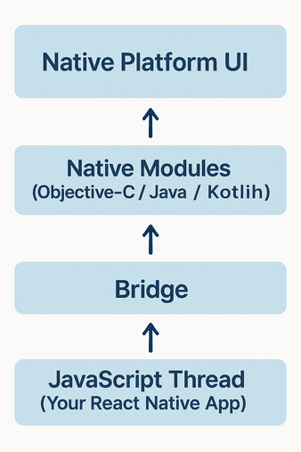

# Chapter 1: Introduction to React Native

You’re a web developer. You know React.js. You're used to building fast, component-driven web apps that run in browsers.

Now, you want to build real native mobile apps for iOS and Android—without learning Swift, Objective-C, Java, or Kotlin from scratch.

**React Native** makes that possible.

In this chapter, we’ll cover:

* What React Native is and how it works
* How it compares to React.js
* The React Native architecture (JS thread, native modules, bridge)
* Setting up your development environment
* Running your first app on an emulator or real device

By the end, you’ll have a running mobile app and know how the React Native runtime connects JavaScript and native platform APIs.

## 1.1 What is React Native?

**React Native** is a framework for building native mobile apps using JavaScript and React.

But here's the key: **React Native does not render to HTML and CSS like React.js does.**

Instead, React Native maps your React components to **native platform UI elements** like `UIView` (iOS) and `View` (Android).

This gives your app **real native performance and look-and-feel**, not just a web view wrapper.

### React Native Rendering Model vs React.js Rendering Model

| Feature          | React.js (Web) | React Native                     |
| ---------------- | -------------- | -------------------------------- |
| UI Targets       | HTML, CSS      | Native platform components       |
| Rendering Engine | Browser DOM    | Native rendering engine          |
| Styling          | CSS            | JavaScript StyleSheets (Flexbox) |
| Navigation       | React Router   | React Navigation / Native APIs   |

## 1.2 How React Native Works (Architecture Overview)

React Native runs your JavaScript code using a **JavaScript engine** (Hermes, JSC, or V8), separate from the main UI thread.

### Core Architecture Layers



**Key points:**

* Your JS code runs in a separate thread from the UI thread.
* Communication between JS and Native happens over a **Bridge** using serialized messages (though new architectures like JSI and Fabric reduce bridge overhead).
* Heavy tasks on JS thread can block UI responsiveness (we'll cover how to avoid that later).

## 1.3 Setting Up Your Development Environment

You have **two main setup options**:

### Option 1: Expo (Easiest for Beginners)

**Expo** is a managed development environment for React Native that handles build configs and native code for you.

**Best for:**

* Beginners
* Rapid prototyping
* Apps that don’t need heavy native module customization

**Setup:**

```bash
npm install -g expo-cli
expo init MyFirstApp
cd MyFirstApp
npx expo start
```

You can preview your app using the **Expo Go app** on your real Android/iOS device.

### Option 2: React Native CLI (For Full Native Control)

This is the bare metal way. You’ll need Android Studio and/or Xcode installed.

**Best for:**

* Apps needing custom native modules
* Advanced deployment configs

**Setup:**

```bash
npx @react-native-community/cli init MyFirstApp
cd MyFirstApp
npx react-native run-android
# or
npx react-native run-ios
```

**Pro Tip:**
Start with Expo for learning, switch to React Native CLI when you need full control.

## 1.4 Running Your First React Native App

### Example: Minimal “Hello World” App

Here’s the simplest React Native app:

```jsx
import React from 'react';
import { Text, View, StyleSheet } from 'react-native';

export default function App() {
  return (
    <View style={styles.container}>
      <Text>Hello World from React Native!</Text>
    </View>
  );
}

const styles = StyleSheet.create({
  container: {
    flex: 1,
    justifyContent: 'center',
    alignItems: 'center',
    backgroundColor: '#f0f0f0',
  },
});
```

### Explanation:

* **View:** The React Native equivalent of a `div`
* **Text:** React Native component for text display
* **StyleSheet:** Instead of CSS, we use a JavaScript-based style object

Run this on your emulator or real device and you’ll see:
**“Hello World from React Native!”**

## 1.5 Common Beginner Errors (and How to Fix Them)

| Error                                    | Fix                                     |
| ---------------------------------------- | --------------------------------------- |
| Metro Bundler not starting               | Run `npx react-native start`            |
| Emulator not showing the app             | Rebuild with `run-android` or `run-ios` |
| Syntax error from wrong component import | Double-check import paths               |

## 1.6 Your First Assignment

Before moving to the next chapter:

**✅ Task:** Create a new screen that says:

Try changing the background color and font size using the `StyleSheet`.

## **Chapter Summary**

In this chapter, you learned:

* How React Native works
* The difference between React.js and React Native
* How to set up your environment using Expo or React Native CLI
* How to run your first app on a device or emulator

## What is Next?

In **Chapter 2**, we’ll dive into **project structure, file organization**, and how to **create scalable folder layouts** for real-world React Native apps.

We’ll also start building our sample project:
**"Task Tracker Mobile"**

---
