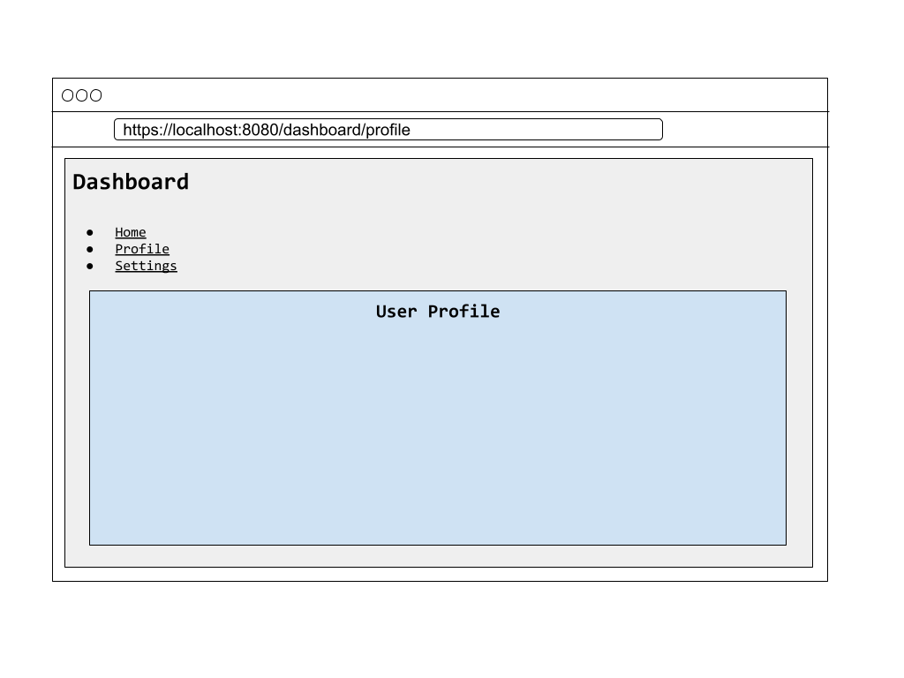
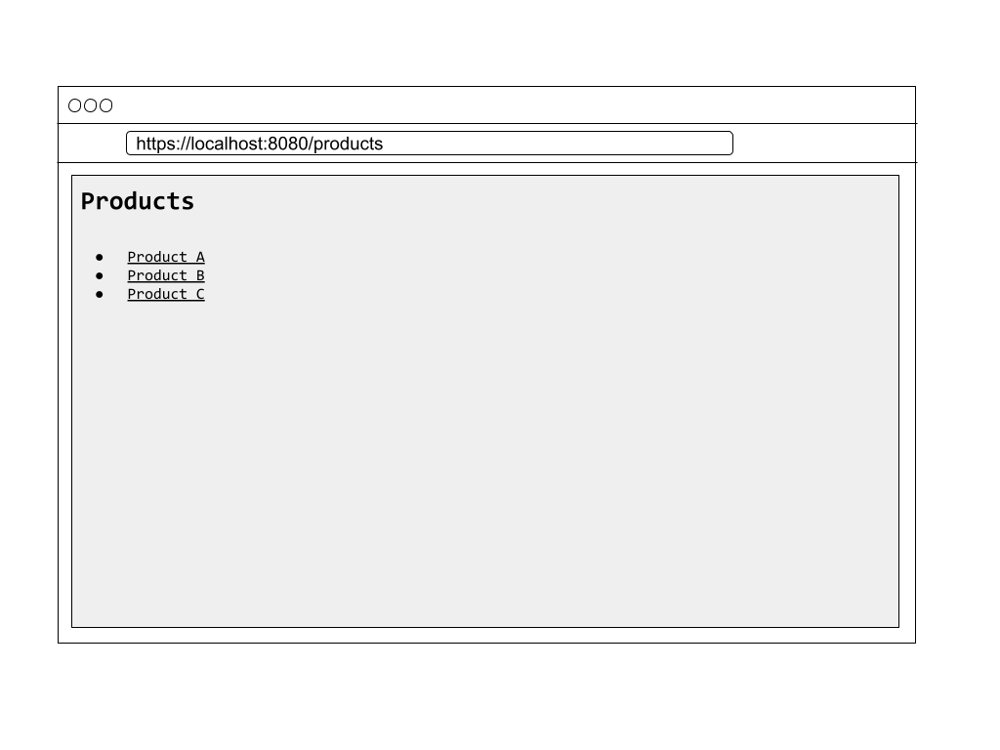
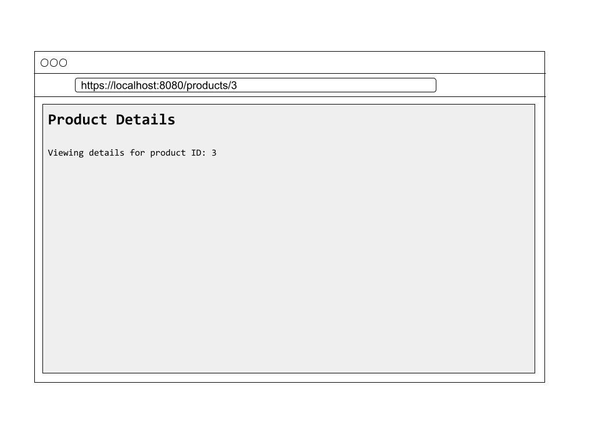

# Advanced Routing Techniques: Nested Routes, Dynamic Routing, and Route Guards

React Router is a powerful library that simplifies navigation and routing in React applications. While basic routing is straightforward, advanced routing techniques such as nested routes, dynamic routing, and route guards allow developers to create more complex and feature-rich applications. In this article, part of the **Modern React.js** series, we’ll explore these advanced routing concepts in depth and demonstrate how to implement them in a React application.

## Nested Routes

Nested routes allow you to define a hierarchy of routes, where child routes are rendered within the context of a parent route. This is particularly useful for structuring applications with multiple levels of navigation, such as a dashboard with different sections.

### Setting Up Nested Routes

#### Directory Structure

```bash
src/
├── App.jsx
├── pages/
│   ├── Dashboard.jsx
│   ├── DashboardHome.jsx
│   ├── Settings.jsx
│   ├── Profile.jsx
```

#### Code Implementation

1. **Create the Components:**

```jsx {numberLines}
// Dashboard.jsx
import { Outlet, Link } from 'react-router-dom';

export default function Dashboard() {
  return (
    <div>
      <h1>Dashboard</h1>
      <nav>
        <ul>
          <li><Link to="/dashboard">Home</Link></li>
          <li><Link to="/dashboard/profile">Profile</Link></li>
          <li><Link to="/dashboard/settings">Settings</Link></li>
        </ul>
      </nav>
      <Outlet />
    </div>
  );
}

// DashboardHome.jsx
export default function DashboardHome() {
  return <h2>Welcome to the Dashboard</h2>;
}

// Profile.jsx
export default function Profile() {
  return <h2>User Profile</h2>;
}

// Settings.jsx
export default function Settings() {
  return <h2>Account Settings</h2>;
}
```

2. **Set Up the Nested Routes:**

```jsx {numberLines}
import { BrowserRouter as Router, Routes, Route } from 'react-router-dom';
import Dashboard from './pages/Dashboard';
import DashboardHome from './pages/DashboardHome';
import Profile from './pages/Profile';
import Settings from './pages/Settings';

function App() {
  return (
    <Router>
      <Routes>
        <Route path="/dashboard" element={<Dashboard />}>
          <Route index element={<DashboardHome />} />
          <Route path="profile" element={<Profile />} />
          <Route path="settings" element={<Settings />} />
        </Route>
      </Routes>
    </Router>
  );
}

export default App;
```

#### How It Works

- The `Dashboard` component serves as the parent route and uses the `<Outlet />` component to render its child routes.
- The child routes (`DashboardHome`, `Profile`, `Settings`) are defined as nested routes within `/dashboard`.
- The `index` route renders by default when `/dashboard` is accessed.



### Understanding the `<Outlet>` Component in React Router

The `<Outlet>` component is an essential part of React Router, used to render child routes in a nested routing setup. It acts as a placeholder that tells React Router where the child components (defined as nested routes) should be rendered. This enables developers to create layouts with shared components while rendering child-specific content dynamically.

For example, if you are building a dashboard with sections like "Profile" and "Settings," you can use the `<Outlet>` component in the parent route to define where these sections will appear within the layout.

- **Layout example:**

```jsx {numberLines 4,5,6,17}
// Dashboard.jsx
import { Link, Outlet } from 'react-router-dom';

/**
 * Dashboard layout component
 */
export default function Dashboard() {
  return (
    <div>
      <h1>Dashboard</h1>
      <nav>
        <ul>
          <li><Link to="profile">Profile</Link></li>
          <li><Link to="settings">Settings</Link></li>
        </ul>
      </nav>
      {/* The child route will be rendered here */}
      <Outlet />
    </div>
  );
}
```

- **Route Configuration:**

```jsx {numberLines}
import { BrowserRouter as Router, Routes, Route } from 'react-router-dom';
import Dashboard from './pages/Dashboard';
import Profile from './pages/Profile';
import Settings from './pages/Settings';

function App() {
  return (
    <Router>
      <Routes>
        <Route path="dashboard" element={<Dashboard />}>
          <Route path="profile" element={<Profile />} />
          <Route path="settings" element={<Settings />} />
        </Route>
      </Routes>
    </Router>
  );
}

export default App;
```

#### How It Works

- The `Dashboard` component serves as the parent layout, displaying a header and navigation links. It uses the `<Outlet />` component to render the child routes (`Profile` and `Settings`) dynamically.
- When the user navigates to `/dashboard/profile`, React Router will render the Profile component within the `<Outlet />` placeholder in the `Dashboard` component. Similarly, navigating to `/dashboard/settings` renders the `Settings` component.

## Dynamic Routing

Dynamic routing allows you to define routes with placeholders that can match dynamic segments of the URL. This is particularly useful for handling routes with parameters, such as viewing individual items in a list.

### Setting Up Dynamic Routes

#### Directory Structure

```bash
src/
├── App.jsx
├── pages/
│   ├── Products.jsx
│   ├── ProductDetails.jsx
```

#### Code Implementation

1. **Create the Components:**

```jsx {numberLines}
// Products.jsx
import { Link } from 'react-router-dom';

export default function Products() {
  const productList = [
    { id: 1, name: 'Product A' },
    { id: 2, name: 'Product B' },
    { id: 3, name: 'Product C' },
  ];

  return (
    <div>
      <h1>Products</h1>
      <ul>
        {productList.map(product => (
          <li key={product.id}>
            <Link to={`/products/${product.id}`}>{product.name}</Link>
          </li>
        ))}
      </ul>
    </div>
  );
}

// ProductDetails.jsx
import { useParams } from 'react-router-dom';

export default function ProductDetails() {
  const { id } = useParams();

  return (
    <div>
      <h1>Product Details</h1>
      <p>Viewing details for product ID: {id}</p>
    </div>
  );
}
```

2. **Set Up the Routes:**

```jsx {numberLines}
import { BrowserRouter as Router, Routes, Route } from 'react-router-dom';
import Products from './pages/Products';
import ProductDetails from './pages/ProductDetails';

function App() {
  return (
    <Router>
      <Routes>
        <Route path="/products" element={<Products />} />
        <Route path="/products/:id" element={<ProductDetails />} />
      </Routes>
    </Router>
  );
}

export default App;
```

#### How It Works

- The `:id` in the route definition (`/products/:id`) represents a dynamic parameter.
- The `useParams` hook is used in the `ProductDetails` component to access the dynamic id parameter from the URL.





## Route Guards

Route guards are used to protect specific routes by restricting access based on conditions, such as user authentication. This ensures that only authorized users can access certain parts of your application.

### Implementing Route Guards

#### Code Implementation

1. **Create a Fake Authentication Service:**

```jsx {numberLines}
// auth.js
export const isAuthenticated = () => {
  return localStorage.getItem('auth') === 'true';
};

export const login = () => {
  localStorage.setItem('auth', 'true');
};

export const logout = () => {
  localStorage.removeItem('auth');
};
```

2. **Create a Protected Route Component:**

```jsx {numberLines}
import { Navigate } from 'react-router-dom';
import { isAuthenticated } from './auth';

export default function ProtectedRoute({ children }) {
  if (!isAuthenticated()) {
    return <Navigate to="/login" />;
  }
  return children;
}
```

3. **Set Up Routes with Guards:**

```jsx {numberLines}
import { BrowserRouter as Router, Routes, Route } from 'react-router-dom';
import ProtectedRoute from './ProtectedRoute';
import Dashboard from './pages/Dashboard';
import Login from './pages/Login';

function App() {
  return (
    <Router>
      <Routes>
        <Route path="/login" element={<Login />} />
        <Route
          path="/dashboard"
          element={
            <ProtectedRoute>
              <Dashboard />
            </ProtectedRoute>
          }
        />
      </Routes>
    </Router>
  );
}

export default App;
```

4. **Create the Login Component:**

```jsx {numberLines}
import { useNavigate } from 'react-router-dom';
import { login } from './auth';

export default function Login() {
  const navigate = useNavigate();

  const handleLogin = () => {
    login();
    navigate('/dashboard');
  };

  return (
    <div>
      <h1>Login</h1>
      <button onClick={handleLogin}>Log In</button>
    </div>
  );
}
```

#### How It Works

- The `ProtectedRoute` component checks if the user is authenticated using the `isAuthenticated` function.
- If the user is not authenticated, they are redirected to the `/login` page using the `<Navigate />` component.
- Upon successful login, the user is redirected to the protected route (e.g., `/dashboard`).

## Conclusion

Advanced routing techniques like nested routes, dynamic routing, and route guards are essential for building scalable, user-friendly, and secure React applications. With React Router, these techniques can be implemented efficiently, enabling you to create complex applications with ease.

By combining these techniques, you can handle hierarchical navigation, dynamic content, and protected routes seamlessly. For more details, check out the [React Router documentation](https://reactrouter.com/). Stay tuned for the next article in the Modern **React.js** series!
